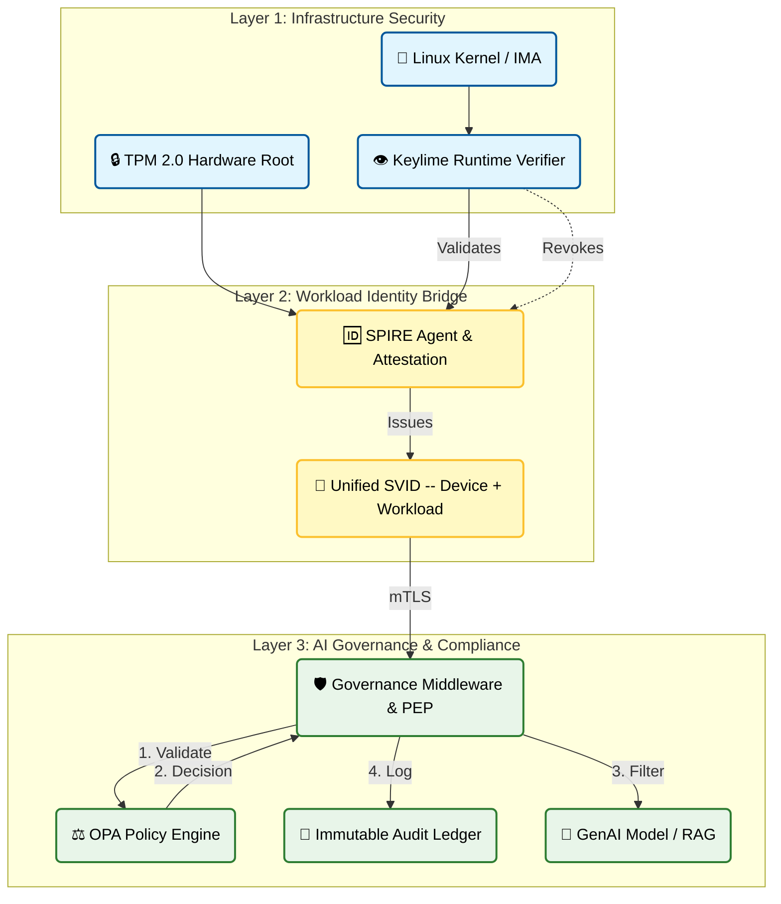

# AegisEdgeAI: Trusted AI for the Distributed Enterprise

**AegisEdgeAI** delivers verifiable trust for AI workloads across the **distributed enterprise**—from **secure on-premise data centers** and **private clouds** to the **far edge**.

Where typical security models verify the user, device, or workload in isolation, AegisEdgeAI cryptographically binds all three identities together. We provide the open-source reference architecture for the **End-to-End Trusted AI Stack** in **critical infrastructure and regulated industries** (Financial Services, Defense, Healthcare, Telco).


```text
+---------------------------------------------------------------+
|             Layer 3: AI Governance & Compliance               |
|                                                               |
|   +-------------+      +-------+      +-------+     +-----+   |
|   | Gov. Chain  |<---->|  OPA  |      | Audit |     | LLM |   |
|   +-------------+      +-------+      +-------+     +-----+   |
|          ^                 ^              ^            ^      |
+----------|-----------------|--------------|------------|------+
           |                 |              |            |
+----------|-----------------|--------------|------------|------+
|          |                 |              |            |      |
|   +-------------+          +--------------+            |      |
|   | SPIRE Agent |--------->| Unified SVID |            |      |
|   +-------------+          +--------------+            |      |
|                                                               |
|             Layer 2: Workload Identity Bridge                 |
+---------------------------------------------------------------+
           ^
           | (Validates & Revokes)
+---------------------------------------------------------------+
|             Layer 1: Infrastructure Security                  |
|                                                               |
|   +---------+        +---------+        +-----------------+   |
|   | TPM 2.0 |------->| Kernel  |------->| Keylime Verifier|   |
|   +---------+        +---------+        +-----------------+   |
+---------------------------------------------------------------+
```

Figure 1: The Unified Trust Model. AegisEdgeAI binds Device Integrity (Layer 1) and Workload Identity (Layer 2) to create the unforgeable foundation required for Governance & Verifiable Audits (Layer 3).

<p align="center">
  <small>
    🔹 <strong>Hardware Root:</strong> TPM/Secure Boot ensures the "Runner" is untampered.<br>
    🔹 <strong>Identity Bridge:</strong> SPIFFE/SPIRE propagates this trust to the Application.<br>
    🔹 <strong>Governance Outcome:</strong> The new <a href="proposals/rag-governance.md">Policy Middleware</a> uses these identities to generate immutable audit logs.
  </small>
</p>

## Key Proposals & Standards
We actively contribute to defining industry standards for secure AI architecture.

* **[LEP-001: Zero-Trust Governance Middleware for RAG](proposals/rag-governance.md)**
    * **Status:** Draft / RFC (Submitted to LangChain Community)
    * **Scope:** Standardizing **Policy-as-Code** and **Verifiable Audit Logs** for Enterprise RAG systems. This proposal solves "Context Contamination" and the "GenAI Audit Paradox" by cryptographically binding the retrieved context to the model decision.

## The Trusted AI Stack
AegisEdgeAI addresses the three critical layers required to unlock regulated markets:

### 1. Infrastructure Security (The Foundation)
* **Hardware Supply Chain:** We utilize **TPM Endorsement Keys (EK)** and **BMC-based Inventory Attestation** to detect component swapping or firmware downgrades before the OS even boots.
* **Runtime Integrity ("Self-Healing Trust"):** We simplify security operations by binding **Keylime** (IMA/EVM) integrity checks directly to the **SPIRE Agent's** periodic re-attestation loop.
    * **The Mechanism:** The Agent must prove its binary integrity (via TPM Quote) every renewal cycle.
    * **The Result:** If the `spire-agent` or `kubelet` binaries are tampered with, the Server denies the renewal. The compromised node's identity naturally expires and is cut off from the mesh, requiring no manual "Kill Switch" infrastructure.

### 2. Workload Identity (The Bridge)
* **Proof of Residency (PoR):** We issue cryptographic certificates that bind the **Workload Identity** (executable hash) to the **Hardware Identity** (TPM). This replaces weak bearer tokens with hardware-rooted proof of possession.
* **Proof of Geofencing (PoG):** We extend PoR to include **Location Identity** (GNSS/Mobile Sensors), ensuring data sovereignty by preventing AI agents from running in disallowed jurisdictions.

### 3. AI Governance & Compliance (The New Layer)
* **Zero-Trust Data Filtering:** Middleware that enforces **OPA (Open Policy Agent)** rules on RAG retrieval contexts.
* **Immutable Audit Logs:** Generation of compliance artifacts that capture the "Immutable Triad" (User Input + Context Hash + Model Config), turning "trust" into a mathematically verifiable feature.

## Why It Matters
* **Unlock Regulated Markets:** Meet strict data sovereignty and integrity requirements with verifiable proof that spans user, device, and workload.
* **Reduce Audit Friction:** Provide clear, end-to-end evidence that identity pillars are authentic.
* **Turn Trust into a Feature:** Make holistic, hardware-rooted trust a customer-visible advantage.

## Stakeholders
* **Ramki Krishnan (Vishanti)** (Lead)
* Andreas Spanner (Red Hat)
* Michael Epley (Red Hat)
* A. Prasad (Oracle)
* Srini Addepalli (Aryaka)
* Vijaya Prakash Masilamani (Independent)
* Bala Siva Sai Akhil Malepati (Independent)
* Dhanush (Vishanti)
* Pranav Kirtani (Independent)

## Problem Statement: The Security Gap in AI Infrastructure

In critical infrastructure sectors, inference often occurs at the Edge (e.g., branch offices, tactical servers) due to latency or data sovereignty requirements. These environments are physically exposed and lack the perimeter security of a central cloud, creating amplification points for emerging **Multi-Agent** threats.

### A. Infrastructure Threats
1.  **Token Replay & Identity Abuse:** Bearer tokens (RFC 6750) can be stolen and replayed. Even Proof-of-Possession tokens are vulnerable if the host is compromised.
2.  **Weak Location Assurance:** IP-based geofencing is easily bypassed via VPNs. AI agents inheriting false location claims can trigger compliance violations.
3.  **Physical Exposure:** Edge nodes in semi-trusted environments (factories, retail) are vulnerable to physical tampering and hardware substitution.

### B. Application & Governance Threats
1.  **Data Provenance Gaps:** In RAG and federated learning, there is no cryptographic link between *what* was measured and *who* measured it. Poisoned data can corrupt decision pipelines without detection.
2.  **MCP Protocol Risks:** In the Model Context Protocol (MCP), "confused deputy" attacks can allow agents to access resources beyond their scope. Unverified MCP servers can inject malicious tools or exfiltrate data.
3.  **Model Placement Risks:**
    * *Local Placement:* Host compromise grants control over both the orchestration logic and the model weights (IP theft).
    * *Remote Placement:* Weak endpoint verification allows "Man-in-the-Middle" attacks on inference requests.

## Core Solution Architecture

### 1. Proof of Residency (PoR)
**Challenge:** Weak bearer tokens in exposed environments.
**Solution:** We cryptographically bind:
> **Workload Identity** (Code Hash) + **Host Hardware Identity** (TPM PKI) + **Platform Policy** (Kernel Version)
This generates a PoR certificate that proves *what* is running and *where* it is running.

### 2. Proof of Geofencing (PoG)
**Challenge:** Unreliable IP-based location checks.
**Solution:** We bind **PoR** + **Location Hardware Identity** (GNSS/Sensor). This enables verifiable enforcement of geographic policy at the workload level, not just the firewall level.

### 3. Supply Chain Security
**Challenge:** Counterfeit hardware and firmware drift.
**Solution:** A layered trust model:
* **Hardware Identity Gate:** Enrollment is restricted to manufacturer-issued TPM Endorsement Keys (EKs).
* **BMC Inventory:** Out-of-band verification of components (NICs, GPUs) against purchase orders.

### 4. Verifiable Privacy: Zero Knowledge Proofs (ZKP)
**Use Case:** Proving compliance without revealing trade secrets.

* **Banking (Fair Lending):** A bank proves to a regulator that its Loan Approval AI meets non-discrimination statutes (e.g., disparate impact < 5%) without ever revealing the proprietary model weights or customer PII.
* **Telco (AI RAN):** An MNO proves their AI power-saving algorithm prioritizes emergency calls during outages, without disclosing the proprietary source code of the optimizer.
* **Technology:** We integrate with ZK-ML provers (e.g., EZKL) to generate cryptographic proofs of model execution paths.

## Additional Resources
* **Zero‑Trust Sovereign AI Deck:** [View Deck](placeholder_link)
* **Blog:** "Unlock the Future of Access" – Moving from IP-based security to hardware-rooted Zero Trust. [Read Blog](placeholder_link)
* **IETF Presentations:**
    * IETF 123 WIMSE: [View Slides](placeholder_link)
    * IETF 123 RATS: [View Slides](placeholder_link)

## References
1.  [Simply NUC: Banks Data Closer to Customers](https://simplynuc.com/blog/banks-data-closer-to-customers/)
2.  [Keylime Documentation](https://keylime.readthedocs.io/en/latest/)
3.  [IETF Verifiable Geofencing Draft](placeholder_link)