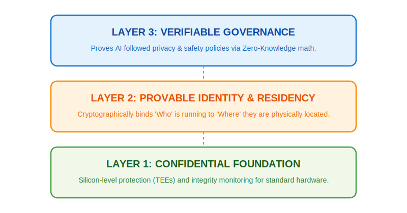
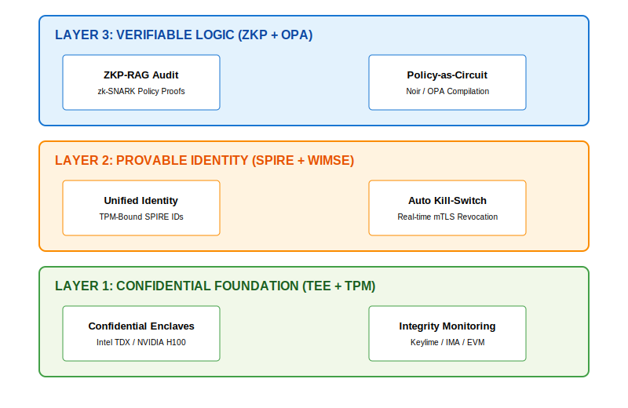

# AegisSovereignAI: Trusted AI for the Distributed Enterprise

**Verifiable Trust from Silicon to Prompt.**

## Executive Summary: The Value of Verifiable Intelligence

In the modern distributed enterprise, AI workloads operate across a fragmented landscape of public clouds, on-premise data centers, and the far edge. Traditional "wrapper-based" security—like firewalls or real-time guardrails—is no longer sufficient for regulated markets. These methods are bypassable, add latency, and fail to provide the mathematical proof required by auditors.

**AegisSovereignAI** transforms AI security from "Best-Effort" to **Verifiable Intelligence**. We provide a contiguous **Chain of Trust** that ensures:

* **Sovereignty:** Mathematical proof that data and models never leave authorized jurisdictions.
* **Privacy:** ZKP enables **Audit without Disclosure**—solving the deadlock between regulatory transparency and data privacy laws (GDPR/CCPA).
* **Resiliency:** The **Autonomous Revocation Loop**—a hardware-rooted mechanism that isolates compromised agents in multi-agent ecosystems before lateral movement.

---

## Why Now?

Three converging forces make verifiable AI security urgent:

1. **Regulatory Pressure:** The EU AI Act mandates auditability for high-risk AI. SOC 2 and ISO 27001 auditors now require evidence of AI governance. GDPR/CCPA create a deadlock between transparency and privacy that only ZKP resolves.
2. **Multi-Agent Explosion:** Autonomous AI agents are proliferating across trading, customer service, and operations. A single compromised agent can move laterally across the fabric. Traditional perimeter security cannot contain agents that act autonomously.
3. **Confidential Computing Maturation:** Intel TDX and NVIDIA H100 TEEs are production-ready. Enterprises can now demand encryption-in-use, but need a control plane that works across legacy and next-gen hardware.

---

## Use Cases

| Industry | Challenge | Aegis Solution |
| --- | --- | --- |
| **Financial Services** | Prove AI trading decisions comply with regulations without exposing proprietary strategies | ZK-Proofs of model version and input constraints |
| **Healthcare AI** | Audit diagnostic AI without exposing patient data (HIPAA) | Audit without Disclosure via ZKP-RAG |
| **Defense / Sovereign Cloud** | Guarantee AI never executes outside authorized jurisdictions | Hardware-attested geofencing with Autonomous Revocation |
| **Multi-Agent Systems** | Isolate compromised agents before lateral movement | SPIRE identity revocation triggered by Keylime attestation failure |

---

## The Three-Layer Trust Architecture: Technical Deep Dive

For security architects and systems engineers, AegisSovereignAI acts as the unifying control plane that cryptographically binds silicon-level attestation to application-level governance.

### Layer 1: Infrastructure Security (The Confidentiality Upgrade Path)

Aegis secures the physical and virtual environment where AI executes, supporting both high-performance enclaves and commodity edge hardware. A single control plane provides integrity on standard hardware today and full confidentiality on TEEs tomorrow.

* **Confidential Computing (CC) & Trusted Execution Environments (TEE):** For high-stakes inference, Aegis integrates with **Intel Trust Domain Extensions (TDX)** and **NVIDIA H100 TEEs**. This ensures that model weights and sensitive context remain encrypted while in use, shielding them from privileged system administrators.
* **Integrity for Standard Hardware:** For legacy hardware that cannot run TEEs, Aegis uses **Keylime** and the **Trusted Platform Module (TPM)** to verify the software stack's **Integrity** (via IMA/EVM). If you cannot have encryption-in-use (**Confidentiality**), you at least have proof the code is untampered (**Integrity**). See the [Hybrid Cloud PoC](./hybrid-cloud-poc/README.md) for the SPIRE-Keylime integration code.

### Layer 2: Workload Identity (The Provable Bridge)

Aegis binds **Who** is running to **Where** they are running, replacing bearer tokens with hardware-rooted possession.

* **Unified Identity:** We bind **Secure Production Identity Framework for Everyone (SPIRE)** workload identities to hardware credentials. An AI agent cannot execute unless it is on a verified, authorized machine.
* **Zero-Knowledge Proof (ZKP) of Residency:** Using our **Internet Engineering Task Force (IETF)** proposals (**WIMSE/RATS**), agents prove they are in a compliant jurisdiction (e.g., "Inside the Corporate Data Center") without revealing raw Global Positioning System (GPS) or network metadata.
* **Autonomous Revocation Loop:** If a node's hardware state drifts (detected by Keylime attestation failure), its SPIRE identity is revoked in real-time, "ghosting" the agent from the distributed fabric before it can move laterally.

### Layer 3: AI Governance (Verifiable Logic & Privacy)

High-level policy becomes mathematical constraints, moving security into the core architecture.

* **Beyond Retrieval-Augmented Generation (RAG):** ZK-Proofs extend beyond context protection to the entire AI lifecycle:
  * **Verifiable Inference:** Prove the AI used a specific, audited model version without revealing weights (IP protection).
  * **Fairness Auditing:** Prove a model is unbiased across demographic groups without the auditor ever seeing the sensitive customer data used in the audit.

* **Policy-as-Circuit:** Governance evolves from "Code" to "Circuits." Rules compiled into **zk-SNARK** circuits provide an immutable **Certificate of Compliance** for every AI decision.

---

## Addressing Complexity: The ZKP Performance Reality

A common concern with ZKP is the computational "tax." Aegis addresses this through a **Hybrid Performance Model**:

1. **Succinctness:** We utilize **zk-SNARKs**, where the resulting proof is tiny (**<1 KB**) and verified in **milliseconds** on standard edge devices.
2. **Asynchronous Proving:** Proof generation happens in parallel to AI inference. The AI responds instantly, while the "Compliance Receipt" is attached moments later, ensuring **zero latency** for the end-user.
3. **Tiered Verification:** Use ZKP for high-value governance (legal/financial) while using lightweight **Hardware Attestation** (TPM) for routine operations.

---

## Strategic Differentiation

| Feature | Legacy AI Security | Aegis Sovereign AI |
| --- | --- | --- |
| **Trust Model** | Implicit (Trust the Provider) | **Explicit (Verify the Math)** |
| **Data Privacy** | Redaction / Masking | **Mathematical Privacy (Zero-Disclosure)** |
| **Auditability** | Forensic Logs (Post-Facto) | **Deterministic Proofs (Real-Time)** |
| **Hardware** | Unprotected / Cloud-only | **Hybrid (Confidential + Standard TPM)** |

---

## Competitive Landscape

Aegis provides **AI-specific orchestration** on top of foundational security primitives:

| Project | What They Provide | Aegis Differentiator |
| --- | --- | --- |
| **Confidential Computing Consortium (CCC)** | The *plumbing* (enclaves) | **AI-Specific Orchestration**—binding enclaves to AI identities and OPA governance |
| **Agentic Frameworks (AAIF / MCP)** | Capabilities (how agents communicate) | **Identity-First**—who is talking and are they on verified silicon |
| **Skyflow / Protecto** | SaaS Data Privacy Vaults | **Infrastructure-Intrinsic**—ensuring the vault logic itself runs on verified silicon |
| **Guardrails AI / NeMo Guardrails** | Filter-Based Protection | **Structural Security**—hardware-isolated agents via Intent-Generation Separation |
| **Policy Engines (Permit.io / OPA)** | "Can this happen?" | **"Proof it DID happen"**—ZK-Receipts prove execution matched policy exactly |

---

## Driving AI Security Standards

AegisSovereignAI contributes to industry standards, turning high-level frameworks into **executable code**.

### OWASP Top 10 for LLMs

* **LLM01 (Prompt Injection):** **Hardware-Verified Intent Tunnels**—LLMs only accept input signed by a hardware-attested classifier. Structural enforcement, not text filtering.
* **LLM06 (Sensitive Data Disclosure):** Our **ZKP-RAG** implementation serves as a reference guardrail for privacy-preserving retrieval.

### Cloud Security Alliance (CSA) - AI Security Stack

* **Hardware-Rooted AI Workload Identity:** Leveraging our **IETF WIMSE** work to move the industry from "Bearer Tokens" toward "Attested Identities."

### NIST AI Risk Management Framework (AI RMF)

NIST emphasizes "measurable" trust. Aegis provides the first measurement engine for AI security:

> **The Immutable Triad**
>
> `Audit Log = Hash(Input) + Hash(Context) + Hash(Model Config)`
>
> Every AI decision carries cryptographic proof of exactly what input, context, and model version produced the output—enabling **Verifiable AI Audit Logs**.

---

## Get Involved

* **Hybrid Cloud PoC:** Integration of **SPIRE** and **Keylime** for [real-time node revocation](./hybrid-cloud-poc/README.md).
* **Contributing:** We welcome contributions! See our [Contributing Guide](./CONTRIBUTING.md) for guidelines.
* **Quick Start:** Clone the repo and explore the [Hybrid Cloud PoC](./hybrid-cloud-poc/) to see unified identity in action.

---

[Architecture Deep Dive](./docs/arch.md) | [IETF WIMSE Draft](https://datatracker.ietf.org/doc/draft-lkspa-wimse-verifiable-geo-fence/) | [Auditor Guide](./docs/auditor.md)