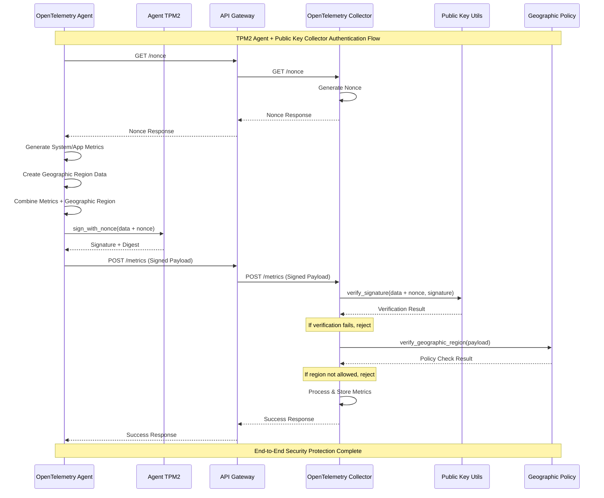

# OpenTelemetry‑Inspired Edge Architecture with TPM Security and Geofencing Proofs

A production‑friendly prototype microservice architecture for secure, verifiable metrics collection at the edge. It applies OpenTelemetry‑inspired observability patterns, TPM‑backed hardware security for the agent, and public‑key verification for the collector. The design provides hardware‑anchored trust with proof‑of‑residency and geofencing controls, delivering tamper‑resistant signatures and scalable, TPM‑resident cryptography. Built for distributed edge environments, it enforces Zero‑Trust principles and geographic compliance from the outset while supporting iterative development.

## Use Case: Edge Computing Telemetry

This architecture is specifically designed for **edge computing environments** where OpenTelemetry agents run on distributed edge nodes (IoT devices, edge servers, field deployments) and need to securely transmit telemetry data to centralized collectors. The system addresses key edge computing challenges:

- **Hardware Security**: TPM ensures cryptographic operations are hardware-backed, protecting against software-based attacks common in edge environments
- **Geographic Compliance**: Enforces data residency requirements critical for edge deployments across different regions and jurisdictions
- **Zero-Trust Security**: Eliminates the need for traditional network-based security, essential for edge nodes that may be in untrusted networks
- **Tamper-Resistant Signatures**: Provides cryptographically verifiable proof that telemetry data originated from authorized edge devices
- **Bandwidth Efficiency**: Optimized for edge-to-cloud communication with minimal overhead while maintaining security
- **Periodic Telemetry**: Designed for periodic data collection (every few minutes/hours) typical of edge environments, not continuous streaming
- **Scalable Crypto**: TPM resident keys scale efficiently across thousands of edge nodes without key management overhead

## Architecture

The system follows a microservices architecture with three main components:

```
┌─────────────────┐    HTTPS/TLS    ┌─────────────────┐    HTTPS/TLS    ┌─────────────────┐
│   OpenTelemetry │ ──────────────► │   API Gateway   │ ──────────────► │   OpenTelemetry │
│      Agent      │                 │                 │                 │    Collector    │
│   (Port 8442)   │                 │  (Port 8443)    │                 │   (Port 8444)   │
└─────────────────┘                 └─────────────────┘                 └─────────────────┘
         │                                   │                                   │
         │                                   │                                   │
         ▼                                   ▼                                   ▼
┌─────────────────┐                 ┌─────────────────┐                 ┌─────────────────┐
│   TPM2 Utils    │                 │   TLS Proxy     │                 │   Public Key    │
│   (Hardware/    │                 │   & Routing     │                 │   Verification  │
│   Software)     │                 │                 │                 │   (OpenSSL)     │
└─────────────────┘                 └─────────────────┘                 └─────────────────┘
```

### Complete Security Flow



### Security Features

1. **TPM2 Hardware/Software Security**: Agent uses TPM2 for all cryptographic operations
2. **Public Key Verification**: Collector uses OpenSSL-based public key verification
3. **Nonce-based Anti-Replay**: Unique tokens prevent replay attacks
4. **Geographic Region Verification**: Enforces data residency policies
5. **TLS/HTTPS Encryption**: All communications are encrypted
6. **API Gateway Security**: Centralized security and routing
7. **Signature Verification**: All data is cryptographically signed and verified

### Data Flow

1. **Agent Initialization**:
   - Agent starts with TPM2 context
   - Connects to API Gateway via HTTPS

2. **Authentication Phase**:
   - Agent requests nonce from Collector via Gateway
   - Collector generates and returns nonce

3. **Data Generation & Signing**:
   - Agent generates system/application metrics
   - Agent creates geographic region data
   - Agent combines metrics + geographic region
   - Agent signs combined data with nonce using TPM2

4. **Data Transmission**:
   - Agent sends signed payload to Gateway
   - Gateway forwards to Collector

5. **Verification & Processing**:
   - Collector verifies signature using public key verification
   - Collector validates geographic region against policy
   - Collector processes and stores metrics

### Key Security Components

- **TPM2 Utils**: Hardware-backed cryptographic operations for the agent
- **Public Key Utils**: OpenSSL-based signature verification for the collector
- **Shell Scripts**: `sign_app_message.sh` and `verify_app_message_signature.sh`
- **Geographic Policy**: Configurable region/state/city allowlists
- **Nonce Management**: Time-based unique tokens
- **Signature Algorithms**: SHA256/SHA384/SHA512 support

## API Schema & Data Flow Documentation

### JSON Schema for End-to-End Metric Flow

The complete data flow and API specifications are documented in a comprehensive JSON schema that defines all data structures, validation rules, and security requirements:

📋 **[Complete Metric Flow Schema](edge-ai/metric_flow_schema.json)**

The schema includes:

#### **🔧 Core Data Structures**
- **Metrics Data**: System and application metrics with service metadata
- **Geographic Region**: Location data for compliance verification
- **Signature Data**: TPM2 signature information with algorithm details
- **Service Information**: Service name, version, and instance identifiers

#### **🌐 API Endpoints**
- **`GET /nonce`**: Retrieve cryptographic nonce for signature generation
- **`POST /metrics/generate`**: Generate and send signed metrics
- **`POST /metrics`**: Receive and verify metrics from agents
- **`GET /health`**: Service health check endpoints
- **`GET /metrics/status`**: Processing status and statistics

#### **🔄 8-Step Flow Process**
1. **Nonce Request**: Agent requests nonce from collector
2. **Metrics Generation**: Generate system or application metrics
3. **Data Signing**: TPM2 signing with JSON serialization
4. **Payload Creation**: Combine all required fields
5. **Metrics Submission**: HTTPS/TLS transmission
6. **Signature Verification**: Public key verification
7. **Geographic Validation**: Region/state/city policy checks
8. **Metrics Processing**: Storage and processing

#### **🛡️ Security Specifications**
- **Transport Security**: HTTPS/TLS 1.2+ requirements
- **Signature Algorithms**: SHA-256/SHA-384/SHA-512 support
- **Nonce Management**: 5-minute expiration with anti-replay protection
- **Geographic Policy**: Configurable allowlists for data residency
- **TPM2 Requirements**: Hardware TPM2 for agent, public key verification for collector

#### **❌ Error Handling**
- **Validation Errors**: Missing fields, invalid types, expired nonces
- **Security Errors**: Signature verification failures, invalid nonces
- **Processing Errors**: TPM2 failures, verification failures

### Code References

Key implementation files referenced in the schema:

- **[Agent Metrics Generation](edge-ai/agent/app.py#L127-L169)**: `MetricsGenerator` class for system and application metrics
- **[Collector Metrics Processing](edge-ai/collector/app.py#L183-L348)**: `MetricsProcessor` class for validation and verification
- **[TPM2 Utilities](edge-ai/utils/tpm2_utils.py)**: Hardware-backed cryptographic operations
- **[Public Key Utilities](edge-ai/utils/public_key_utils.py)**: OpenSSL-based signature verification
- **[Configuration](edge-ai/config.py)**: Geographic region and security settings

## Geographic Region Security

### Overview

The system implements geographic region verification to ensure data compliance and residency requirements. This feature:

- **Enforces Geographic Policy**: Only accepts metrics from authorized regions/states/cities
- **Signed Geographic Data**: Geographic region information is cryptographically signed with TPM2
- **Separate from Metrics**: Geographic region is kept separate from metrics data but both are signed together
- **Configurable Policy**: Easy to configure allowed geographic areas via environment variables

### Geographic Region Structure

The geographic region is included in the payload as a separate field:

```json
{
  "metrics": {
    "timestamp": "2025-08-15T06:00:00Z",
    "metrics": {...},
    "service": {...}
  },
  "geographic_region": {
    "region": "US",
    "state": "California",
    "city": "Santa Clara"
  },
  "nonce": "...",
  "signature": "...",
  "digest": "...",
  "algorithm": "sha256",
  "timestamp": "..."
}
```

### Geographic Policy Enforcement

The collector verifies geographic regions against configured policies:

1. **Region Verification**: Checks if the region is in the allowed regions list
2. **State Verification**: Checks if the state is in the allowed states list (if specified)
3. **City Verification**: Checks if the city is in the allowed cities list (if specified)
4. **Signature Verification**: Ensures geographic region data is cryptographically signed
5. **Policy Rejection**: Metrics from unauthorized regions are rejected with appropriate error messages

### Geographic Region Configuration

Configure geographic regions and policies using environment variables:

```bash
# Agent Geographic Region (where the agent is located)
GEOGRAPHIC_REGION=US
GEOGRAPHIC_STATE=California
GEOGRAPHIC_CITY=Santa Clara

# Collector Geographic Policy (allowed regions)
ALLOWED_REGIONS=["US"]
ALLOWED_STATES=["California", "Texas", "New York"]
ALLOWED_CITIES=["Santa Clara", "San Francisco", "Austin", "New York"]
```

## Prerequisites

### System Requirements

- Python 3.11+
- Software TPM (swtpm) - no hardware TPM required
- TPM2 tools installed

### Software TPM (swtpm) Setup

Before running the microservices, ensure swtpm is properly configured with persistent keys:

```bash
# Install swtpm and TPM2 tools
sudo apt-get install swtpm swtpm-tools tpm2-tools

# Start software TPM and set up persistent keys
./swtpm.sh
./tpm-ek-ak-persist.sh
./tpm-app-persist.sh

# Verify swtpm is accessible
TPM2TOOLS_TCTI="swtpm:host=127.0.0.1,port=2321" tpm2_getcap properties-fixed

# Verify persistent handles
TPM2TOOLS_TCTI="swtpm:host=127.0.0.1,port=2321" tpm2 getcap handles-persistent
```

### Required TPM2 Context Files

The system requires the following TPM2 context files (already present in the repository):

- `app.ctx` - Application context for signing
- `primary.ctx` - Primary key context
- `ak.ctx` - Attestation key context
- `ek.ctx` - Endorsement key context

## Installation

1. **Clone the repository**:
   ```bash
   git clone <repository-url>
   cd edge-ai
   ```

2. **Install Python dependencies**:
   ```bash
   pip install -r requirements.txt
   ```

3. **Set up environment variables** (optional):
   ```bash
   cp .env.example .env
   # Edit .env with your configuration
   ```

## Usage

### Starting the Services

#### Using the Startup Script

```bash

# Start all microservices
python start_services.py
```

This will start:
- Collector on port 8444
- Gateway on port 8443  
- Agent on port 8442

#### Manual Service Startup

```bash
# First, start software TPM (swtpm)
python start_swtpm.py &

# Start Collector
SERVICE_NAME=opentelemetry-collector PORT=8444 python collector/app.py &

# Start Gateway
SERVICE_NAME=opentelemetry-gateway PORT=8443 python gateway/app.py &

# Start Agent
SERVICE_NAME=opentelemetry-agent PORT=8442 python agent/app.py &
```

## Testing the System

### Comprehensive Test Suite

The system includes a comprehensive test suite to verify all components:

#### 1. Configuration Test
```bash
python3 test_config.py
```
Tests configuration loading and environment variables.

#### 2. TPM Comprehensive Test
```bash
python3 test_tpm_comprehensive.py
```
Tests all TPM-related functionality:
- Python module imports
- TPM2 command-line tools
- Signing shell scripts
- Python TPM utilities

#### 3. Signature Flow Test
```bash
python3 test_signature_flow.py
```
Tests the complete signature generation and verification flow:
- Nonce retrieval
- Data signing with TPM2
- Payload creation
- End-to-end transmission

#### 4. Signature Verification Test
```bash
python3 test_signature_verification.py
```
Isolated test of signature verification process:
- TPM2 signing
- Public key verification
- Signature validation

#### 5. Complete Flow Test
```bash
python3 test_complete_flow.py
```
Tests the complete end-to-end architecture:
- Individual component health checks
- Complete agent → gateway → collector flow
- Metrics generation and transmission

#### 6. Summary Test
```bash
python3 test_summary.py
```
Provides a comprehensive overview of all test categories:
- Services health
- TPM2 basic operations
- Signing scripts
- Python imports and utilities
- End-to-end functionality

### Running All Tests

To run the complete test suite:

```bash
# Start services first
python3 start_services.py

# Run all tests
python3 test_config.py
python3 test_tpm_comprehensive.py
python3 test_signature_flow.py
python3 test_signature_verification.py
python3 test_complete_flow.py
python3 test_summary.py
```

### Test Results

All tests should pass with the following expected output:

```
✅ Configuration Test: PASS
✅ TPM Comprehensive Test: PASS
✅ Signature Flow Test: PASS
✅ Signature Verification Test: PASS
✅ Complete Flow Test: PASS
✅ Summary Test: PASS

🎉 ALL TESTS PASSED! System is working correctly.
```

### Testing Geographic Region Functionality

Test the geographic region verification and policy enforcement:

```bash
# Test with valid geographic region
curl -X POST https://localhost:8442/metrics/generate \
  -H "Content-Type: application/json" \
  -d '{"metric_type": "system"}' \
  --insecure

# The agent will automatically include geographic region information
# and the collector will verify it against the configured policy
```

To test geographic region policy enforcement, you can:

1. **Modify the agent's geographic region** in the environment variables
2. **Update the collector's allowed regions** to exclude the agent's region
3. **Verify that metrics are rejected** when geographic policy is violated

Example geographic region test:

```bash
# Set agent to a different region
export GEOGRAPHIC_REGION=EU
export GEOGRAPHIC_STATE=Unknown
export GEOGRAPHIC_CITY=Unknown

# Restart the agent
python agent/app.py &

# Try to send metrics (should be rejected)
curl -X POST https://localhost:8442/metrics/generate \
  -H "Content-Type: application/json" \
  -d '{"metric_type": "system"}' \
  --insecure

# Expected response: {"error": "Geographic region verification failed"}
```

### API Endpoints

#### Agent Endpoints (Port 8442)

- `GET /health` - Health check
- `POST /metrics/generate` - Generate and send metrics
- `GET /metrics/status` - Get agent status

#### Gateway Endpoints (Port 8443)

- `GET /health` - Health check
- `GET /nonce` - Get nonce (proxied to collector)
- `POST /metrics` - Send metrics (proxied to collector)
- `GET /gateway/status` - Gateway status
- `GET /gateway/rate-limits` - Rate limit information

#### Collector Endpoints (Port 8444)

- `GET /health` - Health check
- `GET /nonce` - Generate nonce
- `POST /metrics` - Receive and verify metrics (includes geographic region verification)
- `GET /metrics/status` - Collector status
- `POST /nonces/cleanup` - Clean up expired nonces

### Example API Usage

#### Generate and Send Metrics

```bash
# Generate system metrics (includes geographic region)
curl -X POST https://localhost:8442/metrics/generate \
  -H "Content-Type: application/json" \
  -d '{"metric_type": "system"}' \
  --insecure

# Generate application metrics with custom data
curl -X POST https://localhost:8442/metrics/generate \
  -H "Content-Type: application/json" \
  -d '{
    "metric_type": "application",
    "custom_data": {
      "user_id": "12345",
      "session_id": "abc123"
    }
  }' \
  --insecure
```

The agent automatically includes geographic region information in the payload:

```json
{
  "metrics": {
    "timestamp": "2025-08-15T06:00:00Z",
    "metrics": {
      "cpu_percent": 45.2,
      "memory_percent": 67.8,
      "disk_usage_percent": 23.1
    },
    "service": {
      "name": "opentelemetry-agent",
      "version": "1.0.0",
      "instance_id": "instance-001"
    }
  },
  "geographic_region": {
    "region": "US",
    "state": "California",
    "city": "Santa Clara"
  },
  "nonce": "abc123...",
  "signature": "def456...",
  "digest": "ghi789...",
  "algorithm": "sha256",
  "timestamp": "2025-08-15T06:00:00Z"
}
```

#### Check Service Health

```bash
# Check all services
curl https://localhost:8442/health --insecure
curl https://localhost:8443/health --insecure
curl https://localhost:8444/health --insecure
```

## Configuration

### Environment Variables

| Variable | Default | Description |
|----------|---------|-------------|
| `SERVICE_NAME` | `opentelemetry-service` | Service name |
| `PORT` | `5000` | Service port |
| `SSL_ENABLED` | `true` | Enable HTTPS |
| `TPM2_DEVICE` | `/dev/tpm0` | TPM2 device path (for hardware TPM) |
| `SWTPM_DIR` | `$HOME/.swtpm/ztpm` | Software TPM directory |
| `SWTPM_PORT` | `2321` | Software TPM server port |
| `SWTPM_CTRL` | `2322` | Software TPM control port |
| `TPM2TOOLS_TCTI` | `swtpm:host=127.0.0.1,port=2321` | TPM2 tools TCTI string |
| `OTEL_ENDPOINT` | `http://localhost:4317` | OpenTelemetry endpoint |
| `LOG_LEVEL` | `INFO` | Logging level |
| `NONCE_LENGTH` | `32` | Nonce length in bytes |
| `SIGNATURE_ALGORITHM` | `sha256` | TPM2 signature algorithm |
| `GEOGRAPHIC_REGION` | `US` | Agent's geographic region |
| `GEOGRAPHIC_STATE` | `California` | Agent's geographic state |
| `GEOGRAPHIC_CITY` | `Santa Clara` | Agent's geographic city |
| `ALLOWED_REGIONS` | `["US"]` | List of allowed regions for collector |
| `ALLOWED_STATES` | `["California", "Texas", "New York"]` | List of allowed states for collector |
| `ALLOWED_CITIES` | `["Santa Clara", "San Francisco", "Austin", "New York"]` | List of allowed cities for collector |
| `PUBLIC_KEY_PATH` | `appsk_pubkey.pem` | Path to the public key for verification |
| `VERIFY_SCRIPT_PATH` | `verify_app_message_signature.sh` | Path to the verification script |

### Configuration File

Create a `.env` file for environment-specific configuration:

```bash
# Service Configuration
SERVICE_NAME=opentelemetry-service
SERVICE_VERSION=1.0.0
DEBUG=false

# Server Configuration
HOST=0.0.0.0
PORT=5000

# SSL Configuration
SSL_ENABLED=true
SSL_CERT_PATH=/path/to/cert.pem
SSL_KEY_PATH=/path/to/key.pem

# TPM2 Configuration
TPM2_DEVICE=/dev/tpm0
TPM2_APP_CTX_PATH=app.ctx

# OpenTelemetry Configuration
OTEL_ENDPOINT=http://localhost:4317
OTEL_SERVICE_NAME=opentelemetry-service

# Security Configuration
NONCE_LENGTH=32
SIGNATURE_ALGORITHM=sha256

# Geographic Region Configuration
GEOGRAPHIC_REGION=US
GEOGRAPHIC_STATE=California
GEOGRAPHIC_CITY=Santa Clara

# Geographic Policy Configuration (for collector)
ALLOWED_REGIONS=["US"]
ALLOWED_STATES=["California", "Texas", "New York"]
ALLOWED_CITIES=["Santa Clara", "San Francisco", "Austin", "New York"]
```

## Security Considerations

### TPM2 Security (Agent)

- All cryptographic operations use software TPM (swtpm)
- Private keys never leave the TPM2 environment
- Signatures are TPM-backed and tamper-resistant
- Nonce-based authentication prevents replay attacks

### Public Key Verification (Collector)

- Collector uses OpenSSL-based public key verification
- Signature verification is performed using external shell scripts
- Public key is securely stored and verified
- Verification process is isolated and secure

### Geographic Region Security

- Geographic region information is cryptographically signed with TPM2
- Geographic policy enforcement prevents data from unauthorized regions
- Geographic region is separate from metrics but both are signed together
- Configurable geographic policies for compliance and data residency
- Geographic verification happens after signature verification for security

### Network Security

- All communications use HTTPS/TLS
- Self-signed certificates for development (use proper CA for production)
- Rate limiting prevents abuse
- Request validation and sanitization

### Production Deployment

For production deployment, consider:

1. **Proper SSL Certificates**: Replace self-signed certificates with CA-signed certificates
2. **Database Storage**: Replace in-memory storage with persistent database
3. **Load Balancing**: Add load balancers for high availability
4. **Monitoring**: Add comprehensive monitoring and alerting
5. **Backup**: Implement regular backup of TPM2 contexts and certificates
6. **Access Control**: Implement proper authentication and authorization
7. **Geographic Compliance**: Configure geographic policies for data residency requirements
8. **Geographic Monitoring**: Monitor and alert on geographic policy violations

## Troubleshooting

### Common Issues

#### Software TPM (swtpm) Not Found

```bash
# Check if swtpm is installed
swtpm --version

# Check if swtpm is running
ps aux | grep swtpm

# Test swtpm access
TPM2TOOLS_TCTI="swtpm:host=127.0.0.1,port=2321" tpm2_getcap properties-fixed

# Check persistent handles
TPM2TOOLS_TCTI="swtpm:host=127.0.0.1,port=2321" tpm2 getcap handles-persistent

# Start swtpm with persistent keys if not running
python start_swtpm.py
```

#### Public Key Verification Issues

```bash
# Check if public key exists
ls -la appsk_pubkey.pem

# Regenerate public key if needed
./get_public_key_app.sh

# Test verification script
echo "test message" > appsig_info.bin
./sign_app_message.sh
./verify_app_message_signature.sh
```

#### Service Connection Issues

```bash
# Check service ports
netstat -tlnp | grep :844

# Check service logs
tail -f logs/*.log

# Test service health
curl https://localhost:8442/health --insecure
curl https://localhost:8443/health --insecure
curl https://localhost:8444/health --insecure
```

#### Test Failures

```bash
# Run individual tests to isolate issues
python3 test_config.py
python3 test_tpm_comprehensive.py
python3 test_signature_flow.py
python3 test_signature_verification.py
python3 test_complete_flow.py
python3 test_summary.py

# Check for specific error messages
grep -i "error" logs/*.log
```

### Logging

The system uses structured logging with JSON format. Log levels can be controlled via the `LOG_LEVEL` environment variable.

### Performance Tuning

- Adjust rate limiting parameters in the gateway
- Configure TPM2 timeout values
- Optimize OpenTelemetry batch processing
- Monitor memory usage and adjust accordingly

## Development

### Project Structure

```
├── agent/                 # OpenTelemetry Agent microservice
│   └── app.py            # Includes geographic region in metrics payload
├── collector/             # OpenTelemetry Collector microservice
│   └── app.py            # Includes geographic region verification
├── gateway/               # API Gateway microservice
│   └── app.py
├── utils/                 # Shared utilities
│   ├── __init__.py
│   ├── tpm2_utils.py      # TPM2 operations (uses shell scripts)
│   ├── public_key_utils.py # Public key verification utilities
│   └── ssl_utils.py       # SSL/TLS utilities
├── config.py              # Configuration management (includes geographic settings)
├── start_services.py      # Service startup script
├── start_swtpm.py         # Software TPM startup script
├── sign_app_message.sh    # TPM2 signing script
├── verify_app_message_signature.sh # TPM2 verification script
├── generate_verify_app_quote.sh # TPM2 quote generation and verification
├── get_public_key_app.sh  # Public key export script
├── test_config.py         # Configuration test
├── test_tpm_comprehensive.py # Comprehensive TPM test
├── test_signature_flow.py # Signature flow test
├── test_signature_verification.py # Signature verification test
├── test_complete_flow.py  # Complete end-to-end test
├── test_summary.py        # Test summary
├── requirements.txt       # Python dependencies
└── README.md              # This file
```

### Adding New Features

1. **New Metrics Types**: Extend `MetricsGenerator` class in `agent/app.py`
2. **Additional Security**: Enhance `SecurityManager` in `gateway/app.py`
3. **Custom Processors**: Add new processors in `collector/app.py`
4. **New Endpoints**: Add Flask routes to respective services
5. **Geographic Policies**: Modify geographic region policies in `config.py` and environment variables
6. **Custom Geographic Verification**: Extend geographic verification logic in `collector/app.py`

### Testing

```bash
# Run unit tests
python -m pytest tests/

# Run integration tests
python test_client.py

# Run load tests
python load_test.py
```

## Contributing

1. Fork the repository
2. Create a feature branch
3. Make your changes
4. Add tests for new functionality
5. Ensure all tests pass
6. Submit a pull request

## License

This project is licensed under the MIT License - see the LICENSE file for details.

## Support

For support and questions:

1. Check the troubleshooting section
2. Review the logs for error messages
3. Open an issue on GitHub
4. Contact the development team

## Acknowledgments

- OpenTelemetry project for the telemetry framework
- TPM2 Software Stack for hardware security integration
- Flask framework for the web services
