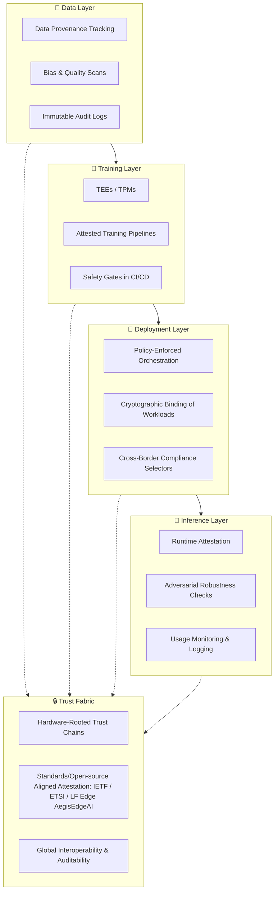

# **AI infrastructure rethinking for safety - work in progress**

---

## 🔧 Why Infrastructure Matters for AI Safety
- **Current State**: AI safety is often treated as a *policy overlay* or *model-level patch* (red-teaming, evals, guidelines).  
- **Problem**: Without infrastructure-level guarantees, safety controls are brittle, non-portable, and hard to audit.  
- **Opportunity**: Rethinking AI infrastructure means embedding **safety primitives** into the compute, networking, and orchestration stack itself — so governance is enforceable, not optional.  

---

## 🏗️ Pillars of a Safety-Centric AI Infrastructure
1. **Hardware-Rooted Trust Chains**  
   - Secure enclaves, TPM/TEE-backed attestations, TPMs, and confidential computing.  
   - Ensures workloads (training, inference, fine-tuning) run only in *measured, attested environments*.  

2. **Policy-Enforced Orchestration**  
   - Kubernetes/VM schedulers extended with **attestation selectors** and **cryptographic bindings**.  
   - Guarantees that only compliant workloads (e.g., safety-evaluated models) are deployed.  

3. **Data & Model Sovereignty Controls**  
   - Provenance tracking (who trained what, on which data, under which conditions).  
   - Immutable audit trails (blockchain/DLT or regulator-friendly logs).  

4. **Cross-Border Interoperability**  
   - Standards-aligned attestation flows (IETF RATS, ETSI, LF Edge).  
   - Enables regulators in different jurisdictions to verify compliance without re-inventing trust anchors.  

5. **Safety-by-Default Pipelines**  
   - Embedding safety checks (bias scans, adversarial robustness tests, red-team harnesses) into CI/CD for AI.  
   - Infrastructure enforces that a model cannot be promoted to production unless safety gates are passed.  

---

## 🌍 Strategic Narrative for Regulators & Executives
- **Regulators**: “AI safety cannot be audited into existence — it must be *attested* at the infrastructure level. By embedding cryptographic trust anchors into AI pipelines, we make safety measurable, reproducible, and enforceable.”  
- **Executives**: “Safety infrastructure is not a compliance tax — it’s a market differentiator. Customers and regulators will trust AI services that can prove, not just claim, their safety posture.”  

---

## 🚀 Next Step
We could sketch a **reference architecture diagram**:  
- Left: *AI lifecycle stages* (data, training, deployment, inference).  
- Right: *Safety primitives* (attestation, provenance, audit, policy enforcement).  
- Center: *Trust fabric* binding them together.  

