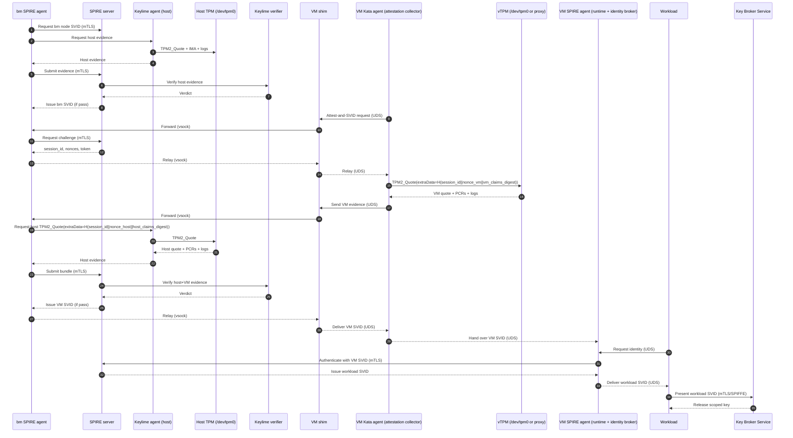

# Unified workload identity - End-to-end flow with three rings and communication mechanisms - work in progress

This proposal advances zero‑trust attestation by introducing a three‑ring trust architecture, a novel role inversion between kata and SPIRE agents, and a fully explicit comms/device mapping. Together, these yield a regulator‑ready, reproducible, and extensible framework for sovereign AI and confidential workloads.

# Terminology

- **BM**: Bare-metal, referring to the physical host machine (as opposed to a virtual machine).
- **VM**: Virtual Machine, an isolated guest environment running on a host (bare-metal or cloud).
- **vTPM**: Virtual Trusted Platform Module, a software-emulated TPM device presented to a VM.
- **SVID**: SPIFFE Verifiable Identity Document, an identity document (X.509 certificate or JWT) issued by SPIRE.
- **SPIRE**: SPIFFE Runtime Environment, a system for issuing and managing SVIDs.
- **IMA**: Integrity Measurement Architecture, a Linux subsystem for runtime measurement of files and binaries.
- **Keylime**: A remote attestation framework that uses TPM and IMA for host integrity verification.
- **KBS**: Key Broker Service, a service that releases cryptographic keys to attested workloads based on their identity.
- **BM SPIRE agent**: Bare-metal SPIRE agent running on the host machine, responsible for attesting the physical host and relaying evidence.
- **VM SPIRE agent**: SPIRE agent running inside the VM, responsible for issuing workload SVIDs to applications within the VM.
- **SPIRE server**: The central server that issues SVIDs (SPIFFE Verifiable Identity Documents) based on attestation evidence.
- **Keylime agent**: Agent running on the host to collect TPM quotes and IMA measurements for attestation.
- **Keylime verifier**: Service that verifies TPM/IMA evidence from the Keylime agent.
- **Host TPM**: The physical TPM device on the host, typically accessible at `/dev/tpm0`.
- **VM Kata agent**: Agent inside the VM (e.g., Kata Containers agent) responsible for VM attestation and relaying evidence.
- **VM shim**: Lightweight process in the VM that mediates communication between the VM Kata agent and the host.
- **Workload**: Application or process running inside the VM that requests workload identity.
- **mTLS**: Mutual TLS, used for secure and authenticated communication between components.
- **UDS**: Unix Domain Socket, used for local inter-process communication.
- **vsock**: Virtual socket, used for communication between VMs and hosts.

# Architecture overview
This architecture unifies the outermost ring (BM SPIRE agent SVID), outer ring (VM attestation and VM SVID), and inner ring (workload identity and KBS release), with explicit transport and device access at each step.

## Summary of Novelties

This proposal introduces several innovations beyond conventional SPIRE/Keylime deployments:

### Three-Ring Trust Model
- **Outermost ring (BM SVID):** Bare-metal SPIRE agent itself is attested and issued an SVID, anchored in host TPM + IMA evidence.
- **Outer ring (VM SVID):** VM attestation fuses vTPM quotes with host TPM quotes in a single session, ensuring replay protection and launch binding.
- **Inner ring (workload SVID):** Workload SVIDs are issued only if the VM SVID is valid, and KBS secrets are released only to workloads with valid workload SVIDs.

### Role Inversion for Clarity
- **VM Kata agent:** Dedicated to attestation collection (vTPM quotes, vm_claims_digest, evidence relay).
- **VM SPIRE agent:** Repurposed as the container runtime and identity broker, consuming the VM SVID and issuing workload SVIDs.
- This separation of duties simplifies auditability and allows attestation logic to evolve independently of workload lifecycle management.

### Explicit Comms and Device Paths
- **UDS** inside the VM (workload ↔ Kata agent, Kata agent ↔ VM SPIRE agent)
- **vsock** between VM shim and BM SPIRE agent
- **mTLS** for all SPIRE server, Keylime verifier, and KBS interactions
- **TPM device access:** `/dev/tpm0` for vTPM inside VM and physical TPM on host
- This explicit mapping ensures reproducibility and regulator-ready clarity.

### Nonce-Anchored Freshness and Fusion
- Server-issued `session_id`, `nonce_host`, and `nonce_vm` are cryptographically bound into both host and VM quotes.
- Evidence is fused at the BM SPIRE agent, signed, and verified as a single bundle, preventing replay or split-verdict attacks.

### Policy-Driven Selectors and Key Scoping
- VM SVIDs are tied to fused selectors (host AK, VM AK, PCRs, VM image, sandbox config).
- Workload SVIDs inherit trust from VM SVIDs.
- KBS keys are released only to workloads with valid workload SVIDs, scoped for one-time use and short TTL.

---

## Outermost ring: Bare-metal SPIRE agent SVID

### Phase 0: Host attestation and BM SVID issuance
- **Initiate:** BM SPIRE agent requests its node SVID from SPIRE server.
- **Comms:** mTLS (BM SPIRE agent ↔ SPIRE server).
- **Evidence:** Host TPM quote via Keylime agent, IMA runtime measurements, optional GPU/geolocation plugins.
- **TPM access:** `/dev/tpm0` (host physical TPM via TIS/CRB).
- **Result:** BM SPIRE agent receives a short‑TTL SVID and uses it to authenticate subsequent VM evidence relays.

---

## Outer ring: VM attestation and VM SVID

### Phase 1: Challenge issuance (server-anchored nonces)
- **Request:** VM Kata agent initiates “attest‑and‑SVID”.
- **Comms:** UDS (workload ↔ VM Kata agent), UDS (VM Kata agent ↔ VM shim), vsock (VM shim ↔ BM SPIRE agent), mTLS (BM SPIRE agent ↔ SPIRE server).
- **Server action:** SPIRE server issues `session_id`, `nonce_host`, `nonce_vm`, `expires_at`, and a signed challenge token.
- **Return path:** mTLS (server→BM), vsock (BM→shim), UDS (shim→VM Kata agent).

### Phase 2: VM quote (vTPM)
- **Compute:** vm_claims_digest over VM measured boot claims (PCRs, VMID, image digest, kata sandbox config hash).
- **Quote:** `TPM2_Quote` with `extraData = H(session_id || nonce_vm || vm_claims_digest)`.
- **TPM access:** `/dev/tpm0` inside VM (vTPM TIS/CRB) or TPM proxy socket.
- **Comms:** UDS (VM Kata agent → VM shim), vsock (VM shim → BM SPIRE agent).
- **Evidence:** VM quote, AK pub, PCRs, event logs, vm_claims_digest, VM metadata.

### Phase 3: Host quote (physical TPM via Keylime)
- **Request:** BM SPIRE agent asks Keylime agent for host quote.
- **Quote:** `TPM2_Quote` with `extraData = H(session_id || nonce_host || host_claims_digest)`.
- **TPM access:** `/dev/tpm0` (host physical TPM).
- **Comms:** local RPC or mTLS (BM SPIRE agent ↔ Keylime agent).
- **Evidence:** Host quote, AK/EK chain, PCRs, IMA allowlist, event logs, host_claims_digest.

### Phase 4: Evidence bundling and verification
- **Bundle:** BM SPIRE agent aggregates VM evidence + host evidence + server challenge token and signs the bundle.
- **Comms:** mTLS (BM SPIRE agent → SPIRE server), mTLS (SPIRE server ↔ Keylime verifier).
- **Verify:** Keylime verifier checks EK/AK chains, PCR profiles, IMA allowlists, event logs, nonce bindings, and shared session_id.
- **Consume nonces:** SPIRE server marks nonces used.
- **Result:** If both host and VM pass, SPIRE server issues VM SVID (short TTL, fused selectors: host AK hash, VM AK hash, PCRs, VM image, sandbox config).
- **Delivery:** mTLS (server→BM), vsock (BM→shim), UDS (shim→VM kata agent).

---

## Inner ring: Workload identity and key release

### Phase 5: Workload SVID issuance
- **Request:** Workload asks VM SPIRE agent for identity.
- **Comms:** UDS (workload ↔ VM SPIRE agent), mTLS (VM SPIRE agent ↔ SPIRE server using VM SVID).
- **Selectors:** VM SPIRE agent collects workload selectors (UID, cgroup, labels).
- **Result:** SPIRE server issues workload SVID (short TTL). Delivered via UDS to workload.

### Phase 6: KBS key release
- **Request:** Workload presents workload SVID to KBS.
- **Comms:** mTLS with SPIFFE bundle (workload ↔ KBS).
- **Policy:** KBS validates SPIFFE ID, selectors, TTL, and trust roots.
- **Result:** KBS releases scoped key (one‑time unwrap, short TTL) for workload cryptographic operations.

---

## Full mermaid diagram with comms and rings

