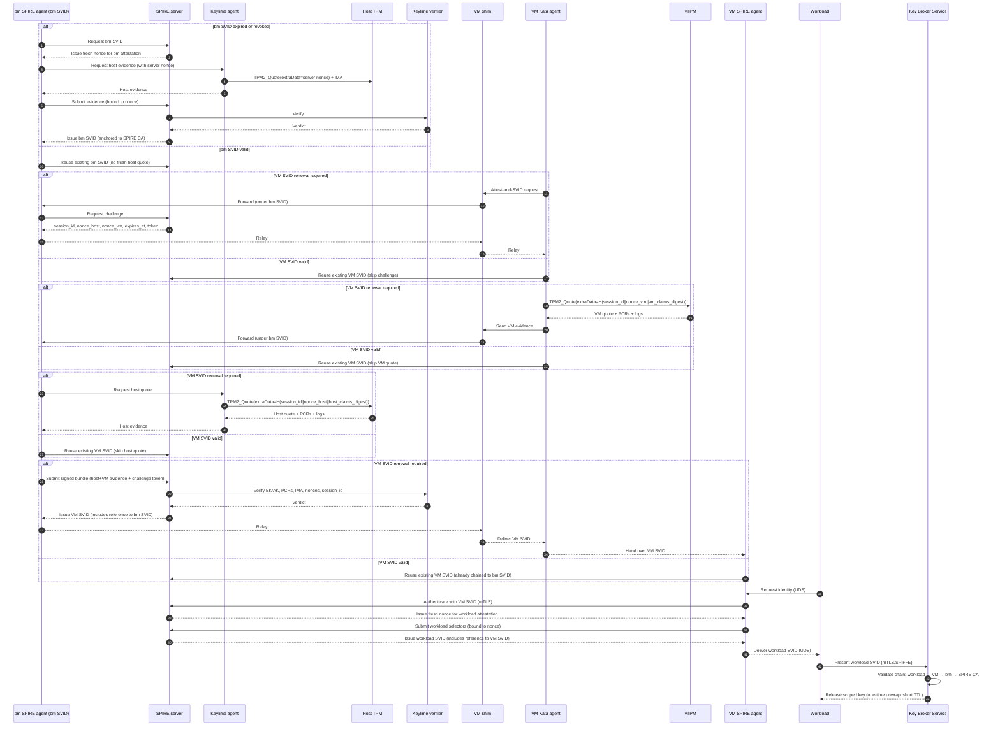

# Unified workload identity - End-to-end flow with three rings and communication mechanisms - work in progress

This architecture advances zero‑trust attestation by unifying a three‑ring trust model spanning the host layer, the virtual machine layer, and the workload layer; and mapping all communications and device paths explicitly (UDS, vsock, mTLS, TPM access). It strengthens the chain of custody by ensuring that all mTLS private keys are non‑exportable and resident in TPM or vTPM hardware roots of trust, so attestation evidence and operational identities are inseparably bound to the same silicon.

To address weaknesses in bearer and proof‑of‑possession tokens, it introduces Proof of Residency (PoR) — binding workload identity with host hardware identity and policy — and Proof of Geofencing (PoG) — extending PoR with GNSS or mobile sensor evidence to prove location.

Finally, it enforces a Trust Chain and Cryptographic Inheritance:
- Host‑level SVIDs anchored to the SPIRE CA,
- Virtual machine–level SVIDs referencing host‑level SVIDs,
- Workload‑level SVIDs referencing virtual machine–level SVIDs,
- and the Key Broker Service enforcing the full chain before key release.

Together, these novelties yield a regulator‑ready, reproducible, and extensible framework for sovereign AI and confidential workloads.

## Terminology

- **BM**: Bare-metal, referring to the physical host machine (as opposed to a virtual machine).
- **VM**: Virtual Machine, an isolated guest environment running on a host (bare-metal or cloud).
- **vTPM**: Virtual Trusted Platform Module, a software-emulated TPM device presented to a VM.
- **SVID**: SPIFFE Verifiable Identity Document, an identity document (X.509 certificate or JWT) issued by SPIRE.
- **SPIRE**: SPIFFE Runtime Environment, a system for issuing and managing SVIDs.
- **IMA**: Integrity Measurement Architecture, a Linux subsystem for runtime measurement of files and binaries.
- **Keylime**: A remote attestation framework that uses TPM and IMA for host integrity verification.
- **KBS**: Key Broker Service, a service that releases cryptographic keys to attested workloads based on their identity.
- **BM SPIRE agent**: Bare-metal SPIRE agent running on the host machine, responsible for attesting the physical host and relaying evidence.
- **VM SPIRE agent**: SPIRE agent running inside the VM, responsible for issuing workload SVIDs to applications within the VM.
- **SPIRE server**: The central server that issues SVIDs (SPIFFE Verifiable Identity Documents) based on attestation evidence.
- **Keylime agent**: Agent running on the host to collect TPM quotes and IMA measurements for attestation.
- **Keylime verifier**: Service that verifies TPM/IMA evidence from the Keylime agent.
- **Host TPM**: The physical TPM device on the host, typically accessible at `/dev/tpm0`.
- **VM Kata agent**: Agent inside the VM (e.g., Kata Containers agent) responsible for VM attestation and relaying evidence.
- **VM shim**: Lightweight process in the VM that mediates communication between the VM Kata agent and the host.
- **Workload**: Application or process running inside the VM that requests workload identity.
- **mTLS**: Mutual TLS, used for secure and authenticated communication between components.
- **UDS**: Unix Domain Socket, used for local inter-process communication.
- **vsock**: Virtual socket, used for communication between VMs and hosts.

## Architecture overview
This architecture unifies the outermost ring (BM SPIRE agent SVID), outer ring (VM attestation and VM SVID), and inner ring (workload identity and KBS release), with explicit transport, device access, and **TPM/vTPM‑resident mTLS keys** at each step.

### Summary of Novelties

#### Three-Ring Trust Model
- **Outermost ring (BM SVID):** Bare‑metal SPIRE agent itself is attested and issued an SVID, anchored in host TPM + IMA evidence including geo-location if available. Its **mTLS private key is resident in the physical TPM** (via the SPIRE TPM plugin).
- **Outer ring (VM SVID):** The **VM SPIRE agent (Kata agent is collapsed into VM SPIRE agent) use vTPM‑resident keys for mTLS** to connect to the SPIRE server. VM svid is issued only BM svid is valid.
- **Inner ring (workload SVID):** Workload SVID issuance is authenticated by the VM SPIRE agent. Workload SVIDs are issued only if the VM SVID is valid, and KBS secrets are released only to workloads with valid workload SVIDs.

#### Explicit Comms and Device Paths
- **UDS** inside the VM (workload ↔ VM SPIRE agent; VM SPIRE agent ↔ VM shim)
- **vsock** between VM shim and BM SPIRE agent
- **mTLS** for all SPIRE server, Keylime verifier, and KBS interactions, with **private keys anchored in TPM/vTPM**
- **TPM device access:** `/dev/tpm0` for vTPM inside VM and physical TPM on host

#### Trust Chain and Cryptographic Inheritance
- BM SVID → Root: Issued after host attestation, anchored to SPIRE CA, **signed with a physical TPM‑resident key**.
- VM SVID → BM SVID: Issued only if BM SVID is valid; includes a reference to the BM SVID, binding VM identity to its attested host. **VM SPIRE agent authenticates with a vTPM‑resident key.**
- Workload SVID → VM SVID: Issued only if VM SVID is valid; includes a reference to the VM SVID, creating a transitive link back to the BM SVID. **Workload SVID requests are authenticated with the VM SPIRE agent’s vTPM key.**
- KBS enforcement: Validates the full chain before releasing scoped keys, ensuring that every workload secret is cryptographically rooted in host attestation.

#### Residency and Geofencing Proofs
- **Proof of Residency (PoR)**: Workload certificates cryptographically bind workload identity (e.g., executable code hash) with approved host hardware identity (TPM PKI key, kernel version, platform policy), eliminating reliance on bearer or proof‑of‑possession tokens.
- **Proof of Geofencing (PoG)**: Extends PoR by incorporating host location hardware identity (GNSS, mobile modem, or proximity sensor) to generate geofencing‑anchored workload credentials, providing verifiable enforcement that workloads execute only on approved hosts in approved regions.

---

## 📖 End‑to‑End Phases (with TPM/vTPM‑resident keys)

### Outermost ring: Bare‑metal SPIRE agent SVID  

**Phase 0: Host attestation and BM SVID issuance**  
- **Initiate:** BM SPIRE agent requests its node SVID from SPIRE server.  
- **Comms:** mTLS (BM SPIRE agent ↔ SPIRE server) using a **private key generated and sealed in the physical TPM**.  
- **Server action:** SPIRE server issues a fresh nonce for BM attestation.  
- **Evidence:** BM SPIRE agent asks Keylime agent to produce a TPM quote with that nonce in `extraData`, plus IMA runtime measurements and optional GPU/geolocation plugins.  
- **TPM access:** `/dev/tpm0` (host physical TPM).  
- **Verification:** Keylime verifier validates EK/AK chain, PCRs, IMA allowlist, event logs, and nonce binding.  
- **Result:**  
  - If BM SVID expired/revoked: Full host attestation, new BM SVID issued.  
  - If BM SVID valid: Reuse existing BM SVID; no fresh host quote required.  
- **Chain:** BM SVID is anchored to SPIRE CA and becomes the parent reference for VM SVIDs.  

---

### Outer ring: VM attestation and VM SVID  

**Phase 1: VM Host attestation and VM SVID issuance**  
- **Request:** VM Spire agent initiates “attest‑and‑SVID”.  
- **Comms:** UDS (VM spire agent ↔ VM shim), vsock (VM shim ↔ BM SPIRE agent), mTLS (BM SPIRE agent ↔ SPIRE server).
- **Server action:** SPIRE server issues `session_id`, `nonce_vm`, `expires_at`, and a signed challenge token.  
- **TPM access:** `/dev/tpm0` inside VM (vTPM).  
- **Evidence:** VM quote, AK pub, PCRs, event logs, `vm_claims_digest`, VM metadata.  
- **Result:**  
  - If VM SVID expired/revoked: Full challenge/nonce exchange is triggered.  
  - If VM SVID valid: Skip challenge; reuse existing VM SVID.  
- **Chain:** Challenge is authenticated under BM SVID, binding VM SVID issuance to the host’s attested identity.  

---

### Inner ring: Workload identity and key release  

**Phase 2: Workload SVID issuance**  
- **Request:** Workload asks VM SPIRE agent for identity.  
- **Comms:** UDS (workload ↔ VM SPIRE agent), mTLS (VM SPIRE agent ↔ SPIRE server using a **vTPM‑resident key**).  
- **Server action:** SPIRE server issues a fresh nonce for workload attestation.  
- **Selectors:** VM SPIRE agent collects workload selectors (UID, cgroup, labels) and binds the nonce into the request.  
- **Result:** SPIRE server issues workload SVID (short TTL), **including a reference to the VM SVID**.
- **Chain:** Workload SVID → VM SVID → BM SVID → SPIRE CA.

## ✅ End‑to‑End Mermaid Sequence Diagram (Phases 0–6, with chain references)

## System requirements

Systems where this architecture can be implemented include:
- **Host OS:** Linux with TPM 2.0 support, IMA enabled, and Keylime installed.

## System bootstrap - control plane
Complete end‑to‑end trusted control‑plane bootstrap where the operator manifest is persisted immediately to TPM‑sealed local files on the three bootstrap bare‑metal hosts with Keylime and Spire, later migrated into Ceph as canonical archive. Includes exact ordering, artifacts, validation, failure handling, and go‑live checks.

### Assumptions
- Three bootstrap bare‑metal hosts (physically separated racks/AZs) with TPM, measured boot, IMA.  
- Operator signing keys available in HSM or multi‑custody YubiKeys.  
- SPIRE agent and Keylime agent installed in images.  
- Ceph, Kubernetes and other services will be provisioned later as described.  
- Replicated append log running on bootstrap trio for WAL replication.

### High level artifact model (before Ceph)
- **Operator manifest file**: /var/lib/verification/operator/manifest.json (signed by operator HSM/YubiKey).  
- **TPM seal wrapper**: /var/lib/verification/operator/manifest.sealed (key to decrypt sealed copy bound to PCRs).  
- **Local verification index**: /var/lib/verification/index.json {manifest_sha256, manifest_sig, stored_ts, host_id}.  
- **Replicated WAL entry**: logs/wal/events containing the manifest metadata and operator signature; 2/3 commit required.  
- **Air‑gapped custody media**: encrypted USB with canonical manifest copy under dual custody.

### End‑to‑end bootstrap sequence

#### Phase A Operator signing and manifest sealing on trio
1. Operator prepares manifest  
   - Create canonical JSON: fields include expected PCRs, IMA hashes, registrar policy, operator custodians, manifest_version, and timestamp.  
   - Sign manifest using HSM (recommended) or quorum of YubiKeys producing operator_signature.

2. Persist signed manifest to each bootstrap host (atomic, sealed)  
   - Copy signed manifest to each host: /var/lib/verification/operator/manifest.json.  
   - Seal a symmetric encryption key or the manifest into the host TPM tied to the expected PCR set and measured‑boot image, producing manifest.sealed.  
   - Overwrite the clear copy only after seal success; ensure only manifest.sealed remains readable by authorized processes.

3. Record local index and WAL event with 2/3 replication requirement  
   - Compute sha256(manifest) and write /var/lib/verification/index.json with manifest_sha256, manifest_sig, stored_ts, host_id. Fsync index.  
   - Append a WAL event {type: "operator-manifest", host_id, manifest_sha256, operator_signature, ts} to the replicated append log and wait for 2/3 commit ack -- leaderless push replication model for each host.
   - Verify WAL commit on each host and persist WAL segment with immutable flag locally.

4. Air‑gapped custody copy for recovery  
   - Store the signed manifest on encrypted media held by operator custodians under dual custody; record custody IDs and timestamp in WAL.

Validation checks after Phase A
- On each host verify: TPM unseal succeeds only under expected PCR values; manifest signature verifies against operator public key; WAL event present and 2/3 committed.

#### Phase B Keylime registrar, verifier and log nucleus
5. Start Keylime registrar and verifier on bootstrap trio  
   - Deploy registrar/verifier using operator policy and the local sealed manifest as authoritative bootstrap policy. Persist registrar startup logs into WAL.

6. Start replicated append log agents (if not already running)  
   - Ensure replication health: 2/3 commit latency within SLO, segment archival working, and local indices match WAL.

7. Collect and persist per‑host Keylime verification bundles  
   - Run Keylime verifier to collect each host bundle; write attestation/<host>.bundle.json locally and append a signed WAL event for each bundle.

8. Start SPIRE servers on bootstrap trio using Keylime bundles as bootstrap identity  
   - Boot SPIRE servers pointing to local Keylime bundles; persist spire/server/bootstrap/<host>.json into WAL. Servers run without Node SVIDs but use Keylime validation for agent enrollment. Verify the SPIRE binary using the TPM by measuring its file hashes into the platform measurement chain and using a TPM quote of PCRs tied to those measurements; the TPM quote is verified by Keylime verifier.

9. SPIRE agents on bootstrap hosts obtain Node SVIDs  
   - Start SPIRE agents on bootstrap hosts; agents present Keylime bundles and receive Node SVIDs. Persist spire/issuance/<node>.log into WAL and index.

Validation checks after Phase B
- Keylime bundles present on all three hosts and WAL entries confirmed; SPIRE server started and at least one agent issuance completed and logged.

#### Phase C Provision Ceph and Kubernetes trios (SVID‑driven joins)
10. Provision Ceph hosts and collect Keylime bundles  
    - PXE install Ceph trio hosts; collect and append per‑host Keylime bundles to WAL.

11. SPIRE agents on Ceph hosts obtain Node SVIDs and persist issuance logs  
    - Agents present Keylime bundles to SPIRE and receive Node SVIDs. Persist spire/issuance/<node>.log to WAL.

12. Start Ceph MONs/OSDs in staging mode  
    - Start Ceph daemons but keep membership enforcement gated; seal Ceph encryption keys to TPM on Ceph hosts and record key seals in WAL.

13. Provision Kubernetes hosts, start SPIRE agents and issue Node/runtime SVIDs  
    - Persist issuance events to WAL; kubelets wait to join full cluster until SVID verification confirmed.

Validation checks after Phase C
- All Ceph and K8s hosts show valid Keylime bundles and spire issuance logs in WAL; Ceph key seals recorded; services in staging mode.

### Phase D — Long‑term log persistence to Ceph

Purpose
* Move replicated WAL segments, Keylime verification bundles, SPIRE issuance logs, signer attestations, and other audit artifacts from the bootstrap hosts into Ceph so there is a single canonical, immutable archive for long‑term retention and auditor access.

When to run the migration
- Only start after Ceph cluster health is OK (MON quorum, OSDs in service).
- Verify network paths from each bootstrap host to Ceph are functional and performant.
- Ensure WAL replication on the bootstrap trio has no outstanding uncommitted segments.
- Record the migration start event in the WAL before moving data.

What to persist (minimal set)
- Finalized WAL segments and segment trailers, including checksums and producer aggregate signatures.
- Operator manifest and its TPM seal metadata: `manifest.json` and `manifest.sealed`.
- Keylime verification bundles: `attestation/<host>.bundle.json`.
- SPIRE server bootstrap records and `spire/issuance/<node>.log` entries.
- Signer public key, signer attestation bundles, and HSM/TSS audit exports.
- Anchor drafts / signed root artifacts and any per‑artifact manifests or proofs produced so far.

### Common questions/concerns and how to address them
Signer and operator key custody risk
* HSM is strongly recommended for the signer and operator key custody; treat YubiKey quorum as temporary.

Bootstrap trio concentration of critical roles
* The bootstrap‑trio concentration is real but manageable; you can reduce risk by minimizing co‑located services and enforcing strict resource, network, and process isolation. For example, spire server can run in 3 separate bare metal hosts, Keylime verifier/registrar in another 3 bare metal hosts.

Bootstrap trio - WAL replication stalls blocking progress
* 2/3 quorum is a consistency choice, not a bug; add explicit degraded‑mode rules, timeouts, and operator‑gated fallbacks so availability problems don’t silently stall the bootstrap.

Time and canonical ordering ambiguity
* Using a single trusted NTP source helps, but you still need explicit canonical ordering rules (sequence number, local monotonic clock etc.), ntp_offset capture, and monotonic time strategies to avoid nondeterminism.

Manifest drift and host divergence risk
* Manifest rotation risk means an operator‑mistake can create mismatched manifests across hosts or an unsealable state; eliminate the risk with scripted, auditable rotation, automated preflight checks, multisig approval, and rollback paths.

## System bootstrap - data plane - summary
* Keylime performs TPM/IMA host attestation. This optionally includes Geolocation sensor details along with Geolocation data.
* SPIRE agent is bootstrapped from that attestation (no Spire bearer token required if you use Keylime‑based attestation), and
* Kubernetes kubelet and Containerd gets SPIRE SVID (no Kubernetes bearer token required if you use SPIRE‑based node attestation), and
* Kubernetes workload gets SPIRE SVIDs (reducing reliance on static k8s bearer tokens)
