# Unified workload identity - End-to-end flow with three rings and communication mechanisms - work in progress

This architecture advances zero‑trust attestation by unifying a three‑ring trust model spanning the host layer, the virtual machine layer, and the workload layer; introducing a role inversion between Kata and SPIRE agents for clearer auditability; and mapping all communications and device paths explicitly (UDS, vsock, mTLS, TPM access). It strengthens the chain of custody by ensuring that all mTLS private keys are non‑exportable and resident in TPM or vTPM hardware roots of trust, so attestation evidence and operational identities are inseparably bound to the same silicon.

To address weaknesses in bearer and proof‑of‑possession tokens, it introduces Proof of Residency (PoR) — binding workload identity with host hardware identity and policy — and Proof of Geofencing (PoG) — extending PoR with GNSS or mobile sensor evidence to prove location.

Finally, it enforces a Trust Chain and Cryptographic Inheritance:
- Host‑level SVIDs anchored to the SPIRE CA,
- Virtual machine–level SVIDs referencing host‑level SVIDs,
- Workload‑level SVIDs referencing virtual machine–level SVIDs,
- and the Key Broker Service enforcing the full chain before key release.

Together, these novelties yield a regulator‑ready, reproducible, and extensible framework for sovereign AI and confidential workloads.

## Terminology

- **BM**: Bare-metal, referring to the physical host machine (as opposed to a virtual machine).
- **VM**: Virtual Machine, an isolated guest environment running on a host (bare-metal or cloud).
- **vTPM**: Virtual Trusted Platform Module, a software-emulated TPM device presented to a VM.
- **SVID**: SPIFFE Verifiable Identity Document, an identity document (X.509 certificate or JWT) issued by SPIRE.
- **SPIRE**: SPIFFE Runtime Environment, a system for issuing and managing SVIDs.
- **IMA**: Integrity Measurement Architecture, a Linux subsystem for runtime measurement of files and binaries.
- **Keylime**: A remote attestation framework that uses TPM and IMA for host integrity verification.
- **KBS**: Key Broker Service, a service that releases cryptographic keys to attested workloads based on their identity.
- **BM SPIRE agent**: Bare-metal SPIRE agent running on the host machine, responsible for attesting the physical host and relaying evidence.
- **VM SPIRE agent**: SPIRE agent running inside the VM, responsible for issuing workload SVIDs to applications within the VM.
- **SPIRE server**: The central server that issues SVIDs (SPIFFE Verifiable Identity Documents) based on attestation evidence.
- **Keylime agent**: Agent running on the host to collect TPM quotes and IMA measurements for attestation.
- **Keylime verifier**: Service that verifies TPM/IMA evidence from the Keylime agent.
- **Host TPM**: The physical TPM device on the host, typically accessible at `/dev/tpm0`.
- **VM Kata agent**: Agent inside the VM (e.g., Kata Containers agent) responsible for VM attestation and relaying evidence.
- **VM shim**: Lightweight process in the VM that mediates communication between the VM Kata agent and the host.
- **Workload**: Application or process running inside the VM that requests workload identity.
- **mTLS**: Mutual TLS, used for secure and authenticated communication between components.
- **UDS**: Unix Domain Socket, used for local inter-process communication.
- **vsock**: Virtual socket, used for communication between VMs and hosts.

## Architecture overview
This architecture unifies the outermost ring (BM SPIRE agent SVID), outer ring (VM attestation and VM SVID), and inner ring (workload identity and KBS release), with explicit transport, device access, and **TPM/vTPM‑resident mTLS keys** at each step.

### Summary of Novelties

#### Three-Ring Trust Model
- **Outermost ring (BM SVID):** Bare‑metal SPIRE agent itself is attested and issued an SVID, anchored in host TPM + IMA evidence. Its **mTLS private key is generated and sealed inside the physical TPM** (via the SPIRE TPM plugin).
- **Outer ring (VM SVID):** VM attestation fuses vTPM quotes with host TPM quotes in a single session, ensuring replay protection and launch binding. The **VM SPIRE agent and Kata agent use vTPM‑resident keys for mTLS** to the SPIRE server and Keylime verifier.
- **Inner ring (workload SVID):** Workload SVIDs are issued only if the VM SVID is valid, and KBS secrets are released only to workloads with valid workload SVIDs. Workload SVID issuance is authenticated by the VM SPIRE agent using its vTPM‑resident key.

#### Role Inversion for Clarity
- **VM Kata agent:** Dedicated to attestation collection (vTPM quotes, vm_claims_digest, evidence relay).
- **VM SPIRE agent:** Repurposed as the container runtime and identity broker, consuming the VM SVID and issuing workload SVIDs. Its mTLS key is vTPM‑resident, ensuring non‑exportability.

#### Explicit Comms and Device Paths
- **UDS** inside the VM (workload ↔ Kata agent, Kata agent ↔ VM SPIRE agent)
- **vsock** between VM shim and BM SPIRE agent
- **mTLS** for all SPIRE server, Keylime verifier, and KBS interactions, with **private keys anchored in TPM/vTPM**
- **TPM device access:** `/dev/tpm0` for vTPM inside VM and physical TPM on host

#### Nonce-Anchored Freshness and Fusion
- Server‑issued `session_id`, `nonce_host`, and `nonce_vm` are cryptographically bound into both host and VM quotes.
- Evidence is fused at the BM SPIRE agent, signed with its **TPM‑resident mTLS key**, and verified as a single bundle.

#### Policy-Driven Selectors and Key Scoping
- VM SVIDs are tied to fused selectors (host AK, VM AK, PCRs, VM image, sandbox config).
- Workload SVIDs inherit trust from VM SVIDs.
- KBS keys are released only to workloads with valid workload SVIDs, scoped for one‑time use and short TTL.

#### Trust Chain and Cryptographic Inheritance
- BM SVID → Root: Issued after host attestation, anchored to SPIRE CA, **signed with a TPM‑resident key**.
- VM SVID → BM SVID: Issued only if BM SVID is valid; includes a reference to the BM SVID, binding VM identity to its attested host. **VM SPIRE agent authenticates with a vTPM‑resident key.**
- Workload SVID → VM SVID: Issued only if VM SVID is valid; includes a reference to the VM SVID, creating a transitive link back to the BM SVID. **Workload SVID requests are authenticated with the VM agent’s vTPM key.**
- KBS enforcement: Validates the full chain before releasing scoped keys, ensuring that every workload secret is cryptographically rooted in host attestation.

#### Residency and Geofencing Proofs
- **Proof of Residency (PoR)**: Workload certificates cryptographically bind workload identity (e.g., executable code hash) with approved host hardware identity (TPM PKI key, kernel version, platform policy), eliminating reliance on bearer or proof‑of‑possession tokens.
- **Proof of Geofencing (PoG)**: Extends PoR by incorporating host location hardware identity (GNSS, mobile modem, or proximity sensor) to generate geofencing‑anchored workload credentials, providing verifiable enforcement that workloads execute only on approved hosts in approved regions.

---

## 📖 End‑to‑End Phases (with TPM/vTPM‑resident keys)

### Outermost ring: Bare‑metal SPIRE agent SVID  

**Phase 0: Host attestation and BM SVID issuance**  
- **Initiate:** BM SPIRE agent requests its node SVID from SPIRE server.  
- **Comms:** mTLS (BM SPIRE agent ↔ SPIRE server) using a **private key generated and sealed in the physical TPM**.  
- **Nonce:** SPIRE server issues a fresh nonce for BM attestation.  
- **Evidence:** BM SPIRE agent asks Keylime agent to produce a TPM quote with that nonce in `extraData`, plus IMA runtime measurements and optional GPU/geolocation plugins.  
- **TPM access:** `/dev/tpm0` (host physical TPM).  
- **Verification:** Keylime verifier validates EK/AK chain, PCRs, IMA allowlist, event logs, and nonce binding.  
- **Result:**  
  - If BM SVID expired/revoked: Full host attestation, new BM SVID issued.  
  - If BM SVID valid: Reuse existing BM SVID; no fresh host quote required.  
- **Chain:** BM SVID is anchored to SPIRE CA and becomes the parent reference for VM SVIDs.  

---

### Outer ring: VM attestation and VM SVID  

**Phase 1: Challenge issuance (server‑anchored nonces)**  
- **Request:** VM Kata agent initiates “attest‑and‑SVID”.  
- **Comms:** UDS (workload ↔ Kata agent), UDS (Kata agent ↔ VM shim), vsock (VM shim ↔ BM SPIRE agent), mTLS (BM SPIRE agent ↔ SPIRE server).  
- **Server action:** SPIRE server issues `session_id`, `nonce_host`, `nonce_vm`, `expires_at`, and a signed challenge token.  
- **Conditional:**  
  - If VM SVID expired/revoked: Full challenge/nonce exchange is triggered.  
  - If VM SVID valid: Skip challenge; reuse existing VM SVID.  
- **Chain:** Challenge is authenticated under BM SVID, binding VM SVID issuance to the host’s attested identity.  

**Phase 2: VM quote (vTPM)**  
- **Compute:** `vm_claims_digest` over VM measured boot claims (PCRs, VMID, image digest, kata sandbox config hash).  
- **Quote:** `TPM2_Quote(extraData = H(session_id || nonce_vm || vm_claims_digest))`.  
- **TPM access:** `/dev/tpm0` inside VM (vTPM).  
- **Comms:** UDS (Kata agent → VM shim), vsock (VM shim → BM SPIRE agent).  
- **Evidence:** VM quote, AK pub, PCRs, event logs, `vm_claims_digest`, VM metadata.  
- **Conditional:**  
  - If VM SVID expired/revoked: Full VM quote collected.  
  - If VM SVID valid: Skip VM quote; reuse existing VM SVID.  
- **Chain:** Evidence is relayed under BM SVID, ensuring VM SVID is cryptographically tied to BM SVID.  

**Phase 3: Host quote (physical TPM via Keylime)**  
- **Request:** BM SPIRE agent asks Keylime agent for host quote.  
- **Quote:** `TPM2_Quote(extraData = H(session_id || nonce_host || host_claims_digest))`.  
- **TPM access:** `/dev/tpm0` (host physical TPM).  
- **Comms:** local RPC or mTLS (BM SPIRE agent ↔ Keylime agent).  
- **Evidence:** Host quote, AK/EK chain, PCRs, IMA allowlist, event logs, `host_claims_digest`.  
- **Conditional:**  
  - If VM SVID expired/revoked: Fresh host quote collected.  
  - If VM SVID valid: Skip host quote; reuse existing VM SVID.  
- **Chain:** Host quote shares the same `session_id`, proving linkage to BM SVID context.  

**Phase 4: Evidence bundling and verification**  
- **Bundle:** BM SPIRE agent aggregates VM evidence + host evidence + server challenge token and signs the bundle with its **TPM‑resident mTLS key**.  
- **Comms:** mTLS (BM SPIRE agent → SPIRE server), mTLS (SPIRE server ↔ Keylime verifier).  
- **Verify:** Keylime verifier checks EK/AK chains, PCR profiles, IMA allowlists, event logs, nonce bindings, and shared `session_id`.  
- **Result:**  
  - If both host and VM pass: SPIRE server issues VM SVID (short TTL), **issued with an explicit reference to the BM SVID (parent SPIFFE ID or cert hash)**.  
  - If VM SVID valid: Skip; reuse existing VM SVID.  
- **Chain:** VM SVID → BM SVID → SPIRE CA.  

---

### Inner ring: Workload identity and key release  

**Phase 5: Workload SVID issuance**  
- **Request:** Workload asks VM SPIRE agent for identity.  
- **Comms:** UDS (workload ↔ VM SPIRE agent), mTLS (VM SPIRE agent ↔ SPIRE server using a **vTPM‑resident key**).  
- **Nonce:** SPIRE server issues a fresh nonce for workload attestation.  
- **Selectors:** VM SPIRE agent collects workload selectors (UID, cgroup, labels) and binds the nonce into the request.  
- **Result:** SPIRE server issues workload SVID (short TTL), **including a reference to the VM SVID**.
- **Chain:** Workload SVID → VM SVID → BM SVID → SPIRE CA.

## ✅ End‑to‑End Mermaid Sequence Diagram (Phases 0–6, with chain references)

```mermaid
sequenceDiagram
    autonumber

    participant BM as bm SPIRE agent (bm SVID)
    participant Server as SPIRE server
    participant KLAgent as Keylime agent
    participant HostTPM as Host TPM
    participant KLVer as Keylime verifier
    participant Shim as VM shim
    participant Kata as VM Kata agent
    participant vTPM as vTPM
    participant VMA as VM SPIRE agent
    participant WL as Workload
    participant KBS as Key Broker Service

    %% Phase 0 – BM SVID
    alt bm SVID expired or revoked
      BM->>Server: Request bm SVID
      Server-->>BM: Issue fresh nonce for bm attestation
      BM->>KLAgent: Request host evidence (with server nonce)
      KLAgent->>HostTPM: TPM2_Quote(extraData=server nonce) + IMA
      KLAgent-->>BM: Host evidence
      BM->>Server: Submit evidence (bound to nonce)
      Server->>KLVer: Verify
      KLVer-->>Server: Verdict
      Server-->>BM: Issue bm SVID (anchored to SPIRE CA)
    else bm SVID valid
      BM->>Server: Reuse existing bm SVID (no fresh host quote)
    end

    %% Phase 1 – Challenge issuance
    alt VM SVID renewal required
      Kata->>Shim: Attest-and-SVID request
      Shim->>BM: Forward (under bm SVID)
      BM->>Server: Request challenge
      Server-->>BM: session_id, nonce_host, nonce_vm, expires_at, token
      BM-->>Shim: Relay
      Shim-->>Kata: Relay
    else VM SVID valid
      Kata->>Server: Reuse existing VM SVID (skip challenge)
    end

    %% Phase 2 – VM quote
    alt VM SVID renewal required
      Kata->>vTPM: TPM2_Quote(extraData=H(session_id||nonce_vm||vm_claims_digest))
      vTPM-->>Kata: VM quote + PCRs + logs
      Kata->>Shim: Send VM evidence
      Shim->>BM: Forward (under bm SVID)
    else VM SVID valid
      Kata->>Server: Reuse existing VM SVID (skip VM quote)
    end

    %% Phase 3 – Host quote
    alt VM SVID renewal required
      BM->>KLAgent: Request host quote
      KLAgent->>HostTPM: TPM2_Quote(extraData=H(session_id||nonce_host||host_claims_digest))
      HostTPM-->>KLAgent: Host quote + PCRs + logs
      KLAgent-->>BM: Host evidence
    else VM SVID valid
      BM->>Server: Reuse existing VM SVID (skip host quote)
    end

    %% Phase 4 – Evidence bundling
    alt VM SVID renewal required
      BM->>Server: Submit signed bundle (host+VM evidence + challenge token)
      Server->>KLVer: Verify EK/AK, PCRs, IMA, nonces, session_id
      KLVer-->>Server: Verdict
      Server-->>BM: Issue VM SVID (includes reference to bm SVID)
      BM-->>Shim: Relay
      Shim-->>Kata: Deliver VM SVID
      Kata-->>VMA: Hand over VM SVID
    else VM SVID valid
      VMA->>Server: Reuse existing VM SVID (already chained to bm SVID)
    end

    %% Phase 5 – Workload SVID
    WL->>VMA: Request identity (UDS)
    VMA->>Server: Authenticate with VM SVID (mTLS)
    Server-->>VMA: Issue fresh nonce for workload attestation
    VMA->>Server: Submit workload selectors (bound to nonce)
    Server-->>VMA: Issue workload SVID (includes reference to VM SVID)
    VMA-->>WL: Deliver workload SVID (UDS)

    %% Phase 6 – KBS key release
    WL->>KBS: Present workload SVID (mTLS/SPIFFE)
    KBS->>KBS: Validate chain: workload → VM → bm → SPIRE CA
    KBS-->>WL: Release scoped key (one-time unwrap, short TTL)
```


## System requirements

Systems where this architecture can be implemented include:
- **Host OS:** Linux with TPM 2.0 support, IMA enabled, and Keylime installed.

## 📖 Compliance Proof Story with HIPAA / PCI Context

### 1. **The Auditor’s Query**
- **HIPAA auditor (healthcare)**:  
  *“At 15:00 IST, prove that the workload processing ePHI (electronic Protected Health Information) was running only on an attested bare‑metal node in us‑west‑2.”*  
  → This ties to **HIPAA §164.312(c)(1)** (integrity) and **§164.312(e)(1)** (transmission security).  

- **PCI DSS auditor (finance)**:  
  *“At 15:00 IST, prove that the workload handling cardholder data was running only on an attested bare‑metal node in us‑west‑2.”*  
  → This ties to **PCI DSS v4.0 Requirement 10** (log and monitor all access) and **Requirement 12** (support information security with organizational policies).  

### 2. **Definitions**
- **T** → Time of interest (e.g., `2025‑10‑06T15:00 IST`).  
- **Node SVID** → Identity document issued by SPIRE after node attestation.  
- **notBefore / notAfter** → Validity window of the node SVID.  
- **Residency label** → Kubernetes node label `spiffe.io/residency=us-west-2`.  
- **SVID hash** → Cryptographic digest of the node SVID, projected into Kubernetes annotations.  

### 3. **Evidence Chain**
1. **Node Attestation (SPIRE logs)**  
   ```
   time="2025-10-06T14:50:00Z" msg="Issued X509-SVID"
   spiffe_id="spiffe://example.org/spire/agent/bm-node-1"
   not_before="2025-10-06T14:50:00Z"
   not_after="2025-10-06T15:20:00Z"
   ```
   → Node SVID valid from 14:50 to 15:20.  

2. **Kubernetes Node Object (labels/annotations)**  
   ```
   labels:
     spiffe.io/host-type: baremetal
     spiffe.io/residency: us-west-2
   annotations:
     spiffe.io/svid-hash: sha256:8f3a2c...
   ```
   → Residency and attestation evidence present before scheduling.  

3. **Pod Scheduling Event (Kubernetes audit log)**  
   ```
   time="2025-10-06T14:59:45Z" 
   msg="Scheduled Pod finance-api-123 to Node worker-1"
   ```
   → Pod bound to attested BM node before T.  

4. **Time of Interest (T)**  
   - At `15:00 IST`, Pod `finance-api-123` was running on Node `worker-1`.  
   - Node SVID validity: `14:50 ≤ 15:00 ≤ 15:20`.  

### 4. **Compliance Proof**
- **HIPAA**: At T, the workload handling ePHI was running on a node with a valid SVID, attested via TPM, and labeled `residency=us-west-2`. This satisfies HIPAA’s requirement for **integrity controls** and **transmission security**, ensuring data was processed only in the approved region.  
- **PCI DSS**: At T, the workload handling cardholder data was running on a node with a valid SVID, attested and logged. This satisfies PCI DSS **Requirement 10** (log and monitor access) and **Requirement 12** (documented security program), since the logs and labels provide verifiable, timestamped evidence.  

### 5. **Conclusion**
✅ For both HIPAA and PCI DSS auditors, you can show:  
- The **node SVID** was valid at T (`notBefore ≤ T ≤ notAfter`).  
- The **node carried residency and attestation evidence** before scheduling.  
- The **Pod was scheduled before T** onto that node.  

Therefore, the workload was running on an **attested bare‑metal node in us‑west‑2 at time T**, satisfying both **healthcare (HIPAA)** and **finance (PCI DSS)** compliance requirements.

### 6. **Implementation example -- AI Agent Hybrid Compliance Pipeline (NLP + LLM)**

This pipeline transforms a bounded set of observability data into a regulator‑ready compliance report using a small NLP/rules engine followed by an LLM‑driven narrative generator.

1. Log filter & windowing
   - Narrow logs to the relevant Kubernetes Pod, Node and time window (e.g., ±5 minutes around T).
   - Keep the dataset small and bounded to limit PII exposure and speed processing.

2. Simple NLP / rules engine
   - Parse structured logs (JSON, YAML) and Kubernetes objects (events, node annotations).
   - Validate conditions (produce a structured evidence set with fields shown below):
     - Time window: `notBefore ≤ T ≤ notAfter`
     - Node selectors / labels include `host-type=baremetal` and `residency=us-west-2`
     - Pod scheduling: Pod was scheduled on the node at or before `T`
   - Output (structured evidence set):
     - evidence_type (e.g., node_svid_log, kube_event, pod_status)
     - timestamp
     - source (component that produced the log)
     - excerpt (JSON/YAML snippet)
     - hashes (sha256) and log offsets/locations for verifiability

3. LLM narrative generator
   - Input: the structured evidence set (and optional schema for control mappings).
   - Responsibilities:
     - Produce a regulator‑friendly narrative that cites evidence excerpts.
     - Map findings to controls (e.g., HIPAA §164.312, PCI DSS Req. 10/12).
     - Explain the conclusion in plain language and list any assumptions.
   - Output: a draft narrative with explicit citations back to the evidence set.

4. Compliance report (final artifact)
   - Evidence chain: ordered log snippets, cryptographic hashes, timestamps, and SVID/certificate references.
   - Narrative conclusion: plain‑language explanation and mapped control references.
   - Explicit control mapping and gap list (if any), plus recommended remediation steps.

Benefits of this approach
- Efficiency: NLP/rules handle deterministic checks cheaply.
- Explainability: LLM adds human‑readable narrative and control mapping.
- Audit‑friendly: Report includes both raw evidence and narrative.
- Scalable: Same pipeline works for HIPAA, PCI DSS, or other regulatory frameworks.


