# Unified workload identity - End-to-end flow with three rings and communication mechanisms - work in progress

This proposal advances zero‑trust attestation by introducing a three‑ring trust architecture, a novel role inversion between kata and SPIRE agents, and a fully explicit comms/device mapping. Together, these yield a regulator‑ready, reproducible, and extensible framework for sovereign AI and confidential workloads.

# Terminology

- **BM**: Bare-metal, referring to the physical host machine (as opposed to a virtual machine).
- **VM**: Virtual Machine, an isolated guest environment running on a host (bare-metal or cloud).
- **vTPM**: Virtual Trusted Platform Module, a software-emulated TPM device presented to a VM.
- **SVID**: SPIFFE Verifiable Identity Document, an identity document (X.509 certificate or JWT) issued by SPIRE.
- **SPIRE**: SPIFFE Runtime Environment, a system for issuing and managing SVIDs.
- **IMA**: Integrity Measurement Architecture, a Linux subsystem for runtime measurement of files and binaries.
- **Keylime**: A remote attestation framework that uses TPM and IMA for host integrity verification.
- **KBS**: Key Broker Service, a service that releases cryptographic keys to attested workloads based on their identity.
- **BM SPIRE agent**: Bare-metal SPIRE agent running on the host machine, responsible for attesting the physical host and relaying evidence.
- **VM SPIRE agent**: SPIRE agent running inside the VM, responsible for issuing workload SVIDs to applications within the VM.
- **SPIRE server**: The central server that issues SVIDs (SPIFFE Verifiable Identity Documents) based on attestation evidence.
- **Keylime agent**: Agent running on the host to collect TPM quotes and IMA measurements for attestation.
- **Keylime verifier**: Service that verifies TPM/IMA evidence from the Keylime agent.
- **Host TPM**: The physical TPM device on the host, typically accessible at `/dev/tpm0`.
- **VM Kata agent**: Agent inside the VM (e.g., Kata Containers agent) responsible for VM attestation and relaying evidence.
- **VM shim**: Lightweight process in the VM that mediates communication between the VM Kata agent and the host.
- **Workload**: Application or process running inside the VM that requests workload identity.
- **mTLS**: Mutual TLS, used for secure and authenticated communication between components.
- **UDS**: Unix Domain Socket, used for local inter-process communication.
- **vsock**: Virtual socket, used for communication between VMs and hosts.

# Architecture overview
This architecture unifies the outermost ring (BM SPIRE agent SVID), outer ring (VM attestation and VM SVID), and inner ring (workload identity and KBS release), with explicit transport and device access at each step.

## Summary of Novelties

This proposal introduces several innovations beyond conventional SPIRE/Keylime deployments:

### Three-Ring Trust Model
- **Outermost ring (BM SVID):** Bare-metal SPIRE agent itself is attested and issued an SVID, anchored in host TPM + IMA evidence.
- **Outer ring (VM SVID):** VM attestation fuses vTPM quotes with host TPM quotes in a single session, ensuring replay protection and launch binding.
- **Inner ring (workload SVID):** Workload SVIDs are issued only if the VM SVID is valid, and KBS secrets are released only to workloads with valid workload SVIDs.

### Role Inversion for Clarity
- **VM Kata agent:** Dedicated to attestation collection (vTPM quotes, vm_claims_digest, evidence relay).
- **VM SPIRE agent:** Repurposed as the container runtime and identity broker, consuming the VM SVID and issuing workload SVIDs.
- This separation of duties simplifies auditability and allows attestation logic to evolve independently of workload lifecycle management.

### Explicit Comms and Device Paths
- **UDS** inside the VM (workload ↔ Kata agent, Kata agent ↔ VM SPIRE agent)
- **vsock** between VM shim and BM SPIRE agent
- **mTLS** for all SPIRE server, Keylime verifier, and KBS interactions
- **TPM device access:** `/dev/tpm0` for vTPM inside VM and physical TPM on host
- This explicit mapping ensures reproducibility and regulator-ready clarity.

### Nonce-Anchored Freshness and Fusion
- Server-issued `session_id`, `nonce_host`, and `nonce_vm` are cryptographically bound into both host and VM quotes.
- Evidence is fused at the BM SPIRE agent, signed, and verified as a single bundle, preventing replay or split-verdict attacks.

### Policy-Driven Selectors and Key Scoping
- VM SVIDs are tied to fused selectors (host AK, VM AK, PCRs, VM image, sandbox config).
- Workload SVIDs inherit trust from VM SVIDs.
- KBS keys are released only to workloads with valid workload SVIDs, scoped for one-time use and short TTL.

### Trust Chain and Cryptographic Inheritance
- BM SVID → Root: Issued after host attestation, anchored to SPIRE CA.
- VM SVID → BM SVID: Issued only if BM SVID is valid; includes a reference to the BM SVID, binding VM identity to its attested host.
- Workload SVID → VM SVID: Issued only if VM SVID is valid; includes a reference to the VM SVID, creating a transitive link back to the BM SVID.
- KBS enforcement: Validates the full chain before releasing scoped keys, ensuring that every workload secret is cryptographically rooted in host attestation.

```mermaid
flowchart TD
    Root["Trust Root / SPIRE CA"]
    BM["BM SVID (host attestation)"]
    VM["VM SVID (ref → BM SVID)"]
    WL["Workload SVID (ref → VM SVID → BM SVID)"]
    KBS["KBS secret release"]

    Root --> BM --> VM --> WL --> KBS

```

---

# 📖 End‑to‑End Phases 

## Outermost ring: Bare‑metal SPIRE agent SVID  

**Phase 0: Host attestation and BM SVID issuance**  
- **Initiate:** BM SPIRE agent requests its node SVID from SPIRE server.  
- **Comms:** mTLS (BM SPIRE agent ↔ SPIRE server).  
- **Nonce:** SPIRE server issues a fresh nonce for BM attestation.  
- **Evidence:** BM SPIRE agent asks Keylime agent to produce a TPM quote with that nonce in `extraData`, plus IMA runtime measurements and optional GPU/geolocation plugins.  
- **TPM access:** `/dev/tpm0` (host physical TPM).  
- **Verification:** Keylime verifier validates EK/AK chain, PCRs, IMA allowlist, event logs, and nonce binding.  
- **Result:**  
  - If BM SVID expired/revoked: Full host attestation, new BM SVID issued.  
  - If BM SVID valid: Reuse existing BM SVID; no fresh host quote required.  
- **Chain:** BM SVID is anchored to SPIRE CA and becomes the parent reference for VM SVIDs.  

---

## Outer ring: VM attestation and VM SVID  

**Phase 1: Challenge issuance (server‑anchored nonces)**  
- **Request:** VM Kata agent initiates “attest‑and‑SVID”.  
- **Comms:** UDS (workload ↔ Kata agent), UDS (Kata agent ↔ VM shim), vsock (VM shim ↔ BM SPIRE agent), mTLS (BM SPIRE agent ↔ SPIRE server).  
- **Server action:** SPIRE server issues `session_id`, `nonce_host`, `nonce_vm`, `expires_at`, and a signed challenge token.  
- **Conditional:**  
  - If VM SVID expired/revoked: Full challenge/nonce exchange is triggered.  
  - If VM SVID valid: Skip challenge; reuse existing VM SVID.  
- **Chain:** Challenge is authenticated under BM SVID, binding VM SVID issuance to the host’s attested identity.  

**Phase 2: VM quote (vTPM)**  
- **Compute:** `vm_claims_digest` over VM measured boot claims (PCRs, VMID, image digest, kata sandbox config hash).  
- **Quote:** `TPM2_Quote(extraData = H(session_id || nonce_vm || vm_claims_digest))`.  
- **TPM access:** `/dev/tpm0` inside VM (vTPM).  
- **Comms:** UDS (Kata agent → VM shim), vsock (VM shim → BM SPIRE agent).  
- **Evidence:** VM quote, AK pub, PCRs, event logs, `vm_claims_digest`, VM metadata.  
- **Conditional:**  
  - If VM SVID expired/revoked: Full VM quote collected.  
  - If VM SVID valid: Skip VM quote; reuse existing VM SVID.  
- **Chain:** Evidence is relayed under BM SVID, ensuring VM SVID is cryptographically tied to BM SVID.  

**Phase 3: Host quote (physical TPM via Keylime)**  
- **Request:** BM SPIRE agent asks Keylime agent for host quote.  
- **Quote:** `TPM2_Quote(extraData = H(session_id || nonce_host || host_claims_digest))`.  
- **TPM access:** `/dev/tpm0` (host physical TPM).  
- **Comms:** local RPC or mTLS (BM SPIRE agent ↔ Keylime agent).  
- **Evidence:** Host quote, AK/EK chain, PCRs, IMA allowlist, event logs, `host_claims_digest`.  
- **Conditional:**  
  - If VM SVID expired/revoked: Fresh host quote collected.  
  - If VM SVID valid: Skip host quote; reuse existing VM SVID.  
- **Chain:** Host quote shares the same `session_id`, proving linkage to BM SVID context.  

**Phase 4: Evidence bundling and verification**  
- **Bundle:** BM SPIRE agent aggregates VM evidence + host evidence + server challenge token and signs the bundle.  
- **Comms:** mTLS (BM SPIRE agent → SPIRE server), mTLS (SPIRE server ↔ Keylime verifier).  
- **Verify:** Keylime verifier checks EK/AK chains, PCR profiles, IMA allowlists, event logs, nonce bindings, and shared `session_id`.  
- **Result:**  
  - If both host and VM pass: SPIRE server issues VM SVID (short TTL), **issued with an explicit reference to the BM SVID (parent SPIFFE ID or cert hash)**.  
  - If VM SVID valid: Skip; reuse existing VM SVID.  
- **Chain:** VM SVID → BM SVID → SPIRE CA.  

---

## Inner ring: Workload identity and key release  

**Phase 5: Workload SVID issuance**  
- **Request:** Workload asks VM SPIRE agent for identity.  
- **Comms:** UDS (workload ↔ VM SPIRE agent), mTLS (VM SPIRE agent ↔ SPIRE server using VM SVID).  
- **Nonce:** SPIRE server issues a fresh nonce for workload attestation.  
- **Selectors:** VM SPIRE agent collects workload selectors (UID, cgroup, labels) and binds the nonce into the request.  
- **Result:** SPIRE server issues workload SVID (short TTL), **includes an explicit reference to the VM SVID (transitive chain to BM SVID)**.  
- **Chain:** Workload SVID → VM SVID → BM SVID → SPIRE CA.  

**Phase 6: KBS key release**  
- **Request:** Workload presents workload SVID to KBS.  
- **Comms:** mTLS/SPIFFE.  
- **Policy:** KBS validates workload SVID and **validates the full chain workload → VM → BM → SPIRE CA before releasing keys**.  
- **Result:** KBS releases scoped key (one‑time unwrap, short TTL) only if the full chain is valid.  

---

# ✅ End‑to‑End Mermaid Sequence Diagram (Phases 0–6, with chain references)

