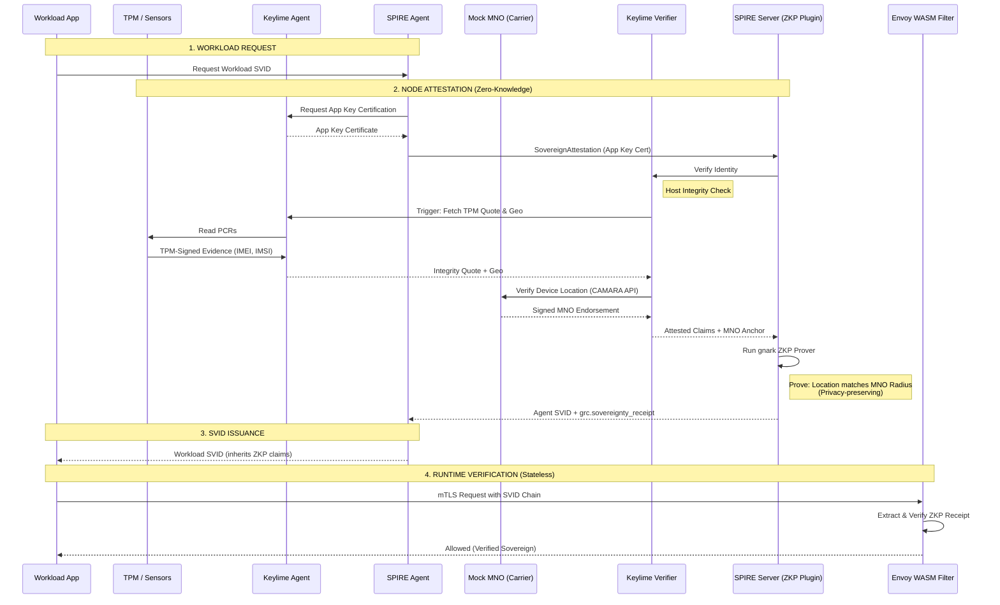

<!-- Version: 0.1.0 | Last Updated: 2025-12-29 -->
# Sovereign Unified Identity Architecture - End-to-End Flow

## 🚀 Open Source Upstreaming-Ready Design

**Architecture Philosophy**: This implementation uses **plugin-based extension** rather than core modifications:

- **SPIRE**: All functionality via plugins (NodeAttestor, CredentialComposer, etc.)
- **Keylime**: New optional APIs added to verifier and agent (no core changes). **Note**: Geolocation APIs have standalone value for host location attestation independent of Unified Identity.
- **Clean Interfaces**: Plugin boundaries enable independent upstream contribution
- **Zero Core Dependencies**: Can be merged upstream without breaking existing deployments

**Feature Flag Gating**: `unified_identity_enabled`
- Single boolean flag controls entire Unified Identity feature set
- **Default: `false`** - System behaves exactly like upstream SPIRE/Keylime
- **When enabled**: Activates TPM App Key mTLS, geolocation attestation, delegated certification
- **Backward Compatible**: Existing deployments unaffected when flag is disabled

**Data Isolation for Clean Open Sourcing**:
- **Keylime Verifier DB**: Existing database for agent attestation state (no schema changes)
- **Mobile Sensor Sidecar DB**: Separate SQLite database for sensor-to-subscriber mapping
  - Key: `sensor_imei` + `sim_imsi` (composite key)
  - Value: `sim_msisdn`, `location_verification` (lat/lon/acc)
- **Decoupled Components**: Sidecar can be deployed independently as standalone CAMARA API wrapper
- **No Cross-DB Dependencies**: Keylime calls sidecar API for lookups, not direct DB access

**Result**: Each component can be contributed to its respective open source project independently with zero breaking changes.

---

## End-to-End Flow Visualization

### Detailed Flow Diagram (Full View)

```
┌─────────────────────────────────────────────────────────────────────────────────────────────────────────────────────────────────────────────────────┐
│                                                      SOVEREIGN UNIFIED IDENTITY - END-TO-END FLOW                                                   │
└─────────────────────────────────────────────────────────────────────────────────────────────────────────────────────────────────────────────────────┘

SETUP PHASE:
┌──────────────┐  [1]  ┌──────────────┐                    ┌──────────────┐  [2]
│ rust-keylime │──────>│   Keylime    │                    │  TPM Plugin  │
│    Agent     │       │  Registrar   │                    │   Server     │
│ Generate EK  │       │ Store: UUID, │                    │ Generate App │
│ Generate AK  │       │ IP, Port, AK │                    │     Key      │
└──────────────┘       └──────────────┘                    └──────────────┘

SPIRE AGENT ATTESTATION PHASE:
┌──────────────┐  [3]  ┌──────────────┐  [4]  ┌──────────────┐  [5]  ┌──────────────┐  [6]  ┌──────────────┐  [7]  ┌──────────────┐
│  SPIRE Agent │──────>│  TPM Plugin  │──────>│ rust-keylime │──────>│  TPM Plugin  │──────>│  SPIRE Agent │──────>│ SPIRE Server │
│ Request App  │       │   Server     │       │    Agent     │       │   Server     │       │ Build        │       │ Receive      │
│ Key & Cert   │       │ Forward      │       │ TPM2_Certify │       │ Return Cert  │       │ Attestation  │       │ Attestation  │
│              │       │              │       │ (AK signs    │       │              │       │              │       │ Extract      │
└──────────────┘       └──────────────┘       │  App Key)    │       └──────────────┘       └──────────────┘       └──────────────┘
                                              └──────────────┘

SPIRE SERVER and KEYLIME VERIFIER VERIFICATION PHASE:
┌──────────────┐  [8]  ┌──────────────┐  [9]  ┌──────────────┐  [10] ┌──────────────┐  [11] ┌──────────────┐  [12] ┌──────────────┐  [13] ┌──────────────┐  [14] ┌──────────────┐  [15] ┌──────────────┐
│ SPIRE Server │──────>│ Keylime      │──────>│   Keylime    │──────>│ Keylime      │──────>│ rust-keylime │──────>│ Mobile Sensor│──────>│ rust-keylime │──────>│ Keylime      │──────>│ SPIRE Server │
│ Extract: App │       │ Verifier     │       │  Registrar   │       │ Verifier     │       │    Agent     │       │ Microservice │       │    Agent     │       │ Verifier     │       │ Issue Agent  │
│ Key, Cert,   │       │ Verify App   │       │ Return: IP,  │       │ Verify AK    │       │ Generate     │       │ Verify       │       │ Return Quote │       │ Verify Quote │       │ SVID with    │
│ Nonce, UUID  │       │ Key Cert     │       │ Port, AK,    │       │ Registration │       │ TPM Quote    │       │ Device Loc   │       │ + Location   │       │ Verify Cert  │       │ BroaderClaims│
└──────────────┘       │ Signature    │       │ mTLS Cert    │       │ (PoC Check)  │       │ (with loc)   │       │ (Mock MNO)   │       └──────────────┘       │ Verify Loc   │       └──────────────┘
                       └──────────────┘       └──────────────┘       └──────────────┘       │  (PCR 15)    │                                                             │ Return       │
                                                                                            └──────────────┘                                                             │ BroaderClaims│
                                                                                                                                                                 └──────────────┘

SPIRE AGENT SVID ISSUANCE & WORKLOAD SVID ISSUANCE:
┌──────────────┐  [16] ┌──────────────┐  [17] ┌──────────────┐  [18] ┌──────────────┐  [19] ┌──────────────┐  [20] ┌──────────────┐  [21] ┌──────────────┐
│ SPIRE Server │──────>│  SPIRE Agent │──────>│   Workload   │──────>│  SPIRE Agent │──────>│ SPIRE Server │──────>│ SPIRE Agent  │──────>│   Workload   │
│ Issue Agent  │       │ Receive      │       │ (Application)│       │ Match Entry  │       │ Issue        │       │ Forward      │       │ Receive      │
│ SVID with    │       │ Agent SVID   │       │ Request SVID │       │ Forward      │       │ Workload SVID│       │ Request      │       │ Workload SVID│
│ BroaderClaims│       └──────────────┘       └──────────────┘       └──────────────┘       │ (inherit     │       └──────────────┘       └──────────────┘
└──────────────┘                                                                            │ agent claims)│
                                                                                            └──────────────┘
```

### Legend:

**[1]** Agent Registration: EK, AK, UUID, IP, Port, mTLS Cert
**[2]** App Key Generation: TPM App Key created and persisted
**[3]** App Key Request: Agent requests App Key public key and context
**[4]** Delegated Certification Request: TPM Plugin forwards to rust-keylime agent
**[5]** Certificate Response: TPM2_Certify result (AK-signed App Key certificate)
**[6]** Build Attestation: Assemble SovereignAttestation (App Key, Cert, Nonce, UUID)
**[7]** Send Attestation: SPIRE Agent sends SovereignAttestation to SPIRE Server (Server receives and extracts)
**[8]** Verify App Key Cert: Verifier verifies App Key certificate signature using TPM AK
**[9]** Lookup Agent: Verifier queries Registrar for agent info (IP, Port, AK, mTLS Cert)
**[10]** Verify AK Registration: Verifier verifies TPM AK is registered with registrar/verifier (PoC security check - only registered AKs can attest)
**[11]** Quote Request: Verifier requests fresh TPM quote with challenge nonce
**[12]** Location Detection: Agent detects mobile sensor, binds to PCR 15 with nonce
**[13]** Location Extraction: Keylime Verifier initiates fetch of location via mTLS, validates nonce and PCR index*
**[14]** Quote Response: Agent returns TPM quote and nonce-bound location data
**[15]** Verification Result: Verifier returns BroaderClaims (geolocation, TPM attestation) → SPIRE Server
**[16]** Agent SVID: Server issues agent SVID with BroaderClaims embedded → SPIRE Agent
**[17]** Workload Request: Workload connects to Agent Workload API
**[18]** Workload API: Workload requests SVID via Agent Workload API
**[19]** Forward Request: Agent forwards workload SVID request to Server
**[20]** Spire Server Issues Workload SVID: Server issues workload SVID (inherits agent claims, no Keylime call) to spire agent
**[21]** Spire Agent Returns SVID: Agent returns workload SVID to workload
**[22]** Workload Receives SVID: Workload receives workload SVID from SPIRE Agent

### Key Components:

**SPIRE Ecosystem (Plugin-Based Extensions):**
- **SPIRE Server**: SVID issuance, policy enforcement
  - Plugin: `unified_identity` NodeAttestor (processes SovereignAttestation)
  - Plugin: `credential_composer` (composes SVIDs with AttestedClaims)
  - Clean plugin interfaces - no core modifications
- **SPIRE Agent**: Workload API, attestation orchestration
  - External plugin: TPM Plugin Server (out-of-process)
  - Plugin integration via standard gRPC/HTTP interfaces
- **TPM Plugin Server**: External process for App Key generation, TPM signing
  - Mediates all TPM operations for SPIRE Agent
  - Independent lifecycle from SPIRE Agent

**Keylime Ecosystem (Optional API Extensions):**
- **rust-keylime Agent**: High-privilege TPM operations (EK, AK, Quotes, Certify)
  - New API: `/v2.2/agent/certify_appkey` (delegated certification)
  - New API: `/v2.2/agent/attested_geolocation` (nonce-bound geolocation)
    - **Standalone Value**: Geolocation API provides TPM-bound host location **independent of Unified Identity**
    - Can be used by any verifier for location-aware attestation
    - Backward compatible - existing functionality unaffected
- **Keylime Verifier**: TPM attestation verification, geolocation verification
  - New API: `/v2.2/verify/sovereignattestation` (unified verification)
  - Optional feature - gated by `unified_identity_enabled` flag
  - **Geolocation verification works standalone**: Verifier can fetch and validate geolocation independently
- **Keylime Registrar**: Agent registration database (no changes)

**Integration Layer (Client-Side & Server-Side):**
- **Mobile Sensor Microservice**: Pure Mobile location verification via CAMARA APIs
  - **Single Responsibility**: Focused exclusively on mobile sensors; GNSS verification is handled directly by the WASM filter.
  - **DB-less Flow**: Prioritizes using location data (`latitude`, `longitude`, `accuracy`) and `msisdn` directly from SVID claims, bypassing local database lookups.
  - **Deployment**: Runs as a **sidecar** to Envoy (same pod/host, `localhost:9050`).
  - **Runtime Authorization**: Used by Envoy WASM filter to verify mobile sensor residency.
- **Envoy WASM Plugin** (New): Standardized authorization filter
  - Extracts sensor identity from SPIRE SVIDs
  - Enforces location policies at the API Gateway level

**Upstreaming Strategy:**
- **Core Components**:
  - SPIRE plugins can be contributed as standalone packages
  - Keylime APIs are optional extensions (feature-flagged)
  - Keylime APIs are optional extensions (feature-flagged)
- **Integration Components** (See **[UPSTREAM_MERGE_ROADMAP.md](UPSTREAM_MERGE_ROADMAP.md) Pillar 3**):
  - Envoy WASM Plugin and Mobile Sensor Microservice (Mock MNO) to be released as standalone, reusable open source projects
- **Mobile Sensor Microservice (Mock MNO)**:
  - Acts as the "Mock MNO" provider for verifying "Device Location" via CAMARA APIs.
  - Verifier calls this service (conceptually) or verifies the ZKP receipt derived from it.
- No breaking changes to either upstream project
- Each component independently mergeable

*The Keylime Verifier initiates the fetch of location data via a secure mTLS connection from the agent, validating it against a fresh challenge nonce and PCR 15. No microservice call is made during attestation. When no TPM-reported Mobile sensor is present, Sovereign SVIDs omit `grc.geolocation` in that case.*

---

## 📊 Observability

### Unified Identity Metrics

The implementation provides granular metrics for both the attestation control plane and the runtime verification data plane.

| Scope | Metric | Type | Description |
|-------|--------|------|-------------|
| **SPIRE** | `agent_manager.unified_identity.reattest.success` | Counter | Successful TPM-based re-attestations |
| **SPIRE** | `agent_manager.unified_identity.reattest.error` | Counter | Failed TPM-based re-attestations |
| **Envoy** | `wasm_filter_request_total` | Counter | Total requests processed by the sovereign filter |
| **Envoy** | `wasm_filter_sidecar_call_total` | Counter | Total calls to the mobile sensor sidecar |
| **Envoy** | `wasm_filter_sidecar_latency_ms` | Histogram | Latency of sidecar verification calls |
| **Envoy** | `wasm_filter_verification_success_total` | Counter | Successful sidecar verifications |
| **Envoy** | `wasm_filter_verification_failure_total` | Counter | Failed sidecar verifications |
| **Sidecar** | `sidecar_request_total` | Counter | Total requests (labels: `result='total'\|'error'`) |
| **Sidecar** | `sidecar_location_verification_success_total` | Counter | Successful location verifications |
| **Sidecar** | `sidecar_location_verification_failure_total` | Counter | Failed location verifications |
| **Sidecar** | `sidecar_camara_api_latency_seconds` | Histogram | Latency of CAMARA API calls |

**Scrape Configuration:**
- **SPIRE Server**: Port `9988` (HCL `telemetry` block)
- **Envoy Proxy**: Port `9901`, path `/stats/prometheus`
- **Mobile Sidecar**: Port `9050`, path `/metrics`

---

## 🔐 Key Architecture Highlights

### TPM Hardware Binding for All Operations

**Critical Design Decision**: After initial attestation, ALL subsequent SPIRE Agent ↔ SPIRE Server communications use the **TPM App Key as the mTLS private key**.

#### Why External TPM Plugin Server Exists

The TPM Plugin Server is an **external gRPC/HTTP process** (out-of-process), NOT an inline plugin:

```
SPIRE Agent (Go) → mTLS to SPIRE Server
      ↓ (crypto.Signer interface)
TPMSigner.Sign() called for TLS handshake
      ↓ (gRPC/HTTP call)
TPM Plugin Server (Python)
      ↓ (tpm2_sign)
TPM Hardware
```

**Every workload SVID request requires:**
1. SPIRE Agent initiates mTLS connection to SPIRE Server
2. TLS handshake needs signature
3. `TPMSigner.Sign()` invoked ([tpm_signer.go:122](./spire/pkg/agent/tpmplugin/tpm_signer.go#L122))
4. **Real-time gRPC/HTTP call to TPM Plugin Server**
5. TPM Plugin calls `tpm2_sign` on physical TPM
6. Signature returned and used in TLS handshake

#### Security Implications

**Certificate Theft Becomes Useless:**
- An attacker who steals the SPIRE agent SVID certificate cannot use it
- Each TLS handshake has unique random data requiring a fresh TPM signature
- No signature caching or replay possible
- **Physical TPM access required for every connection**

**Two-Phase TLS Design:**

| Phase | TLS Private Key | Purpose |
|-------|----------------|---------|
| **Initial Attestation** | Ephemeral SPIRE key | Standard agent enrollment |
| **After Attestation** ([client.go:597](./spire/pkg/agent/client/client.go#L597)) | **TPM App Key** | All workload SVID operations |

**Code Reference:**
```go
// Line 614 in client.go - The critical switch
agentCert.PrivateKey = tpmSigner  // Replace with TPM signer
c.c.Log.Info("Unified-Identity - Verification: Using TPM App Key for mTLS signing")
```

#### Why External Plugin is Necessary

1. **Delegated Certification**: TPM Plugin must call rust-keylime agent HTTP API (`/v2.2/agent/certify_appkey`) for App Key certificate
2. **Real-time TPM Access**: Every TLS handshake requires fresh `tpm2_sign` operation
3. **Language/Library**: Python `tpm2-pytss` provides robust TPM access
4. **Process Isolation**: TPM operations isolated from SPIRE Agent crashes

**Result**: Complete hardware-rooted trust chain where software compromise cannot bypass TPM protection.

---

## 🏴 Feature Flag: `unified_identity_enabled`

**Purpose**: Single boolean flag controls entire Unified Identity feature set, ensuring backward compatibility.

### System Behavior

| Component | Flag = `false` (Default) | Flag = `true` (Unified Identity) |
|-----------|-------------------------|----------------------------------|
| **SPIRE Agent** | Standard attestation, ephemeral keys | TPM App Key for mTLS after attestation |
| **SPIRE Server** | Standard SVID issuance | SVIDs include AttestedClaims extension |
| **Keylime Agent** | Standard TPM attestation<br>**+ Geolocation API available*** | + Delegated certification API<br>+ Geolocation API (same)*** |
| **Keylime Verifier** | Standard quote verification<br>**+ Geolocation fetch available*** | + Unified verification API<br>+ Geolocation fetch (same)*** |

**Note**: The geolocation APIs (`/v2.2/agent/attested_geolocation` and verifier geolocation fetch) provide standalone value for **host location attestation** regardless of Unified Identity integration. Any verifier can use these APIs to obtain TPM-bound geolocation claims.

### Configuration

**SPIRE (`server.conf` / `agent.conf`):**
```hcl
# Feature flag controls plugin loading
unified_identity_enabled = true  # Default: false
```

**Keylime (`verifier.conf` / `agent.conf`):**
```ini
[cloud_verifier]
unified_identity_enabled = true  # Default: false
```

### Backward Compatibility Guarantee

- **Default off**: Systems behave identically to upstream SPIRE/Keylime
- **No code paths executed**: Unified Identity code never runs when disabled
- **Safe deployment**: Can merge to upstream without affecting existing users
- **Gradual rollout**: Operators enable per-environment as needed

---

## End-to-End Flow: SPIRE Agent Sovereign SVID Attestation

### Setup: Initial Setup (Before Attestation)

1. **rust-keylime Agent Registration**
   - The rust-keylime agent starts and registers with the Keylime Registrar
   - The agent generates its TPM Endorsement Key (EK) and Attestation Key (AK)
   - The registrar stores the agent's UUID, IP address, port, TPM keys, and mTLS certificate
   - The agent is now registered and ready to serve attestation requests

2. **TPM Plugin Server (External Process) Startup**
   - The TPM Plugin Server is an **external gRPC/HTTP process** (out-of-process plugin)
   - It starts independently and generates an App Key in the TPM
   - The App Key is a workload-specific key used for identity attestation and mTLS signing
   - The App Key context (handle) is stored for later use
   - **Note**: This is an external Python process that SPIRE Agent connects to via Unix socket, NOT an inline plugin compiled into SPIRE Agent

### Attestation: SPIRE Agent Attestation Request

3. **SPIRE Agent Initiates Attestation**
   - The SPIRE Agent initiates attestation by opening a gRPC stream to the SPIRE Server over **standard TLS** (TLS 1.2/1.3)
   - The gRPC connection uses standard TLS for transport security (server authentication only)
   - The SPIRE Server sends a challenge nonce to the agent
   - The agent must prove its identity using TPM-based attestation (SovereignAttestation message)
   - **Note**: The initial gRPC connection uses standard TLS, not mTLS - the TPM App Key is used for attestation proof, not TLS client authentication

4. **SPIRE Agent Requests App Key Information**
   - The SPIRE Agent sends a POST request to `/get-app-key` endpoint on the SPIRE Agent TPM Plugin Server (sidecar) via UDS
   - The SPIRE Agent TPM Plugin Server (sidecar) returns the App Key public key (PEM format) in JSON response

5. **Delegated Certification Request**
   - The SPIRE Agent requests an App Key certificate from the SPIRE Agent TPM Plugin Server (sidecar)
   - The SPIRE Agent TPM Plugin Server (sidecar) forwards this request to the rust-keylime agent's delegated certification endpoint
   - The rust-keylime agent performs TPM2_Certify: it uses the TPM's Attestation Key (AK) to sign the App Key's public key
   - This creates a certificate proving the App Key exists in the TPM and was certified by the AK
   - The certificate (containing attestation data and signature) is returned along with the agent's UUID

6. **SPIRE Agent Builds SovereignAttestation**
   - The SPIRE Agent assembles the SovereignAttestation message containing:
     - App Key public key
     - App Key certificate (signed by AK)
     - Challenge nonce from SPIRE Server
     - Agent UUID
     - TPM quote field is left empty (the verifier will fetch it directly)
   - The SPIRE Agent sends this SovereignAttestation to the SPIRE Server

### Verification: SPIRE Server Verification

7. **SPIRE Server Receives Attestation**
   - The SPIRE Server receives the SovereignAttestation from the agent
   - It extracts the App Key public key, certificate, nonce, and agent UUID
   - The SPIRE Server needs to verify this attestation before issuing an SVID

8. **SPIRE Server Calls Keylime Verifier**
   - The SPIRE Server sends a verification request to the Keylime Verifier
   - The request includes the App Key public key, certificate, nonce, and agent UUID
   - The verifier is responsible for validating the TPM evidence

### Phase 4: Keylime Verifier On-Demand Verification

9. **Verifier Looks Up Agent Information**
   - The verifier uses the agent UUID to query the Keylime Registrar
   - The registrar returns the agent's IP address, port, TPM AK, and mTLS certificate
   - This allows the verifier to contact the agent directly

10. **Verifier Verifies App Key Certificate Signature**
    - The verifier parses the App Key certificate (JSON structure with `certify_data` and `signature`)
    - It extracts the `certify_data` (TPMS_ATTEST structure) and `signature` (TPMT_SIGNATURE)
    - The verifier uses the AK public key (from registrar) to verify the signature over `certify_data`
    - It verifies the qualifying data in `certify_data` matches the hash of (App Key public key + challenge nonce)
    - If signature verification fails, attestation is rejected with error "app key certificate signature verification failed"
    - This proves the App Key certificate was actually signed by the TPM's AK and is bound to the specific App Key and nonce

11. **Verifier Fetches TPM Quote On-Demand**
    - The verifier connects to the rust-keylime agent (over HTTPS/mTLS)
    - It requests a fresh TPM quote using the challenge nonce from SPIRE Server
    - The agent generates a TPM quote containing:
      - Platform Configuration Register (PCR) values showing system state
      - The challenge nonce
      - Signed by the TPM's Attestation Key (AK)
    - The quote is returned to the verifier

12. **Verifier Verifies the Quote**
    - The verifier uses the AK public key (from registrar) to verify the quote signature
    - It verifies the nonce matches the one from SPIRE Server (freshness check)
    - It validates the hash algorithm and quote structure
    - This proves the TPM is genuine and the platform state is authentic

13. **Verifier Fetches Geolocation with Nonce**
    - The verifier connects to the rust-keylime agent (over HTTPS/mTLS)
    - It requests the current geolocation using the challenge nonce from SPIRE Server
    - The agent generates a geolocation response where the hash of (geolocation + nonce) is extended into **PCR 15**
    - The verifier validates that the returned nonce matches the request, providing a freshness guarantee (TOCTOU protection)
    - **TPM-Attested Data (Mobile)**: `sensor_id`, `sensor_imei`, `sim_imsi` only
    - **TPM-Attested Data (Location)**: `sensor_id`, `sensor_serial_number`, `latitude`, `longitude`, `accuracy`
    - **NOT TPM-Attested**: `sim_msisdn` (looked up from sidecar database using IMEI+IMSI composite key)
    - **Note**: The Keylime Verifier initiates this validation as part of the hardware-backed attestation process. No additional microservice verification is performed during attestation.

14. **Verifier Retrieves Attested Claims**
   - The verifier calls the fact provider to get optional metadata (if available)
   - **In Verification, geolocation comes from the TPM quote response** (not from fact provider)
   - The verifier overrides any fact provider geolocation with the TPM quote geolocation
   - The verifier prepares the verification response with attested claims (geolocation, TPM attestation, etc.)

16. **Verifier Returns Verification Result**
    - The verifier returns a verification response to SPIRE Server containing:
      - Verification status (success/failure)
      - Attested claims (geolocation with sensor_id, type, etc.)
      - Verification details (certificate signature valid, quote signature valid, nonce valid, mobile location verified, etc.)

### Phase 5: SPIRE Server Issues SVID

17. **SPIRE Server Validates Verification Result**
    - The SPIRE Server receives the verification result from Keylime Verifier
    - If verification succeeded (including certificate signature verification and TPM quote verification), the server proceeds to issue the agent SVID
    - If certificate signature verification failed, the server rejects the attestation and does not issue an SVID
    - If TPM quote verification failed, the server rejects the attestation and does not issue an SVID

18. **SPIRE Server Issues Sovereign SVID**
    - The SPIRE Server creates an X.509 certificate (SVID) for the SPIRE Agent
    - The SVID includes the attested claims from Keylime Verifier (geolocation with sensor_id, TPM attestation, etc.)
    - The SVID is embedded with metadata proving the agent's TPM-based identity and verified location
    - The SVID is returned to the SPIRE Agent

19. **SPIRE Agent Receives SVID**
    - The SPIRE Agent receives its agent SVID from SPIRE Server
    - The agent can now use this SVID to authenticate and request workload SVIDs
    - The attestation process is complete

### Key Design Points

- **On-Demand Quote Fetching**: The verifier fetches quotes directly from the agent when needed, ensuring freshness with the challenge nonce
- **Delegated Certification**: The App Key is certified by the TPM's AK, proving it exists in the TPM
- **Separation of Concerns**: Quote generation (platform attestation) is separate from App Key certification (workload identity)
- **No Periodic Polling**: Unlike traditional Keylime, agents aren't continuously monitored; verification happens on-demand per attestation request
- **Agent Registration Model**: Agents register with the Keylime Registrar (persistent storage) but are not registered with the Keylime Verifier (on-demand lookup only)
- **Nonce-Based Geolocation Freshness**: Geolocation is cryptographically bound to a challenge nonce and extended into PCR 15, preventing Time-of-Check-Time-Of-Use (TOCTOU) attacks.
- **Mobile Location Verification**: The verifier fetches geolocation data (sensor_type, sensor_id, sensor_imei, sensor_imsi) directly from the agent via mTLS. The data is validated using the nonce and PCR index and included in attested claims.
  - **Note**: Runtime verification at the enterprise gateway (Envoy WASM Filter) still uses the mobile location verification microservice for CAMARA API verification when processing incoming requests.
- **TPM Plugin Server Communication**: SPIRE Agent communicates with TPM Plugin Server via JSON over UDS (Unix Domain Socket) for security and performance
- **Delegated Certification Transport**: TPM Plugin Server uses HTTPS/mTLS (port 9002) to communicate with rust-keylime agent (UDS support deferred)
- **SPIRE Agent Attestation Transport**: SPIRE Agent uses standard TLS (not mTLS) for gRPC communication with SPIRE Server
- **TPM App Key Usage**: TPM App Key is used for attestation proof (in SovereignAttestation message), not for TLS client certificate authentication
- **SPIRE Agent Attestation Transport**: SPIRE Agent uses standard TLS (not mTLS) for gRPC communication with SPIRE Server
- **Token Caching** (Runtime Verification): Mobile location verification microservice (used by Envoy WASM Filter) caches CAMARA auth_req_id (persisted to file) and access_token (with expiration) to reduce API calls and improve performance
- **Location Verification Caching** (Runtime Verification): The `verify_location` API result is cached with configurable TTL (default: 15 minutes). The actual CAMARA API is called at most once per TTL period; subsequent calls within the TTL return the cached result. This significantly reduces CAMARA API calls and improves performance. Note: This caching is for runtime verification at the enterprise gateway, not during attestation.
- **GPS/GNSS Sensor Bypass** (Runtime Verification): GPS/GNSS sensors (trusted hardware) bypass mobile location service entirely at the enterprise gateway, allowing requests directly without CAMARA API calls

This flow provides hardware-backed identity attestation where the SPIRE Agent proves its identity using the TPM, and the SPIRE Server verifies this proof through the Keylime Verifier before issuing credentials.

---

## End-to-End Flow: Workload SVID Issuance

The workload SVID flow follows the standard SPIRE pattern, with the key difference being the certificate chain that includes the agent SVID (which contains TPM attestation claims). This allows workloads to inherit the TPM-backed identity of their hosting agent.

### Setup: Workload Registration

1. **Registration Entry Creation**
   - An administrator creates a registration entry for the workload in the SPIRE Server
   - The entry defines the workload's SPIFFE ID (e.g., `spiffe://example.org/python-app`)
   - The entry specifies the selector criteria (e.g., Unix UID, process name, etc.)
   - The registration entry is stored in the SPIRE Server's database

### Attestation: Workload Requests SVID

2. **Workload Connects to SPIRE Agent**
   - A workload process starts and needs an identity
   - The workload connects to the SPIRE Agent's Workload API (typically via Unix Domain Socket)
   - The workload provides its process context (PID, UID, etc.) for authentication

3. **SPIRE Agent Validates Workload**
   - The SPIRE Agent validates the workload's process context against registration entries
   - The agent matches the workload's selectors (PID, UID, etc.) to find the appropriate registration entry
   - If validated, the agent proceeds to request an SVID from the SPIRE Server

4. **SPIRE Agent Requests Workload SVID**
   - The SPIRE Agent sends a request to the SPIRE Server for the workload SVID
   - **Important**: After attestation, SPIRE Agent uses **non-standard mTLS** with TPM App Key for workload SVID requests
   - **mTLS Flow**:
     1. SPIRE Agent initiates gRPC connection to SPIRE Server
     2. During TLS handshake, SPIRE Agent needs to sign TLS CertificateVerify message
     3. SPIRE Agent calls TPM Plugin Server `/sign-data` endpoint via UDS:
        - Request: `{"data": "<base64_hash_of_tls_handshake>", "hash_alg": "sha256", "is_digest": true, "scheme": "rsapss"}`
        - TPM Plugin Server uses `tpm2_sign` to sign the hash with TPM App Key (private key stays in TPM)
        - Response: `{"status": "success", "signature": "<base64_signature>"}`
     4. SPIRE Agent uses the signature in TLS CertificateVerify message
     5. SPIRE Server verifies the signature using App Key public key (from agent SVID)
   - The request includes:
     - The workload's SPIFFE ID (from the matched registration entry)
     - The agent's own SVID (for authentication, contains App Key public key)
     - Workload selector information
   - **Transport**: gRPC over mTLS (non-standard, using TPM App Key for client authentication)

### Verification: SPIRE Server Issues Workload SVID

5. **SPIRE Server Validates Request**
   - The SPIRE Server authenticates the agent using **non-standard mTLS** with TPM App Key
   - The server verifies the TLS client signature (signed by TPM App Key private key)
   - The server verifies the agent SVID's certificate chain and signature
   - The server validates that the agent is authorized to request SVIDs for the specified workload
   - **Note**: Workload SVID requests skip Keylime verification - workloads inherit attested claims from the agent SVID
   - **mTLS Authentication**: The TPM App Key signature proves the agent controls the TPM App Key (hardware-backed authentication)

6. **SPIRE Server Extracts Agent Attestation Claims**
   - The SPIRE Server extracts the AttestedClaims from the agent SVID
   - These claims include TPM attestation data (geolocation, TPM quote, etc.)
   - The server prepares to issue a workload SVID with workload-specific claims only
   - **No Keylime Verification**: Workload SVID generation does not call Keylime Verifier; it uses the agent SVID's attested claims directly

7. **SPIRE Server Issues Workload SVID**
   - The SPIRE Server creates an X.509 certificate (SVID) for the workload
   - The workload SVID contains:
     - The workload's SPIFFE ID
     - Workload-specific claims (e.g., `grc.workload` namespace)
     - **No TPM attestation claims** (these remain in the agent SVID)
   - The workload SVID is signed by the SPIRE Server's CA
   - The certificate chain includes: [Workload SVID, Agent SVID]

8. **SPIRE Server Returns Workload SVID**
   - The SPIRE Server returns the workload SVID and certificate chain to the SPIRE Agent
   - The agent caches the SVID for the workload

### Phase 4: Workload Receives SVID

9. **SPIRE Agent Returns SVID to Workload**
   - The SPIRE Agent returns the workload SVID and certificate chain to the workload
   - The workload receives:
      - The workload SVID (leaf certificate)
      - The agent SVID (included in chain for claim inheritance)
      - Both certificates are signed by the SPIRE Server CA (flat hierarchy, Option A)

10. **Workload Uses SVID**
    - The workload can now use its SVID for:
      - Authenticating to other services (mTLS)
      - Proving its identity in service-to-service communication
      - Accessing resources based on SPIFFE identity
    - The certificate chain allows verifiers to:
      - Validate the workload's identity
      - Trace back to the agent's TPM attestation (via agent SVID)
      - Enforce policies based on both workload and agent identity

### Key Design Points

- **Certificate Chain**: The workload SVID certificate chain includes the agent SVID, allowing policy enforcement based on both workload and agent identity
- **Claim Separation**: Workload SVID contains only workload-specific claims; TPM attestation claims remain in the agent SVID
- **Inherited Trust**: Workloads inherit the TPM-backed trust of their hosting agent through the certificate chain
- **Standard SPIRE Pattern**: The workload SVID flow follows standard SPIRE patterns, with the addition of the agent SVID in the certificate chain

### Certificate Chain Structure (Option A: Claims Propagation)

> [!NOTE]
> The current implementation uses **Option A (flat hierarchy)**. Both Agent and Workload SVIDs are signed directly by the SPIRE Server CA. The Agent SVID is included in the certificate chain to provide claim inheritance, but it is **NOT** a true X.509 intermediate CA. See the "Hierarchical Workload SVID Architecture Options" section for future intermediate CA plans.

```
Workload SVID (Leaf)
├── Subject: spiffe://example.org/python-app
├── Claims: grc.workload.* (workload-specific only)
├── Issuer: SPIRE Server CA           ← Signed directly by Server CA (flat)
│
└── Agent SVID (Chain Position 1)     ← Included for claim inheritance, NOT an intermediate CA
    ├── Subject: spiffe://example.org/spire/agent/join_token/...
    ├── Claims: grc.geolocation.*, grc.tpm-attestation.*
    ├── Issuer: SPIRE Server CA       ← Also signed directly by Server CA (flat)
    ├── BasicConstraints: CA:FALSE    ← NOT a CA certificate
    │
    └── SPIRE Server CA (Root)
```

**Key Clarification**: In the current implementation:
- Both SVIDs are **leaf certificates** (`CA:FALSE`) signed by the Server CA
- The Agent SVID is passed in the certificate chain for **claim visibility**, not for signing
- Relying parties extract attestation claims from the Agent SVID via the chain
- Standard X.509 path validation treats both as leaves under the same root

This structure allows verifiers to:
- Validate the workload's identity directly (Server CA signature)
- Access the agent's TPM attestation claims from the chain
- Enforce geofencing and platform policies based on agent claims

---

## Hierarchical Workload SVID Architecture Options

### The Challenge: SPIRE's Flat Certificate Model

Standard SPIRE uses a **flat certificate hierarchy** where the SPIRE Server CA directly signs all SVIDs:

```
┌─────────────────────┐
│   SPIRE Server      │  ← Root CA (issues ALL SVIDs directly)
│       CA            │
└──────────┬──────────┘
           │ (flat issuance)
     ┌─────┴─────┐
     ▼           ▼
┌─────────┐  ┌─────────┐
│ Agent   │  │Workload │   ← Both are LEAF certs from same CA
│ SVID    │  │ SVID    │
└─────────┘  └─────────┘
```

**Limitation**: The SPIRE `unifiedidentity` plugin cannot natively provide intermediate CA functionality. This section documents the architectural options for achieving a true hierarchical certificate chain.

### Design Goals

| Goal | Description |
|------|-------------|
| **Traceability** | Know which TPM-attested agent issued a workload SVID |
| **Revocation** | Revoke all workload certs when an agent is compromised |
| **Trust Scoping** | Limit which workloads an agent can certify |
| **Audit Chain** | Cryptographic proof: Hardware → Agent → Workload |

---

### Option A: Claims Propagation (Current Implementation)

**Approach**: Keep flat certs, embed agent attestation as claims in workload SVID.

```
Workload SVID:
  Subject: spiffe://example.org/python-app
  Claims:
    agent.spiffe_id: "spiffe://example.org/spire/agent/tpm/..."
    grc.tpm-attestation.*: (inherited from agent)
    grc.geolocation.*: (inherited from agent)
```

| Pros | Cons |
|------|------|
| Works now, no SPIRE core changes | No true PKI hierarchy |
| Simple implementation | Revocation is per-workload, not per-agent |
| Claims visible to relying parties | No cryptographic agent→workload binding |

**Status**: ✅ Implemented (current behavior)

---

### Option B: UpstreamAuthority Plugin (External Root)

**Approach**: Make SPIRE Server act as an intermediate CA under an external root (e.g., HashiCorp Vault, AWS ACM PCA).

```
External HSM/Vault (Root)
         │
    SPIRE Server (Intermediate)
         │
    Agent/Workload SVIDs (Leaf)
```

| Pros | Cons |
|------|------|
| Real PKI hierarchy | Doesn't solve agent→workload hierarchy |
| Integrates with enterprise PKI | Just pushes root up, same flat structure under SPIRE |
| Uses SPIRE's native plugin | External dependency |

**Status**: ⚪ Standard SPIRE feature, not Unified Identity specific

---

### Option C: Hybrid TPM Assertion in Claims

**Approach**: Keep SPIRE signing centralized, but add a TPM-signed assertion as a claim in workload SVIDs.

```
Workload SVID:
  Subject: spiffe://example.org/python-app
  Issuer: SPIRE Server CA (standard)
  Claims:
    agent.tpm_assertion: <signed by agent's TPM App Key>
      ├── agent_spiffe_id
      ├── tpm_pcr_quote_hash
      ├── timestamp
      └── signature (TPM App Key)
```

**How it works**:
1. When SPIRE Agent requests workload SVID, it generates a TPM-signed assertion
2. The assertion is embedded as a claim in the workload SVID
3. Relying parties verify both: SVID signature (SPIRE CA) + Assertion signature (TPM App Key)

| Pros | Cons |
|------|------|
| Plugin-level implementation | Two signature verifications required |
| Provides cryptographic agent binding | Not standard X.509 path validation |
| No SPIRE core changes | Custom verification logic at relying parties |
| Uses existing TPM App Key | |

**Status**: ⚪ Proposed alternative

---

### Option D: TPM-Based Intermediate CA (Recommended)

**Approach**: Leverage the existing TPM App Key (already attested via delegated certification) as an intermediate CA signing key.

```
┌─────────────────────────────────────────────────────────────────────────┐
│                     TRUE HIERARCHICAL PKI                                │
├─────────────────────────────────────────────────────────────────────────┤
│                                                                         │
│  SPIRE Server CA (Root)                                                 │
│       │                                                                 │
│       │ signs (Server CA private key)                                   │
│       ▼                                                                 │
│  Agent SVID (Intermediate CA)                                           │
│  ├── Subject: spiffe://example.org/spire/agent/tpm/...                 │
│  ├── Public Key: TPM App Key (certified by AK via TPM2_Certify)        │
│  ├── BasicConstraints: CA:TRUE, pathLen:0                              │
│  ├── KeyUsage: KeyCertSign, DigitalSignature                           │
│  └── Claims: grc.geolocation.*, grc.tpm-attestation.*                  │
│       │                                                                 │
│       │ signs (TPM App Key via TPM Plugin Server)                       │
│       ▼                                                                 │
│  Workload SVID (Leaf)                                                   │
│  ├── Subject: spiffe://example.org/python-app                          │
│  ├── BasicConstraints: CA:FALSE                                        │
│  └── Claims: grc.workload.* (inherits agent context)                   │
│                                                                         │
└─────────────────────────────────────────────────────────────────────────┘
```

#### Why This Works with Existing Infrastructure

The Unified Identity implementation already has all the components:

| Component | Current State | Role in Option D |
|-----------|---------------|------------------|
| **TPM App Key** | ✅ Generated by TPM Plugin Server | Intermediate CA signing key |
| **TPM2_Certify** | ✅ AK certifies App Key via rust-keylime | Proves App Key is hardware-bound |
| **TPM Plugin `/sign-data`** | ✅ Signs TLS handshakes for mTLS | Signs workload SVIDs |
| **Agent SVID** | ✅ Contains TPM App Key as public key | Becomes intermediate CA cert |

#### Implementation Changes Required

**1. Agent SVID becomes Intermediate CA**

In `unifiedidentity` CredentialComposer:

```go
// When issuing Agent SVID, mark it as an intermediate CA
func (p *Plugin) ComposeAgentX509SVID(ctx context.Context, ...) {
    agentCert := &x509.Certificate{
        Subject:               agentSPIFFEID,
        PublicKey:             tpmAppKeyPublicKey,  // Already set
        IsCA:                  true,                 // NEW: Enable CA
        MaxPathLen:            0,                    // Can only sign leaf certs
        MaxPathLenZero:        true,
        KeyUsage:              x509.KeyUsageCertSign | x509.KeyUsageDigitalSignature,
        BasicConstraintsValid: true,
        // ... existing attested claims
    }
}
```

**2. SPIRE Agent Signs Workload SVIDs**

Move workload SVID signing from SPIRE Server to SPIRE Agent:

```go
// SPIRE Agent: Sign workload SVID using TPM App Key
func (a *Agent) SignWorkloadSVID(workloadCSR *x509.CertificateRequest) ([][]byte, error) {
    workloadCert := &x509.Certificate{
        Subject:   workloadCSR.Subject,
        PublicKey: workloadCSR.PublicKey,
        IsCA:      false,
        // Inherit relevant claims from agent SVID
    }
    
    // Sign using TPM App Key via TPM Plugin Server
    tbsCert := workloadCert.RawTBSCertificate
    signature, err := tpmPluginGateway.SignData(tbsCert, "sha256")
    if err != nil {
        return nil, err
    }
    
    // Construct signed certificate
    signedCert := appendSignature(workloadCert, signature)
    
    // Return full chain: [Workload, Agent SVID, Server CA]
    return [][]byte{signedCert, a.agentSVID.Raw, a.serverCACert.Raw}, nil
}
```

**3. Relying Party Verification**

Standard X.509 path validation works automatically:

```
Relying Party receives mTLS connection:
  1. Verify Workload SVID signature → using Agent SVID public key (TPM App Key)
  2. Verify Agent SVID signature → using SPIRE Server CA
  3. Trust SPIRE Server CA → configured trust anchor
  4. Extract claims from Agent SVID → enforce geofencing/TPM policies
```

#### Security Properties

| Property | Result |
|----------|--------|
| **True X.509 hierarchy** | Standard path validation: Root → Intermediate → Leaf |
| **Hardware-bound intermediate** | TPM App Key cannot be extracted; signing requires physical TPM |
| **Agent revocation** | Revoke Agent SVID = all its workload SVIDs immediately invalid |
| **Claim inheritance** | Workload inherits agent's TPM/geo attestation via chain |
| **Audit trail** | Cryptographic proof of which hardware signed each workload |
| **Certificate theft mitigation** | Stolen workload cert useless without agent's TPM for renewal |

#### Trade-offs

| Consideration | Impact |
|---------------|--------|
| **Performance** | TPM signing (~100ms) slower than in-memory keys (~1ms) |
| **Key escrow** | SPIRE Server cannot re-sign workloads for a given agent |
| **Complexity** | Agent becomes a signing authority, more complex logic |
| **SPIRE changes** | Requires modifying workload SVID issuance flow |

**Status**: 🎯 **Recommended for future implementation**

---

### Comparison Matrix

| Option | Hierarchy | Hardware Binding | Agent Revocation | Implementation Complexity |
|--------|-----------|------------------|------------------|---------------------------|
| **A: Claims Propagation** | ❌ Flat | ✅ Via claims | ❌ Per-workload | ✅ Low (current) |
| **B: UpstreamAuthority** | ⚠️ External root only | ❌ No | ❌ Per-workload | ✅ Low |
| **C: Hybrid Assertion** | ⚠️ Logical only | ✅ TPM signature | ⚠️ Manual | ⚡ Medium |
| **D: TPM Intermediate CA** | ✅ True X.509 | ✅ Hardware-bound | ✅ Automatic | ⚡ Medium-High |

---

### Implementation Recommendation

**Phase 1 (Current)**: Option A - Claims Propagation
- Already implemented and working
- Provides attestation data to relying parties
- Sufficient for initial deployments

**Phase 2 (Future)**: Option D - TPM-Based Intermediate CA
- Leverage existing TPM App Key infrastructure
- True hierarchical PKI with hardware-bound signing
- Agent compromise isolation (revoke one agent, all its workloads invalidated)
- Standard X.509 path validation at relying parties

**Migration Path**:
1. Modify Agent SVID issuance to include `CA:TRUE, pathLen:0`
2. Add workload SVID signing capability to SPIRE Agent
3. Route workload SVID requests through Agent instead of Server
4. Update relying parties to validate full chain (most already do)

---

## End-to-End Flow: Enterprise On-Prem Runtime Access (Envoy WASM Filter)

After workloads receive their SPIRE SVIDs, they can use these certificates to access enterprise on-prem services. The Envoy proxy with WASM filter verifies the sensor identity at runtime.

### Setup: Enterprise On-Prem Gateway

1. **Envoy Proxy Setup**
   - Envoy proxy runs on enterprise on-prem gateway (e.g., 10.1.0.10:8080)
   - Configured to terminate mTLS from SPIRE clients
   - Verifies SPIRE certificate signatures using SPIRE CA bundle
   - Uses WASM filter to extract sensor information from certificate chain

2. **Mobile Location Service Setup**
   - Mobile location service runs on enterprise on-prem gateway (localhost:9050)
   - Handles CAMARA API calls with caching (15-minute TTL, configurable)
   - No caching in WASM filter - all caching centralized in mobile location service

### Runtime: Workload Access Request

3. **Workload Initiates Request**
   - Workload (on 10.1.0.11) makes HTTPS request to enterprise gateway (10.1.0.10:8080)
   - Uses SPIRE workload SVID certificate chain for mTLS client authentication
   - Certificate chain includes: [Workload SVID, Agent SVID] (Agent SVID contains Unified Identity extension)

4. **Envoy Terminates mTLS**
   - Envoy terminates the mTLS connection
   - Verifies SPIRE certificate chain using SPIRE CA bundle
   - Extracts certificate chain for WASM filter processing

- **WASM Filter Extracts Sensor Information**:
  - Parses the certificate chain.
  - Extracts Unified Identity extension (OID `1.3.6.1.4.1.55744.1.1`) from Agent SVID (second certificate in chain).
  - Extracts sensor metadata: `sensor_id`, `sensor_type`, `sensor_imei`, `sensor_imsi`, `sensor_msisdn`.
  - **Coordinate Propagation**: Extracts `latitude`, `longitude`, and `accuracy` if present in SVID claims to enable the **DB-less verification flow**.
  - **No Filter Caching**: The WASM filter is stateless; all result caching is centralized in the mobile location microservice.

6. **WASM Filter Sensor Type Handling**
   - **GPS/GNSS sensors** (`sensor_type == "gnss"`):
     - Trusted hardware, bypass mobile location service entirely
     - Logs bypass message and allows request directly
     - Adds `X-Sensor-ID` header and forwards to backend
   - **Mobile sensors** (`sensor_type == "mobile"`):
     - Calls mobile location service at `localhost:9050/verify` (blocking call)
     - Request: `POST /verify` with sensor metadata AND coordinates (if available)
     - Mobile location service:
       - **Flow Selection**: Uses DB-LESS flow if coordinates are provided; falls back to DB-BASED lookup if missing
       - Checks `verify_location` cache (TTL: 15 minutes, configurable)
       - If cache hit: Returns cached result (no CAMARA API call)
       - If cache miss/expired: Calls CAMARA APIs and caches result
     - If verification succeeds: Adds `X-Sensor-ID` and `X-Mobile-MSISDN` headers and forwards to backend
     - If verification fails: Returns 403 Forbidden

7. **Request Forwarding**
   - If verification succeeds (or GPS sensor bypassed), Envoy forwards request to backend mTLS server (10.1.0.10:9443)
   - Request includes `X-Sensor-ID` header for audit trail
   - Backend server logs sensor ID for compliance

### Key Design Points

- **No Caching in WASM Filter**: The WASM filter does NOT implement any caching. All caching (CAMARA API result caching with 15-minute TTL) is handled by the mobile location service. This simplifies the filter logic and ensures a single source of truth for caching behavior.
- **GPS Sensor Bypass**: GPS/GNSS sensors (trusted hardware) bypass mobile location service entirely, allowing requests directly without verification
- **Mobile Sensor Verification**: Mobile sensors require CAMARA API verification via mobile location service (with caching)
- **Blocking Verification**: For mobile sensors, requests pause until mobile location service responds
- **Certificate Chain**: WASM filter extracts sensor information from Agent SVID (second certificate in chain, contains attestation claims)
- **Centralized Caching**: All caching logic centralized in mobile location service, making it easier to maintain and debug

### Flow Diagram

```
Workload (10.1.0.11)
    │
    │ mTLS (SPIRE cert chain: [Workload SVID, Agent SVID])
    v
Envoy Proxy (10.1.0.10:8080)
    │
    ├─> 1. Terminate mTLS
    ├─> 2. Verify SPIRE cert chain (using SPIRE CA bundle)
    ├─> 3. WASM filter extracts sensor info from Agent SVID (Unified Identity extension)
    │
    ├─> 4. Check sensor_type:
    │   ├─> If "gnss": Bypass mobile location service, allow directly
    │   └─> If "mobile":
    │       │
    │       └─> POST /verify → Mobile Location Service (localhost:9050)
    │           │
    │           ├─> Check verify_location cache (TTL: 15 min)
    │           │   ├─> Cache hit: Return cached result
    │           │   └─> Cache miss: Call CAMARA APIs, cache result
    │           │
    │           └─> Return verification result
    │
    ├─> 5. If verified/bypassed: Add X-Sensor-ID header, forward to backend
    └─>    If not verified: Return 403 Forbidden
    │
    v
Backend mTLS Server (10.1.0.10:9443)
    │
    └─> Receives request with X-Sensor-ID header
        └─> Logs sensor ID for audit trail
```

---

## Complete Security Flow: SPIRE Agent Sovereign SVID Attestation

The following diagram illustrates the complete end-to-end flow for SPIRE Agent Sovereign SVID attestation, showing all components, interactions, and data transformations.

### SETUP: INITIAL SETUP (Before Attestation)

**Step 1: rust-keylime Agent Registration**
```
rust-keylime Agent (High Privilege, Port 9002)
    │
    ├─> Generate EK (Endorsement Key)
    ├─> Generate AK (Attestation Key)
    └─> Register with Keylime Registrar (Port 8890)
        │
        └─> Send: UUID, IP, port, TPM keys, mTLS certificate
            │
            <─ Keylime Registrar stores registration
```

**Step 2: SPIRE Agent TPM Plugin Server (Sidecar) Startup**
```
SPIRE Agent TPM Plugin Server (Python Sidecar, UDS Socket: /tmp/spire-data/tpm-plugin/tpm-plugin.sock)
    │
    ├─> Generate App Key in TPM on startup
    ├─> Store App Key context/handle
    ├─> Start HTTP/UDS server
    └─> Ready for certification requests
```
### ATTESTATION: SPIRE AGENT ATTESTATION REQUEST

**Step 3: SPIRE Agent Initiates Attestation**
```
SPIRE Agent (Low Privilege)
    │
    └─> Initiate gRPC stream: AttestAgent() over TLS (standard TLS, not mTLS)
        │   Transport: gRPC over TLS 1.2/1.3 (server authentication only)
        │   Protocol: AttestAgent() gRPC method
        │
        └─> SPIRE Server (Port 8081)
            │
            ├─> Receives attestation request over TLS
            └─> Send challenge nonce
                │
                <─ SPIRE Agent
                    │
                    └─> Receives challenge nonce
                        │
                        └─> Note: Connection uses standard TLS (not mTLS with TPM App Key)
```

**Step 4: SPIRE Agent Requests App Key Information**
```
SPIRE Agent
    │
    └─> POST /get-app-key (JSON over UDS)
        │
        └─> SPIRE Agent TPM Plugin Server (Sidecar, UDS: /tmp/spire-data/tpm-plugin/tpm-plugin.sock)
            │
            └─> Return: { "status": "success", "app_key_public": "<PEM>" }
                │
                <─ SPIRE Agent
                    │
                    └─> Receives: App Key public key (PEM format)
```

**Step 5: Delegated Certification Request**
```
SPIRE Agent TPM Plugin Server (Sidecar)
    │
    └─> POST /request-certificate (JSON over UDS)
        │   Request: { "app_key_public": "<PEM>", "challenge_nonce": "<nonce>", "endpoint": "https://127.0.0.1:9002" }
        │
        └─> DelegatedCertificationClient
            │
            └─> POST /v2.2/delegated_certification/certify_app_key (HTTPS/mTLS)
                │
                └─> rust-keylime Agent (High Privilege, Port 9002)
                    │
                    ├─> Perform TPM2_Certify
                    │   ├─> Load App Key from context
                    │   ├─> Use AK to sign App Key public key
                    │   └─> Generate certificate (attest + sig)
                    │
                    └─> Return: { certificate: { certify_data, signature }, agent_uuid }
                        │
                        <─ SPIRE Agent TPM Plugin Server (Sidecar)
                            │
                            └─> Return: { "status": "success", "app_key_certificate": "<base64>", "agent_uuid": "<uuid>" }
                                │
                                <─ SPIRE Agent
```

**Step 6: SPIRE Agent Builds and Sends SovereignAttestation**
```
SPIRE Agent
    │
    ├─> Build SovereignAttestation message:
    │   ├─> app_key_public: App Key public key (PEM format)
    │   ├─> app_key_certificate: App Key certificate (AK-signed, base64-encoded bytes)
    │   ├─> challenge_nonce: Challenge nonce from SPIRE Server
    │   ├─> keylime_agent_uuid: Agent UUID
    │   └─> tpm_signed_attestation: empty string (verifier fetches quote directly)
    │
    └─> Send SovereignAttestation via gRPC: AttestAgent() over TLS
        │   Transport: Standard TLS (not mTLS)
        │   Protocol: gRPC AttestAgent() method
        │   Note: TPM App Key is used for attestation proof, NOT for TLS client cert
        │
        └─> SPIRE Server (Port 8081)
            │
            └─> Receives SovereignAttestation over TLS
                │
                └─> Extracts: App Key public key, certificate, nonce, agent UUID
```
### VERIFICATION: SPIRE SERVER VERIFICATION

**Step 7: SPIRE Server Receives Attestation and sends to Keylime Verifier**
```
SPIRE Server (Port 8081)
    │
    ├─> Extract: App Key public key, certificate, nonce, agent UUID
    │
    └─> POST /v2.4/verify/evidence
        │
        └─> Keylime Verifier (Port 8881)
            │
            └─> Receives verification request
```

### PHASE 4: KEYLIME VERIFIER ON-DEMAND VERIFICATION

**Step 8: Verifier Looks Up Agent Information**
```
Keylime Verifier (Port 8881)
    │
    └─> GET /agents/{agent_uuid}
        │
        └─> Keylime Registrar (Port 8890)
            │
            └─> Return: { ip, port, tpm_ak, mtls_cert }
                │
                <─ Keylime Verifier
```

**Step 9: Verifier Verifies App Key Certificate Signature**
```
Keylime Verifier (Port 8881)
    │
    ├─> Parse certificate JSON
    ├─> Extract certify_data & signature
    ├─> Verify signature with AK (from registrar)
    └─> Verify qualifying data (hash of App Key + nonce)
```

**Step 10: Verifier Fetches TPM Quote On-Demand**
```
Keylime Verifier (Port 8881)
    │
    └─> POST /v2.2/quote (HTTPS/mTLS)
        │
        └─> rust-keylime Agent (High Privilege, Port 9002)
            │
            ├─> Generate TPM Quote:
            │   ├─> PCR values (platform state)
            │   ├─> Challenge nonce
            │   └─> Signed by AK
            │
            └─> Return: { quote, signature, geolocation: { type: "mobile", sensor_id: "12d1:1433" } }
                │
                <─ Keylime Verifier
```

**Step 11: Verifier Fetches Geolocation with Nonce On-Demand**
```
Keylime Verifier (Port 8881)
    │
    └─> GET /v2.2/agent/attested_geolocation?nonce={nonce} (HTTPS/mTLS)
        │
        └─> rust-keylime Agent (High Privilege, Port 9002)
            │
            ├─> Extend PCR 15: SHA256(geolocation_json + nonce)
            └─> Return: { sensor_type, sensor_id, sensor_imei, sensor_imsi, tpm_pcr_index: 15, nonce: "{nonce}" }
                │
                <─ Keylime Verifier
                    │
                    └─> Validate nonce and map to SPIRE claims
```

**Note**: The Keylime Verifier no longer calls the mobile location verification microservice during attestation. The geolocation data from the TPM quote is used directly. Runtime verification at the enterprise gateway (Envoy WASM filter) still uses the mobile location microservice for CAMARA API verification.

**Step 12: Verifier Retrieves Attested Claims**
```
Keylime Verifier (Port 8881)
    │
    └─> Get Attested Claims
        │
        ├─> Call fact provider (optional)
        ├─> Override with geolocation from TPM quote
        └─> Prepare attested claims structure
            │
            └─> Return: { geolocation: {...} } (from TPM quote)
```

**Step 13: Verifier Returns Verification Result**
```
Keylime Verifier (Port 8881)
    │
    ├─> Verify Evidence:
    │   ├─> Certificate signature verified
    │   ├─> Quote signature verified (AK)
    │   ├─> Nonce matches
    │   ├─> Quote structure validated
    │   └─> Geolocation extracted from TPM quote
    │
    └─> POST /v2.4/verify/evidence (response)
        │
        └─> SPIRE Server (Port 8081)
            │
            └─> Receives: { status: "success", attested_claims: { grc.geolocation, grc.tpm-attestation }, ... }
```
### PHASE 5: SPIRE SERVER ISSUES SVID

**Step 14: SPIRE Server Validates Verification Result**
```
SPIRE Server (Port 8081)
    │
    ├─> Check verification status
    ├─> Verify certificate signature valid
    ├─> Verify TPM quote valid
    └─> Extract attested claims (including geolocation from TPM quote)
```

**Step 15: SPIRE Server Issues Sovereign SVID**
```
SPIRE Server (Port 8081)
    │
    ├─> Create X.509 certificate
    ├─> Embed attested claims (geolocation, TPM attestation)
    ├─> Sign with SPIRE Server CA
    │
    └─> POST /agent/attest-agent (response)
        │
        └─> SPIRE Agent (Low Privilege)
            │
            ├─> Receives Agent SVID
            ├─> Agent can now authenticate
            └─> Ready to request workload SVIDs
                │
                └─> ✓ Attestation Complete
```


┌─────────────────────────────────────────────────────────────────────────────────────────────┐
│                              KEY SECURITY MECHANISMS                                         │
└─────────────────────────────────────────────────────────────────────────────────────────────┘

1. **TPM Hardware Security**
   - EK (Endorsement Key): Permanent TPM identity
   - AK (Attestation Key): Ephemeral attestation identity
   - App Key: Workload-specific key in TPM
   - TPM2_Certify: AK certifies App Key exists in TPM

2. **On-Demand Quote Fetching**
   - Verifier fetches fresh quote with challenge nonce
   - Prevents replay attacks
   - Ensures quote freshness

3. **Delegated Certification**
   - App Key certified by TPM AK
   - Proves App Key exists in TPM
   - Cryptographic binding to hardware

4. **TPM AK Registration Verification (PoC Security Model)**
   - Keylime Verifier verifies that the TPM AK used to sign the App Key certificate is registered with the registrar/verifier
   - Only registered/trusted AKs can proceed with SPIRE Agent SVID attestation
   - Prevents unregistered AKs from attesting (security enforcement)
   - Verification occurs after App Key certificate signature validation and before TPM quote verification
   - Checks verifier database first, then falls back to registrar query

5. **Certificate Chain**
   - Agent SVID contains TPM attestation claims
   - Workload SVID chain includes agent SVID
   - Policy enforcement at multiple levels

6. **Nonce-Based Freshness**
   - SPIRE Server provides challenge nonce
   - Included in TPM quote and App Key certificate
   - Prevents replay attacks

7. **Nonce-Based Freshness (TOCTOU Prevention)**
   - Geolocation sensor identifiers (sensor_type, sensor_id, sensor_imei, sensor_imsi) are bound to a fresh challenge nonce.
   - The hash of (geolocation + nonce) is extended into **PCR 15** on the TPM.
   - The verifier fetches this data via mTLS and validates the nonce, ensuring the location is current at the time of SVID issuance.
   - No microservice call is made during attestation - geolocation data is validated cryptographically.
   - **Note**: Runtime verification at the enterprise gateway (Envoy WASM Filter) still uses the mobile location verification microservice for CAMARA API verification:
     - Microservice utilizes **DB-LESS flow** (priority) if coordinates are provided in SVID claims; falls back to DB-BASED lookup otherwise.
     - Microservice verifies device location via CAMARA APIs:
       - Token caching: auth_req_id (persisted) and access_token (with expiration) are cached.
       - Location verification caching: `verify_location` results are cached with configurable TTL (default: 15 minutes).
     - Verifier returns success/failure based on CAMARA response.
   - Enables geofencing and location-based policy enforcement

---

## SPIRE Agent Attestation: TLS vs mTLS Communication

### Standard TLS for Attestation Transport

**SPIRE Agent → SPIRE Server Communication:**
- **Transport Protocol**: Standard TLS (TLS 1.2/1.3) over gRPC
- **Connection Type**: Server-authenticated TLS (not mTLS)
- **Port**: 8081 (default SPIRE Server port)
- **Protocol**: gRPC `AttestAgent()` method
- **Authentication**: SPIRE Server presents its TLS certificate; SPIRE Agent verifies server identity
- **Client Authentication**: None (standard TLS, not mTLS)

### TPM App Key Usage: Two-Phase Approach

**Phase 1: Initial Attestation (Standard TLS)**
- The TPM App Key is **NOT** used for TLS client certificate authentication during initial attestation
- The TPM App Key is used for **attestation proof** within the `SovereignAttestation` message
- The App Key private key remains in the TPM and is never exported
- The App Key public key and AK-signed certificate are sent in the `SovereignAttestation` message
- **Transport**: Standard TLS (server authentication only)

**TPM App Key in Initial Attestation:**
1. **App Key Public Key**: Sent in `SovereignAttestation.app_key_public` field (PEM format)
2. **App Key Certificate**: Sent in `SovereignAttestation.app_key_certificate` field (base64-encoded bytes)
   - This certificate is signed by the TPM's Attestation Key (AK) via TPM2_Certify
   - Proves the App Key exists in the TPM and is bound to the challenge nonce
3. **Attestation Proof**: The App Key certificate serves as cryptographic proof of TPM-based identity

**Phase 2: Post-Attestation mTLS (Non-Standard mTLS with TPM App Key)**
- **After successful attestation**, SPIRE Agent uses **non-standard mTLS** with TPM App Key for workload SVID requests
- The TPM App Key private key (stays in TPM) is used to sign TLS handshake messages
- SPIRE Agent calls TPM Plugin Server `/sign-data` endpoint to sign TLS CertificateVerify message or client certificate
- This provides hardware-backed client authentication for subsequent gRPC calls to SPIRE Server
- **Transport**: Non-standard mTLS (TPM App Key for client authentication)

**How Non-Standard mTLS Works:**
1. SPIRE Agent requests TPM Plugin Server to sign TLS handshake data using TPM App Key
2. TPM Plugin Server uses `tpm2_sign` to sign the data (hash of TLS handshake messages) with TPM App Key
3. SPIRE Agent uses the signature in TLS CertificateVerify message or client certificate
4. SPIRE Server verifies the signature using the App Key public key (from agent SVID or attestation)
5. This proves the agent controls the TPM App Key (hardware-backed authentication)

**Why Non-Standard mTLS?**
- TPM App Key private key cannot be exported (stays in TPM)
- Standard TLS libraries expect private keys to be accessible for TLS handshake
- Non-standard approach: SPIRE Agent uses TPM Plugin Server to sign TLS handshake messages on-demand
- This provides hardware-backed client authentication without exporting the private key

**Security Model:**
- **Initial Attestation**: Standard TLS (server authentication) + TPM App Key attestation proof
- **Post-Attestation**: Non-standard mTLS (TPM App Key for client authentication)
- **Identity Proof**: TPM App Key certificate (hardware-backed attestation)
- **Verification**: Keylime Verifier validates the App Key certificate signature and TPM quote
- **Result**: Hardware-rooted identity proof with hardware-backed mTLS client authentication

**Comparison: Standard mTLS vs Non-Standard TPM App Key mTLS**

| Aspect | Standard mTLS | TPM App Key (Initial Attestation) | TPM App Key (Post-Attestation) |
|--------|---------------|-----------------------------------|--------------------------------|
| **Phase** | N/A | Initial attestation | Workload SVID requests |
| **Transport** | TLS with client certificate | Standard TLS (no client cert) | Non-standard mTLS (TPM App Key) |
| **Client Auth** | TLS client certificate | Attestation message (SovereignAttestation) | TLS CertificateVerify (TPM-signed) |
| **Private Key** | Exported from TPM (if TPM-backed) | Stays in TPM (never exported) | Stays in TPM (sign via TPM Plugin Server) |
| **Proof Mechanism** | TLS handshake with client cert | App Key certificate in gRPC message | TPM App Key signature in TLS handshake |
| **Verification** | TLS certificate chain validation | Keylime Verifier validates TPM evidence | SPIRE Server verifies TPM App Key signature |
| **Hardware Binding** | Optional (if using TPM-backed cert) | Required (App Key in TPM) | Required (App Key in TPM) |

---

## Mobile Location Verification Microservice

**Status:** ✅ Implemented and integrated

> [!NOTE]
> **Architecture Simplification**: The sensor → MSISDN mapping is now stored in the **Keylime DB** (client-side) and **embedded in the SPIRE Agent SVID**. This eliminates the need for a server-side database lookup. The microservice is now a **thin CAMARA API wrapper** that receives MSISDN directly from the SVID claims.

### Data Flow: Attestation Time vs Runtime

| Phase | Location | Data Source | CAMARA Call |
|-------|----------|-------------|-------------|
| **Attestation** (Keylime DB) | Sovereign Cloud | Keylime DB → SVID | ✅ Once (verified at attestation) |
| **Runtime** (Envoy Gateway) | Enterprise On-Prem | SVID claims | Policy-based (optional) |

### Sensor Type Schemas

The system supports two distinct sensor types with different data models:

| Sensor Type | Schema Fields | Use Case |
|-------------|---------------|----------|
| **Mobile** | `sensor_id`, `sensor_imei`, `sim_imsi`, `sim_msisdn`, `location_verification` | Cellular devices, CAMARA API verification |
| **GNSS** | `sensor_id`, `sensor_serial_number`, `retrieved_location` | GPS/satellite receivers, trusted hardware |

### Keylime DB Schema (Client-Side)

The Keylime Verifier database stores sensor data with type-aware key-value structure:

**Mobile Sensor (Key → Value):**
```
Key Fields (Composite: sensor_imei + sim_imsi):
├── sensor_imei: "356345043865103"    ← Part of composite key
├── sim_imsi: "214070610960475"       ← Part of composite key
└── sensor_id: "12d1:1433"            ← Optional (can be 0)

Value Fields (Returned):
├── sim_msisdn: "tel:+34696810912"
└── location_verification:
    ├── latitude: 0
    ├── longitude: 0
    └── accuracy: 0
```

**GNSS Sensor (Key → Value):**
```
Key Fields (Primary = sensor_serial_number):
├── sensor_serial_number: "SN-GPS-2024-001"    ← Primary identifier
└── sensor_id: "gnss-001"                       ← Optional (can be 0)

Value Fields (Returned):
└── retrieved_location:
    ├── latitude: 40.33
    ├── longitude: -3.7707
    └── accuracy: 5.0
```

- **Lookup (Mobile)**: `sensor_imei` + `sim_imsi` (composite key - IMEI alone is not unique)
- **Lookup (GNSS)**: `sensor_serial_number` (primary)
- **Default Seed (Mobile)**: `(imei:356345043865103, imsi:214070610960475) → sim_msisdn:tel:+34696810912`
- **SVID Claims**: After attestation, sensor data is embedded in SVID with type-specific claim namespaces

### SVID Claim Structure (Refined - Nested Hierarchy)

All sensor metadata is consolidated under a single `grc.geolocation` namespace with type-specific nested objects.

> **Note**: The values shown below are examples. Actual values are populated from detected hardware (IMEI, IMSI) and database lookups (MSISDN).

**Mobile Sensor SVID Claims:**
```json
{
  "grc.geolocation": {
    "tpm-attested-location": true,
    "tpm-attested-pcr-index": 15,
    "mobile": {
      "sensor_id": "12d1:1433",           // ← TPM-attested
      "sensor_imei": "356345043865103",   // ← TPM-attested
      "sim_imsi": "214070610960475",      // ← TPM-attested
      "sim_msisdn": "tel:+34696810912",   // ← DB lookup (IMEI+IMSI key)
      "location_verification": {          // ← DB lookup (IMEI+IMSI key)
        "latitude": 40.33,
        "longitude": -3.7707,
        "accuracy": 7.0
      }
    }
  }
}
```

**GNSS Sensor SVID Claims:**
```json
{
  "grc.geolocation": {
    "tpm-attested-location": true,
    "tpm-attested-pcr-index": 15,
    "gnss": {
      "sensor_id": "gnss-001",                    // ← TPM-attested
      "sensor_serial_number": "SN-GPS-2024-001", // ← TPM-attested
      "retrieved_location": {                     // ← TPM-attested (trusted hardware)
        "latitude": 40.33,
        "longitude": -3.7707,
        "accuracy": 5.0
      }
    }
  }
}
```

**Key Schema Features:**
- **TPM-Attested (Mobile)**: `sensor_id`, `sensor_imei`, `sim_imsi` only
- **TPM-Attested (GNSS)**: `sensor_id`, `sensor_serial_number`, `retrieved_location`
- **Database-Derived (Mobile)**: `sim_msisdn`, `location_verification` (looked up using IMEI+IMSI composite key)
- **Future-Proof**: Schema aligned with [AegisSovereignAI hardware-location proposal](https://github.com/lfedgeai/AegisSovereignAI/blob/main/proposals/camara-hardware-location.md).


### Mobile Sensor Microservice (Server-Side Sidecar)

**Role**: Thin CAMARA API wrapper (no database lookup required)

The microservice receives MSISDN directly from the Envoy WASM filter (extracted from SVID claims) and calls CAMARA APIs for runtime verification when policy requires it.

**CAMARA API Flow** (when called):
1. `POST /bc-authorize` with `login_hint` (MSISDN from SVID) and `scope`
2. `POST /token` with `grant_type=urn:openid:params:grant-type:ciba` and `auth_req_id`
3. `POST /location/v0/verify` with `access_token`, `ueId` (MSISDN), coordinates

**Caching**:
- **Token Caching**: `auth_req_id` (persisted to file) and `access_token` (with expiration)
- **Location Verification Caching**: TTL-based (default: 15 minutes), configurable via `CAMARA_VERIFY_CACHE_TTL_SECONDS`

**Configuration**:
- `CAMARA_BYPASS`: Skip CAMARA APIs for testing (default: false)
- `CAMARA_BASIC_AUTH_FILE`: Path to file containing CAMARA credentials (secure secret management)
- `CAMARA_VERIFY_CACHE_TTL_SECONDS`: Cache TTL (default: 900 seconds = 15 minutes, set to 0 to disable)

**Location:**
- `mobile-sensor-microservice/service.py` - Flask microservice implementation
- `keylime/keylime/cloud_verifier_tornado.py` - Verifier extracts geolocation and MSISDN
- `tpm-plugin/tpm_plugin_server.py` - SPIRE Agent TPM Plugin Server implementation

---

## Enterprise On-Prem Envoy WASM Filter

**Status:** ✅ Implemented and integrated

> [!IMPORTANT]
> **Architecture Decision**: WASM + Sidecar is the recommended pattern. The WASM filter handles certificate extraction (unavoidable for custom X.509 extensions), while the sidecar handles OAuth token management, caching, and secrets.

### Simplified Architecture Overview

```
┌─────────────────────────────────────────────────────────────────────────────┐
│               ATTESTATION TIME (Sovereign Cloud)                            │
├─────────────────────────────────────────────────────────────────────────────┤
│                                                                             │
│   ┌─────────────────┐         ┌─────────────────────────────────┐           │
│   │  Keylime DB     │         │  SPIRE Agent SVID               │           │
│   │  ┌───────────┐  │         │  grc.geolocation:               │           │
│   │  │sensor_id  │──┼────────►│    sensor_id: "12d1:1433"       │           │
│   │  │msisdn     │──┼────────►│    msisdn: "tel:+34696810912"   │           │
│   │  │lat, lon   │  │         │    verified: true               │           │
│   │  └───────────┘  │         └─────────────────────────────────┘           │
│   └─────────────────┘                                                       │
└─────────────────────────────────────────────────────────────────────────────┘
                                 │
                                 ▼
┌─────────────────────────────────────────────────────────────────────────────┐
│               RUNTIME (Enterprise On-Prem Gateway)                          │
├─────────────────────────────────────────────────────────────────────────────┤
│                                                                             │
│   ┌──────────────────┐    Policy Mode?                                      │
│   │  Envoy WASM      │    ┌─────────┬──────────┬─────────┐                  │
│   │  Filter          │───►│  Trust  │  Runtime │ Strict  │                  │
│   └──────────────────┘    └────┬────┴────┬─────┴────┬────┘                  │
│                                │         │          │                       │
│                                ▼         ▼          ▼                       │
│                           ✅ Allow   ┌────────┐ ┌────────┐                  │
│                           (no call)  │Sidecar │ │Sidecar │                  │
│                                      │(cached)│ │(no TTL)│                  │
│                                      └────────┘ └────────┘                  │
└─────────────────────────────────────────────────────────────────────────────┘
```

### Policy-Based Verification Modes

The WASM filter supports three verification modes, configurable per-deployment:

| Mode | CAMARA Call | Sidecar Required | Use Case |
|------|-------------|------------------|----------|
| **Trust** (default) | ❌ None | ❌ No | Standard workloads, trust attestation-time verification |
| **Runtime** | ✅ With cache (15min TTL) | ✅ Yes | High-security apps, banking, enterprise |
| **Strict** | ✅ No cache (real-time) | ✅ Yes | Critical infrastructure, military, regulatory compliance |

**Configuration** (envoy.yaml):
```yaml
# WASM filter configuration
typed_config:
  "@type": "type.googleapis.com/envoy.extensions.filters.http.wasm.v3.Wasm"
  config:
    configuration:
      "@type": "type.googleapis.com/google.protobuf.StringValue"
      value: |
        verification_mode: "runtime"   # Options: trust, runtime, strict (Default: runtime)
        sidecar_endpoint: "http://localhost:9050/verify"
```

### Certificate Extraction & Claim Processing

The WASM filter extracts claims from the SPIRE certificate chain:

1. **Extract Unified Identity Extension** (OID `1.3.6.1.4.1.55744.1.1`) from Agent SVID
2. **Parse JSON claims**: `sensor_id`, `sensor_type`, `sensor_imei`, `sensor_imsi`, **`msisdn`** ← NEW
3. **Apply policy**:
   - GPS/GNSS sensors: Always bypass (trusted hardware)
   - Mobile sensors: Apply verification mode policy

### Verification Flow by Mode

```
┌─────────────────────────────────────────────────────────────────────────────┐
│                           WASM FILTER DECISION TREE                         │
├─────────────────────────────────────────────────────────────────────────────┤
│                                                                             │
│  1. Extract claims from Agent SVID (Unified Identity extension)             │
│     └─ sensor_id, sensor_type, sensor_imei, sensor_imsi, msisdn             │
│                                                                             │
│  2. Check sensor_type:                                                      │
│     ├─ "gnss" → ✅ ALLOW (trusted hardware, no verification)               │
│     └─ "mobile" → Apply verification mode:                                  │
│                                                                             │
│  3. Verification Mode:                                                      │
│     ├─ TRUST   → ✅ ALLOW (trust SVID attestation, no CAMARA call)         │
│     ├─ RUNTIME → Call sidecar (with caching) → Allow/Deny (DEFAULT)       │
│     └─ STRICT  → Call sidecar (no caching) → Allow/Deny                    │
│                                                                             │
│  4. On success: Add X-Sensor-ID, X-MSISDN headers → Forward to backend     │
│     On failure: Return 403 Forbidden                                        │
│                                                                             │
└─────────────────────────────────────────────────────────────────────────────┘
```

### Sidecar Communication (Runtime/Strict modes only)

When verification mode requires CAMARA validation:

**Request** (WASM → Sidecar):
```json
POST http://localhost:9050/verify
{
  "msisdn": "tel:+34696810912",    // From SVID claim (no DB lookup!)
  "sensor_id": "12d1:1433",
  "sensor_imei": "356345043865103",
  "sensor_imsi": "214070610960475",
  "skip_cache": false              // true for Strict mode
}
```

**Response** (Sidecar → WASM):
```json
{
  "verified": true,
  "latitude": 40.33,
  "longitude": -3.7707,
  "accuracy": 7.0,
  "cached": true,
  "cache_expires_at": "2025-12-26T03:30:00Z"
}
```

### Architecture Benefits

- **WASM filter is unavoidable**: Required for extracting custom X.509 extensions from certificates
- **Sidecar handles complexity**: OAuth tokens, response caching, secure secrets
- **Policy flexibility**: Operators choose verification level per deployment
- **No server-side DB**: MSISDN comes from SVID claims (attestation-time binding)
- **GPS bypass**: Hardware-trusted sensors skip all verification

**Location:**
- `enterprise-private-cloud/wasm-plugin/src/lib.rs` - WASM filter implementation
- `enterprise-private-cloud/envoy/envoy.yaml` - Envoy configuration
- `mobile-sensor-microservice/service.py` - Sidecar implementation

---

## ✅ Gen 4: Zero-Knowledge Proof Layer (Implemented - POC)

> [!NOTE]
> Gen 4 builds on the Gen 3 foundation. All TPM attestation, delegated certification, and unified identity infrastructure remains unchanged. Gen 4 adds a **privacy-preserving verification layer** via ZK-SNARKs using gnark (Groth16-BN254).
>
> **Implementation Status**: Gen 4 is **fully implemented** in the POC with a mock MNO service for lab testing. All components (gnark ZKP prover, WASM Zkp mode, claim inheritance) are operational.
>
> **Related Proposals:**
> - [Verifiable Policy Enforcement (VPE)](../proposals/verifiable-policy-enforcement.md) — Full Gen 4 workflow, ZKP circuit design, dual-SVID pattern
> - [CAMARA Hardware Location](../proposals/camara-hardware-location.md) — Premium Tier API extension, signed MNO endorsement format

> [!IMPORTANT]
> **Signed MNO Response Required for True Zero-Trust**
>
> Without a **cryptographically signed** MNO response, Gen 4 has a trust gap:
>
> | Scenario | Trust Chain | Result |
> |----------|-------------|--------|
> | **With signed MNO** | TPM (hw) → MNO Signature (crypto) → ZKP (math) | ✅ True zero-trust |
> | **Without signed MNO** | TPM (hw) → CAMARA API call (trust) → ZKP (math) | ⚠️ Partial trust |
>
> The ZKP proves *computation correctness* ("if inputs valid, then compliant"), but does NOT prove *input authenticity* ("MNO response is genuine"). An attacker who compromises the Keylime Verifier ↔ CAMARA channel could inject fake location data.
>
> **Dependency:** Gen 4 true zero-trust requires the [camara-hardware-location.md](../proposals/camara-hardware-location.md) "Premium Tier" proposal for MNO signed endorsements.

### Architecture Flow



### Evolution: Gen 3 → Gen 4

| Aspect | Gen 3 (Current) | Gen 4 (Implemented) |
|--------|-----------------|-----------------|
| **SVID Claims** | `grc.geolocation.*` (raw coordinates) | `grc.sovereignty_receipt.*` (ZKP) |
| **Envoy Verification** | Raw hw-rooted evidence + location | **ZKP verification only** (no raw data) |
| **Privacy** | Coordinates visible to gateway | **Zero disclosure** to relying parties |
| **Audit** | Logs contain location data | Logs contain only compliance proof |

### Key Architectural Change: Envoy Verification

**Gen 3 (Current):**
```
Envoy WASM Filter
    ↓
Extract grc.geolocation.* claims (lat, lon, IMEI, IMSI)
    ↓
Verify via CAMARA API (mobile) or trust GNSS
    ↓
Allow/Deny
```

**Gen 4 (Implemented):**
```
Envoy WASM Filter
    ↓
Extract grc.sovereignty_receipt.* claim (1KB SNARK)
    ↓
Route to ZKP Verifier Service (or inline verification)
    ↓
Verify proof against PolicyZone commitment
    ↓
Allow/Deny (no raw coordinates exposed)
```

### ZKP Technology: gnark (Recommended)

For SPIRE Server plugin compatibility, we recommend [gnark](https://github.com/Consensys/gnark)—a Go-native ZK-SNARK library:

| Option | Pros | Cons |
|--------|------|------|
| **gnark (Go)** | Native SPIRE Plugin SDK; no FFI | Circuit written in Go |
| Noir → ACIR → gnark | Portable Noir circuits | FFI complexity (Rust → Go) |

### MNO Integration via Keylime Verifier API Extension

In Gen 4, MNO endorsement is fetched **inside the existing `/v2.2/verify/sovereignattestation` API** — no new endpoint needed. The Keylime Verifier's logic is simply extended to also call the MNO API before returning.

**Current Gen 3 Flow (unchanged):**
```
SPIRE Server ──▶ Keylime Verifier `/v2.2/verify/sovereignattestation`
                        │
                        ├─▶ Fetch TPM Quote (rust-keylime agent)
                        ├─▶ Fetch Geolocation (rust-keylime agent)
                        │
                        └─▶ Return AttestedClaims → SPIRE Server
```

**Gen 4 Extension (same API, extended logic):**
```
SPIRE Server ──▶ Keylime Verifier `/v2.2/verify/sovereignattestation`
                        │
                        ├─▶ Fetch TPM Quote (existing)
                        ├─▶ Fetch Geolocation (existing)
                        ├─▶ Fetch MNO Anchor (NEW) ◀── calls MNO/CAMARA API
                        │
                        └─▶ Return AttestedClaims + MNO Anchor
                                      │
                                      ▼
                        SPIRE Server gnark Plugin
                                      │
                        Generate ZKP from (TPM evidence + MNO Anchor)
                                      │
                                      ▼
                        Issue Agent SVID with Sovereignty Receipt
```

**Why extend existing API:**
1. **Location is a host property** — Keylime already handles host-level attestation
2. **Same attestation flow** — No architectural changes to SPIRE ↔ Keylime integration
3. **Existing secure channels** — Verifier already has mTLS to rust-keylime agent
4. **Single round-trip** — Produces TPM evidence + MNO endorsement in one call

**Gen 3 vs Gen 4 MNO Flow:**

| Aspect | Gen 3 (Current) | Gen 4 (Planned) |
|--------|-----------------|-----------------|
| **When** | Runtime (every request) | Attestation-time (once) |
| **Where** | Envoy → Mobile Sidecar | Keylime Verifier API (extended) |
| **Output** | Pass/Fail verification | Signed MNO Anchor → ZKP input |
| **API Change** | N/A | None — extends existing `/v2.2/verify/sovereignattestation` |

### Trust Progression: Unsigned → Signed MNO → ZKP

The path to Gen 4 is enabled by **MNO signed responses** (see [camara-hardware-location.md](../proposals/camara-hardware-location.md) proposal):

| Level | MNO Response | Verification | Trust Guarantee |
|-------|--------------|--------------|-----------------|
| **Gen 3 (Current)** | Unsigned (pass/fail) | Runtime at Envoy | Trust CAMARA API call |
| **Gen 3.5 (Bridge)** | **Signed endorsement** | Attestation-time at Keylime Verifier | Verifiable carrier cryptographic proof |
| **Gen 4 (Target)** | Signed endorsement | Attestation-time + ZKP | Mathematical proof, zero disclosure |

**Key Insight:** Once MNO API returns **signed responses**, Gen 3 can immediately adopt the attestation-time flow:

```
Gen 3 (Current):    Envoy → CAMARA API (runtime, unsigned, every request)
                           ↓
Gen 3.5 (Bridge):   Keylime Verifier → CAMARA API (attestation-time, signed)
                    → Signed anchor stored in SVID claims
                    → Runtime sidecar becomes optional
                           ↓
Gen 4 (Target):     Keylime Verifier → CAMARA API (attestation-time, signed)
                    → Signed anchor as ZKP input
                    → Sovereignty Receipt in SVID (no raw data exposed)
```

**Benefits of Signed MNO Response:**
1. **Gen 3 improvement** — Eliminates runtime sidecar; attestation-time verification
2. **Gen 4 enabler** — Cryptographic anchor for ZKP circuit
3. **Audit trail** — Carrier-signed proof of location at attestation time
4. **Reduced API calls** — One call per attestation vs. every request

### SPIRE Server ZKP Plugin Architecture

```
┌─────────────────────────────────────────────────────────────────────┐
│                         SPIRE SERVER                                 │
├─────────────────────────────────────────────────────────────────────┤
│                                                                     │
│  ┌────────────────┐   ┌────────────────┐   ┌────────────────────┐  │
│  │    Keylime     │   │  AegisSovereignAI  │   │  unifiedidentity   │  │
│  │    Verifier    │   │   ZKP Plugin   │   │  CredentialComposer│  │
│  │    Plugin      │   │ (gnark Prover) │   │                    │  │
│  └───────┬────────┘   └───────┬────────┘   └─────────┬──────────┘  │
│          │                    │                      │             │
│          │ AttestedClaims     │ SNARK                │             │
│          └────────────────────┴──────────────────────┘             │
│                               │                                    │
│                    ┌──────────▼──────────┐                        │
│                    │  Agent SVID with    │                        │
│                    │  grc.sovereignty_   │                        │
│                    │  receipt.* claims   │                        │
│                    └─────────────────────┘                        │
└─────────────────────────────────────────────────────────────────────┘
```

### gnark Circuit: Geofencing Policy

```go
// pkg/server/zkpplugin/circuit.go
type SovereignResidencyCircuit struct {
    // Private Witnesses (from Gen 3 TPM evidence)
    SecretLocation frontend.Variable `gnark:",secret"` // e.g., Lat/Lon from device
    SecretIMEI     frontend.Variable `gnark:",secret"`
    SecretIMSI     frontend.Variable `gnark:",secret"`
    
    // Public Inputs
    PolicyZone    frontend.Variable `gnark:",public"`  // Bounding box hash
    Nonce         frontend.Variable `gnark:",public"`  // Freshness (PCR 15)
    MNOAnchorHash frontend.Variable `gnark:",public"`  // MNO endorsement
}

func (c *SovereignResidencyCircuit) Define(api frontend.API) error {
    // 1. Verify device binding: H(IMEI || IMSI) == MNO anchor device_id_hash
    deviceHash := api.Hash(c.SecretIMEI, c.SecretIMSI)
    api.AssertIsEqual(deviceHash, c.MNOAnchorHash)
    
    // 2. Geofencing: Location within PolicyZone
    api.AssertIsEqual(api.InZone(c.SecretLocation, c.PolicyZone), 1)
    
    return nil
}
```

### WASM Filter Verification Mode Extension

The existing `VerificationMode` enum in `lib.rs` will be extended:

```rust
enum VerificationMode {
    Trust,    // No sidecar call (Gen 3 default)
    Runtime,  // Sidecar call with caching (Gen 3)
    Strict,   // Real-time sidecar (Gen 3)
    Zkp,      // ZKP verification (Gen 4) ← NEW
}
```

**`Zkp` Mode Behavior:**
1. Extract `grc.sovereignty_receipt.snark` from SVID extension
2. Extract `grc.sovereignty_receipt.policy_zone` (public input)
3. Route to ZKP verifier service (or inline if binary size permits)
4. Allow if proof valid, deny otherwise
5. **No raw location data ever visible to gateway**

### Implementation Timeline

| Phase | Deliverable | Effort |
|-------|-------------|--------|
| **P1** | gnark circuit + SPIRE Plugin scaffold | 2-3 weeks |
| **P2** | Integration with `unifiedidentity/claims.go` | 1 week |
| **P3** | WASM Filter `Zkp` verification mode | 1-2 weeks |
| **Total** | **Production-Ready Gen 4** | **~6 weeks** |

### Gen 4 Claim Schema

```json
{
  "grc.sovereignty_receipt": {
    "snark": "<base64-encoded 1KB SNARK>",
    "policy_zone": "EU-DE-1",
    "residency_hash": "<H(SNARK || Agent_SPIFFE_ID)>",
    "expires_at": "2026-01-10T12:00:00Z"
  }
}
```

**Note:** Gen 3 `grc.geolocation.*` claims remain in Agent SVIDs for backward compatibility. Gen 4-aware Envoy gateways use `grc.sovereignty_receipt.*`; legacy gateways fall back to Gen 3 claims.

---

## Production Readiness & Implementation Status

### Current Implementation State

**Status**: ✅ Functional PoC on Real Hardware (TPM 2.0)

The "Unified Identity" feature is **fully functional** and has been verified on real TPM hardware (10.1.0.11). The system successfully:
- Generates TPM App Keys for SPIRE workloads
- Performs delegated certification (AK signs App Key)
- Verifies TPM quotes with geolocation data
- Issues Sovereign SVIDs with attested claims
- Enforces runtime geolocation verification at enterprise gateways


### Recent Enhancements

#### Delegated Certification Security (Production Controls)

The delegated certification endpoint (`/certify_app_key`) now includes production-grade security controls:

**Features:**
- **IP Allowlist**: Configurable list of allowed IPs (default: localhost only)
- **Rate Limiting**: Per-IP request limiting (default: 10 requests/minute, 60s sliding windows)
- **Secure Defaults**: Disabled by default, requires explicit configuration

**Configuration** (`rust-keylime/keylime-agent.conf`):
```toml
[delegated_certification]
enabled = false # Gated by unified_identity_enabled
allowed_ips = ["127.0.0.1"] # Localhost only
rate_limit_per_minute = 10 # Conservative limit
```

**Implementation Files:**
- `rust-keylime/keylime/src/config/base.rs` - Configuration parsing
- `rust-keylime/keylime-agent/src/delegated_certification_handler.rs` - Security enforcement
- `rust-keylime/keylime-agent/src/main.rs` - QuoteData integration

**Verification**: Tested on real TPM hardware with full integration test suite (`ci_test_runner.py`).

### Security Considerations

**Current Security Features**:
- ✅ Feature flag gating (`unified_identity_enabled`)
- ✅ Hardware-rooted trust (TPM 2.0)
- ✅ IP allowlist and rate limiting
- ✅ mTLS between components
- ✅ Geolocation attestation with TPM binding
- ✅ **Full TLS certificate validation** (No `InsecureSkipVerify`)

**Production Gaps & Roadmap Status**:
For a comprehensive view of production readiness, identified security gaps, and the detailed upstreaming strategy, please refer to the project roadmap:
👉 **[`UPSTREAM_MERGE_ROADMAP.md`](UPSTREAM_MERGE_ROADMAP.md)**
