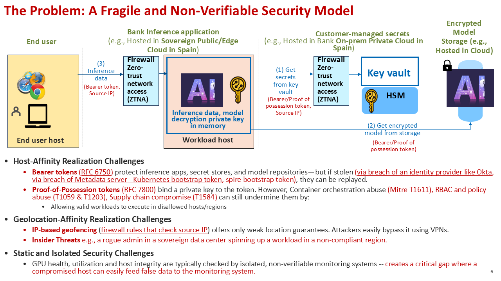
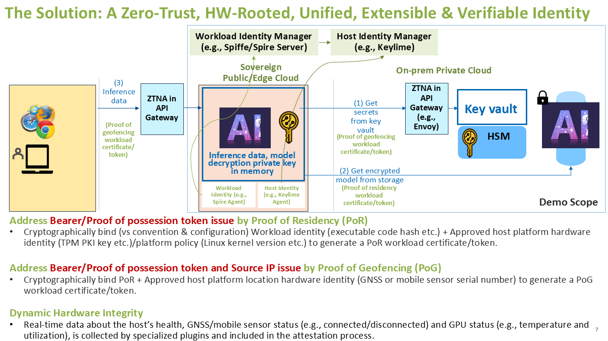

# Hybrid Cloud POC

## Overview

This directory contains a proof-of-concept implementation demonstrating hybrid cloud unified identity with hardware-rooted verifiable geofencing and residency proofs using SPIRE, Keylime, and Envoy.

This POC addresses the challenges of the traditional non-verifiable security model by providing cryptographically verifiable proofs that bind workload identity, host integrity, and geolocation into unified credentials.

**Slides:** [View Presentation](https://onedrive.live.com/?id=746ADA9DC9BA7CB7%21sa416cb345794427ab085a20f8ccc0edd&cid=746ADA9DC9BA7CB7&redeem=aHR0cHM6Ly8xZHJ2Lm1zL2IvYy83NDZhZGE5ZGM5YmE3Y2I3L0VUVExGcVNVVjNwQ3NJV2lENHpNRHQwQlh6U3djQ01HWDhjQS1xbGxLZm1Zdnc%5FZT1PTnJqZjE&parId=746ADA9DC9BA7CB7%21s95775661177f4ef5a4ba84313cd3795a&o=OneUp)

## The Problem: A Fragile and Non-Verifiable Security Model

*See Slide 6 for the problem diagram*

Current security approaches for AI inference applications, secret stores, system agents, and model repositories face **critical gaps** that are amplified in edge AI deployments. The traditional security model relies on bearer tokens, proof-of-possession tokens, and IP-based geofencing, which are vulnerable to replay attacks, account manipulation, and location spoofing.

### Host-Affinity Realization Challenges

- **Bearer tokens (RFC 6750)**: Protect inference applications, secret stores, and model repositories but can be replayed if stolen through compromise of:
  - Identity providers (e.g., Okta)
  - Metadata servers (e.g., Kubernetes bootstrap token, SPIRE bootstrap token)

- **Proof-of-Possession tokens (RFC 7800)**: Bind a private key to the token, reducing replay risk, but remain vulnerable to:
  - Container orchestration abuse (MITRE T1611)
  - RBAC and policy abuse (T1059 & T1203)
  - Supply chain compromise (T1584)
  - These abuses can allow valid workloads to execute on disallowed hosts/regions

### Geolocation-Affinity Realization Challenges

- **IP-based geofencing**: Firewall rules based on source IP provide only weak location assurances — easily bypassed via VPNs, proxies, or IP spoofing.

### Static and Isolated Security Challenges

- GPU health, utilization, and host integrity are typically checked by isolated, non-verifiable monitoring systems. This creates a critical gap where a compromised host can easily feed false data to the monitoring system.



*Figure: Slide 6 - The Problem: A Fragile and Non-Verifiable Security Model*

The diagram illustrates a traditional security architecture for AI inference applications showing:
1. End user host sending inference data with bearer tokens and source IP to Bank Inference application in Sovereign Cloud
2. Workload host requesting secrets from Customer-managed key vault using bearer/proof-of-possession tokens
3. Key vault retrieving encrypted models from storage

The diagram highlights three critical security challenges:
- **Host-Affinity Realization Challenges**: Bearer token replay, proof-of-possession token vulnerabilities to orchestration/RBAC abuse
- **Geolocation-Affinity Realization Challenges**: IP-based geofencing bypass via VPNs/proxies
- **Static and Isolated Security Challenges**: Non-verifiable monitoring systems

## The Solution: A Zero-Trust, HW-Rooted, Unified, Extensible & Verifiable Identity

*See Slide 7 for the solution architecture diagram*

Our solution addresses these challenges through hardware-rooted cryptographic proofs that bind workload identity, host integrity, and geolocation into a unified, verifiable credential.

### Proof of Residency (PoR)

**Challenge addressed:** Weak bearer/proof-of-possession token models for system and AI agents in sensitive edge contexts.

**Approach:** Cryptographically bind — rather than rely on convention or configuration — the following elements to issue a PoR workload certificate/token:
- **Workload identity** (e.g., executable code hash)
- **Approved host platform hardware identity** (e.g., TPM PKI key)
- **Platform policy** (e.g., Linux kernel version, measured boot state)

### Proof of Geofencing (PoG)

**Challenge addressed:** Token misuse risks and unreliable Source IP checks for location-sensitive edge workloads.

**Approach:** Cryptographically bind the PoR attestation above **plus**:
- **Approved host platform location hardware identity** (e.g., GNSS module or mobile sensor hardware/firmware version)

This produces a PoG workload certificate/token, enabling verifiable enforcement of geographic policy at the workload level.

### Dynamic Hardware Integrity

Real-time data about the host's health, GNSS/mobile sensor status (e.g., connected/disconnected), and GPU status (e.g., temperature and utilization) is collected by specialized plugins and included in the attestation process.



*Figure: Slide 7 - The Solution: A Zero-Trust, HW-Rooted, Unified, Extensible & Verifiable Identity*

The diagram shows the solution architecture with:
1. **Workload Identity Agent** sending inference data with Proof of Geofencing workload certificate/token to AI Inference Host
2. **AI Inference Host** (with Spiffe/Spire Agent and Keylime Agent) requesting secrets from Key vault/HSM using Proof of Geofencing tokens
3. **Key vault** retrieving encrypted models from storage using Proof of Residency tokens

The architecture includes:
- **Workload Identity Manager** (SPIRE Server) and **Host Identity/Policy Manager** (Keylime) for continuous attestation
- Cryptographic binding of workload identity, host hardware identity (TPM), platform policy, and location hardware identity (GNSS/mobile sensor) into unified SVIDs
- Replacement of fragile bearer tokens with hardware-rooted **Proof of Residency (PoR)** and **Proof of Geofencing (PoG)**

## Unified Identity Architecture

For detailed information on the unified identity product architecture, including the complete end-to-end flow, attestation mechanisms, and component interactions, see:

**[README-arch-sovereign-unified-identity.md](README-arch-sovereign-unified-identity.md)**

This document covers:
- Complete end-to-end flow for SPIRE Agent Sovereign SVID attestation
- Workload SVID issuance flow
- Keylime Verifier on-demand verification
- Mobile location verification microservice
- Certificate chain structure
- Security mechanisms and design points

## Hybrid Cloud Unified Identity PoC End-to-End Solution Architecture

*See Slide 12 for the complete implementation architecture diagram*

The current implementation demonstrates a hybrid cloud unified identity system connecting a Sovereign Cloud/Edge Cloud environment with a Customer on-Prem Private Cloud.

### Architecture Overview

**Sovereign Cloud Or Edge Cloud (Client Side):**
- **Identity Services:**
  - Host Identity (Keylime Verifier & Registrar)
  - Workload Identity (SPIRE Server)
- **Agents and Plugins:**
  - Keylime Agent
  - SPIRE Agent
  - SPIRE TPM Plugin
- **Client Application:**
  - Client App using unified identity
- **Hardware/Sensors:**
  - Mobile location sensor (e.g., USB tethered smartphone)
  - TPM (Trusted Platform Module)

**Customer on-Prem Private Cloud (Server Side):**
- **Gateway and Application:**
  - Envoy (API Gateway) with WASM plugin
  - Server App
- **Geolocation Service:**
  - Mobile Geolocation Service (CAMARA API)

### System Flow

1. **Sovereign Cloud Flow:**
   - SPIRE agent gets/refreshes unified identity with TPM-attested geolocation from SPIRE server
   - Client app inherits unified identity from SPIRE server – intermediate cert in cert hierarchy

2. **Inter-Cloud Communication:**
   - Client App communicates with Envoy (API Gateway) via HTTPS/mTLS using unified identity

3. **Customer on-Prem Cloud Flow:**
   - Envoy verifies unified identity signature using configured SPIRE server public key cert
   - Envoy verifies geolocation through Mobile Geolocation Service (CAMARA API)
   - Envoy communicates to Server App using standard mTLS


*Figure: Slide 12 - Hybrid Cloud Unified Identity PoC End-to-End Solution Architecture*

**Sovereign Cloud/Edge Cloud (left, orange boundary):**
- Contains: Host Identity (Keylime Verifier & Registrar), Workload Identity (SPIRE Server), Keylime Agent, SPIRE Agent, SPIRE TPM Plugin, Mobile location sensor (USB tethered smartphone), TPM, and Client App
- System flow: SPIRE agent gets/refreshes unified identity with TPM-attested geolocation from SPIRE server
- Client App flow: Client app inherits unified identity from SPIRE server – intermediate cert in cert hierarchy

**Customer on-Prem Private Cloud (right, blue boundary):**
- Contains: Envoy (API Gateway) with WASM plugin, Server App, and Mobile Geolocation Service (CAMARA API)
- System flow: Envoy verifies unified identity signature using configured SPIRE server public key cert and verifies geolocation through Mobile Geolocation Service
- Server App flow: Envoy communicates to Server App using standard mTLS

**Inter-Cloud Communication:**
- Client App connects to Envoy via HTTPS/mTLS using unified identity

## Quick Start Guide

This section provides a step-by-step guide to set up and run the complete hybrid cloud unified identity demonstration.

### Prerequisites

- Two machines:
  - **Physical with static IP address (e.g. 10.1.0.11)**: Sovereign Cloud/Edge Cloud (SPIRE Server, SPIRE Agent, Spire TPM Plugin, Keylime Verifier, Keylime Agent)
  - **Physical or Virtual with static IP address (e.g. 10.1.0.10)**: Customer On-Prem Private Cloud (Envoy Gateway, Mobile Location Service, mTLS Server)
- TPM 2.0 hardware (or TPM emulator for testing)
- Mobile location sensor (USB tethered smartphone) or GNSS module (optional, for geofencing demo)
- Root/sudo access on both machines
- CAMARA API credentials for mobile location service
- Add user to TSS group for TPM access
- Network connectivity between machines
- Python 3.10+ installed on both machines
- Rust toolchain installed on both machines
- Git installed on both machines

### Demo Act 1: Trusted Infrastructure Setup

*See Slide 12 for the architecture diagram*

**SOVEREIGN PUBLIC/EDGE CLOUD CONTROL PLANE WINDOW:** (10.1.0.11)
```bash
cd ~/AegisEdgeAI/hybrid-cloud-poc
./test_complete_control_plane.sh --no-pause
ps -aux | grep spire-server
ps -aux | grep keylime.cmd.verifier
ps -aux | grep keylime.cmd.registrar
```
**ON PREM API GATEWAY WINDOW:** (10.1.0.10)
```bash
cd ~/AegisEdgeAI/hybrid-cloud-poc/enterprise-private-cloud
./test_onprem.sh
ps -aux | grep envoy
ps -aux | grep mobile-sensor-microservice
ps -aux | grep mtls-server
```
### Demo Act 2: The Happy Path (Proof of Geofencing)

*See Slides 7 and 12 for solution architecture and implementation details*

This act demonstrates the complete flow from workload attestation through successful geolocation verification.

#### Step 3: Start SPIRE Agent and Workload Services (10.1.0.11)

**SOVEREIGN PUBLIC/EDGE CLOUD AGENT WINDOW:** (10.1.0.11)
```bash
cd ~/AegisEdgeAI/hybrid-cloud-poc
./test_complete.sh --no-pause
```

**What this script does:**
- Configures SPIRE Agent with TPM support
- Configures rust-keylime Agent with TPM support
- Creates SPIRE TPM Plugin server (sidecar)
- Registers agents with Keylime Registrar
- Creates SPIRE registration entries for workloads
- Tests the complete attestation flow
- Verifies workload SVID issuance with unified identity

**Expected output:**
- SPIRE Agent running with Workload API on Unix socket
- rust-keylime Agent running on port 9002
- TPM Plugin Server running and ready for certification requests

**Monitor logs (optional):**
```bash
# In separate terminals, watch logs:
tail -f /tmp/spire-agent.log            # SPIRE Agent
tail -f /tmp/rust-keylime-agent.log     # rust-keylime Agent
tail -f /tmp/tpm-plugin-server.log      # SPIRE TPM Plugin

# Or use the attestation watch script (filters for attestation events):
./watch-spire-agent-attestations.sh    # SPIRE Agent attestations only
```

**Verify setup:**
```bash
# Check SPIRE Agent health
spire-agent healthcheck

# Check SPIRE Server status
spire-server bundle show
```

#### Step 4: Start mTLS Client and Verify End-to-End Flow (10.1.0.11)

**SOVEREIGN PUBLIC/EDGE CLOUD CLIENT APP WINDOW:** (10.1.0.11)
```bash
cd ~/AegisEdgeAI/hybrid-cloud-poc/python-app-demo

# Clean up old client log file
rm -f /tmp/mtls-client-app.log

# Set environment variables
export CLIENT_USE_SPIRE="true"
export SPIRE_AGENT_SOCKET="/tmp/spire-agent/public/api.sock"
export SERVER_HOST="10.1.0.10"  # Envoy on on-prem
export SERVER_PORT="8080"
export CA_CERT_PATH="~/.mtls-demo/envoy-cert.pem"

# Run the client
python3 mtls-client-app.py
```

**What happens:**

1. Client connects to SPIRE Agent Workload API
2. SPIRE Agent attests the client process and matches to registration entry
3. SPIRE Agent requests workload SVID from SPIRE Server
4. Workload SVID inherits unified identity claims from agent SVID (geolocation, TPM attestation)
5. Client uses workload SVID for mTLS connection to Envoy
6. Envoy verifies SPIRE certificate signature using SPIRE CA bundle
7. Envoy WASM filter extracts sensor ID from certificate chain
8. Envoy calls Mobile Location Service to verify geolocation
9. If verified, Envoy forwards request to backend mTLS server with `X-Sensor-ID` header
10. Backend server logs the sensor ID for audit trail

**Expected output:**
```
╔════════════════════════════════════════════════════════════════╗
║  mTLS Client Starting with SPIRE SVID (Automatic Renewal)      ║
╚════════════════════════════════════════════════════════════════╝
SPIRE Agent socket: /tmp/spire-agent/public/api.sock
Server: 10.1.0.10:8080

  Mode: SPIRE (automatic SVID renewal enabled)
  ✓ Got initial SVID: spiffe://example.org/mtls-client
  ✓ Connected to server
  📤 Sending: HELLO #1
  📥 Received: SERVER ACK: HELLO #1
```

**Monitor client logs (optional):**
```bash
# Watch client output in the same terminal, or in a separate terminal:
tail -f /tmp/mtls-client-app.log
```

#### Step 5: Verify End-to-End Flow and Inspect Unified Identity Claims

**ON PREM API GATEWAY WINDOW:** (10.1.0.10)
```bash
cd ~/AegisEdgeAI/hybrid-cloud-poc/enterprise-private-cloud
./watch-envoy-logs.sh
```

**Check Envoy logs for sensor verification:**
```bash
# On 10.1.0.10
sudo tail -f /opt/envoy/logs/envoy.log | grep -E '(sensor|verification|cache|TTL)'
```

**Expected log entries:**
- `Extracted sensor_id: 12d1:1433`
- `Using cached verification` (after first request, within 15s)
- `Cache expired` (after 15s, re-verifying)
- `Sensor verification successful`

**ON PREM MOBILE LOCATION SERVICE WINDOW:** (10.1.0.10)
```bash
cd ~/AegisEdgeAI/hybrid-cloud-poc/enterprise-private-cloud
./watch-mobile-sensor-logs.sh
```

**Check Mobile Location Service logs:**
```bash
# On 10.1.0.10
tail -f /tmp/mobile-sensor.log | grep -E '(CAMARA|authorize|token|verify_location)'
```

**ON PREM SERVER APP WINDOW:** (10.1.0.10)
```bash
cd ~/AegisEdgeAI/hybrid-cloud-poc/enterprise-private-cloud
./watch-mtls-server-logs.sh
```

**Check mTLS Server logs:**
```bash
# On 10.1.0.10
tail -f /tmp/mtls-server.log | grep -E '(Sensor ID|X-Sensor-ID)'
```

**Expected log entries:**
- `Client X HTTP GET /hello: HELLO #N [Sensor ID: 12d1:1433]`

**Check SPIRE Agent attestation:**
```bash
# On 10.1.0.11
./watch-spire-agent-attestations.sh
```

**Expected log entries showing:**
- Agent attestation with TPM App Key certification
- Unified identity SVID issuance with geolocation claims
- Workload SVID inheritance from agent SVID

**Inspect Unified Identity Claims:**
```bash
# On 10.1.0.11
cd ~/AegisEdgeAI/hybrid-cloud-poc/python-app-demo
python3 fetch-sovereign-svid-grpc.py

# Inspect the SVID and claims
../scripts/dump-svid-attested-claims.sh /tmp/svid-dump/svid.pem
```

**Expected output shows:**
- Workload SPIFFE ID
- Agent SVID in certificate chain
- **AttestedClaims** including:
  - `grc.geolocation.*` (sensor_id, type, latitude, longitude)
  - `grc.tpm-attestation.*` (App Key cert, TPM quote data)
  - `grc.workload.*` (workload ID, key source)

### Demo Act 3: The Defense (The Rogue Admin)

*This demonstrates protection against insider threats as described in Slide 6*

This act demonstrates how the system detects and blocks insider threats when hardware integrity is compromised.

**SOVEREIGN PUBLIC/EDGE CLOUD AGENT WINDOW:** (10.1.0.11)
```bash
cd ~/AegisEdgeAI/hybrid-cloud-poc
./watch-spire-agent-attestations.sh
```
**SOVEREIGN PUBLIC/EDGE CLOUD CLIENT APP WINDOW:** (10.1.0.11)
```bash
cd ~/AegisEdgeAI/hybrid-cloud-poc
./test_mtls_client.sh
```
**SOVEREIGN PUBLIC/EDGE CLOUD ROGUE ADMIN WINDOW:** (10.1.0.11)
```bash
cd ~/AegisEdgeAI/hybrid-cloud-poc
./test_rogue_admin.sh

# Simulate rogue admin disconnecting the USB Mobile Sensor
sudo ./test_toggle_huawei_mobile_sensor.sh off

# Wait for system to detect the change and issue degraded SVID
# Then reconnect sensor to restore normal operation
sudo ./test_toggle_huawei_mobile_sensor.sh on
```

**What happens:**
1. Rogue admin disconnects USB Mobile Sensor (simulating physical tampering)
2. Keylime Agent detects the USB disconnect event via Dynamic Hardware Integrity monitoring
3. Hardware integrity score drops, triggering degraded attestation
4. SPIRE Agent attempts to refresh SVID but receives Degraded SVID (valid for network, missing Proof of Residency)
5. Client retries connection with degraded SVID
6. Envoy WASM Plugin verifies certificate and detects missing geolocation claim
7. **Key demonstration**: Envoy returns **403 Forbidden** with error **"Geo Claim Missing"**
8. System successfully blocks the request, proving protection against insider threats

**ON PREM API GATEWAY WINDOW:** (10.1.0.10)
```bash
cd ~/AegisEdgeAI/hybrid-cloud-poc/enterprise-private-cloud
./watch-envoy-logs.sh
```
**ON PREM MOBILE LOCATION SERVICE WINDOW:** (10.1.0.10)
```bash
cd ~/AegisEdgeAI/hybrid-cloud-poc/enterprise-private-cloud
./watch-mobile-sensor-logs.sh
```
**ON PREM SERVER APP WINDOW:** (10.1.0.10)
```bash
cd ~/AegisEdgeAI/hybrid-cloud-poc/enterprise-private-cloud
./watch-mtls-server-logs.sh
```

**Expected log entries:**
- Envoy logs show: `403 Forbidden` with `Geo Claim Missing` error
- SPIRE Agent logs show: Degraded SVID issuance (missing geolocation claims)
- Keylime Agent logs show: USB sensor disconnect detection

### Troubleshooting

**SPIRE Agent not attesting:**
- Check TPM is accessible: `ls -la /dev/tpm*`
- Verify TPM Plugin Server is running: `ps aux | grep tpm-plugin`
- Check SPIRE Agent logs: `tail -f /tmp/spire-agent.log`

**Envoy not verifying certificates:**
- Verify SPIRE bundle exists: `ls -la /opt/envoy/certs/spire-bundle.pem`
- Check Envoy config: `sudo envoy --config-path /opt/envoy/envoy.yaml --mode validate`

**Mobile Location Service failing:**
- Check CAMARA credentials: `echo $CAMARA_BASIC_AUTH`
- Verify sensor ID in database: `sqlite3 mobile-sensor-microservice/sensor_mapping.db "SELECT * FROM sensor_map;"`

**Client connection fails:**
- Verify Envoy certificate is copied: `ls -la ~/.mtls-demo/envoy-cert.pem`
- Check firewall rules: `sudo iptables -L -n | grep 8080`
- Verify SPIRE Agent socket: `ls -la /tmp/spire-agent/public/api.sock`

## Components

### SPIRE
- **Server**: Issues SVIDs with attested claims
- **Agent**: Provides Workload API to applications
- **TPM Plugin**: Integrates TPM attestation with SPIRE
- Location: `spire/`

### Keylime
- **Verifier**: Validates TPM attestation
- **Registrar**: Stores agent registration information
- **Agent**: Provides TPM attestation to SPIRE
- Location: `keylime/` and `rust-keylime/`

### Python Applications
- **Client**: mTLS client using SPIRE SVIDs
- **Server**: mTLS server for testing
- Location: `python-app-demo/`

### Enterprise Private Cloud
- **Envoy Proxy**: mTLS termination and routing
- **WASM Filter**: Sensor ID extraction and verification
- **Mobile Location Service**: CAMARA API integration
- Location: `enterprise-private-cloud/`

## Documentation

- [Unified Identity Architecture](README-arch-sovereign-unified-identity.md) - Complete end-to-end flow and architecture details
- [Enterprise Private Cloud README](enterprise-private-cloud/README.md) - Detailed setup and architecture
- [Python App Demo README](python-app-demo/README.md) - Client/server usage
- [test_complete.sh](test_complete.sh) - Complete integration test script

## Logs

### Log File Locations

**On 10.1.0.11 (Sovereign Cloud):**
- SPIRE Server: `/tmp/spire-server.log`
- SPIRE Agent: `/tmp/spire-agent.log`
- Keylime Verifier: `/tmp/keylime-verifier.log`
- rust-keylime Agent: `/tmp/rust-keylime-agent.log`
- TPM Plugin Server: `/tmp/tpm-plugin-server.log`

**On 10.1.0.10 (On-Prem):**
- Envoy: `/opt/envoy/logs/envoy.log` (requires sudo)
- mTLS Server: `/tmp/mtls-server.log`
- Mobile Location Service: `/tmp/mobile-sensor.log`

### Watch Logs During Demo

For monitoring logs during a demo, use the watch scripts:

**Option 1: Individual terminal windows**
```bash
cd enterprise-private-cloud

# Terminal 1 - Envoy logs
./watch-envoy-logs.sh

# Terminal 2 - mTLS server logs
./watch-mtls-server-logs.sh

# Terminal 3 - Mobile sensor service logs
./watch-mobile-sensor-logs.sh
```

**Option 2: Single tmux session (all logs in one window)**
```bash
cd enterprise-private-cloud
./watch-all-logs.sh
```

This creates a tmux session with 3 panes showing all logs simultaneously.

## Demo Script: 3-Act Presentation

For a guided demonstration following the slide deck structure, use the 3-Act demo script:

```bash
./demo-3-act-presentation.sh
```

This script guides the audience through the presentation slides:

### **Introduction: The Sovereign Challenge**
*Refer to Slides 1-6*

- **Slide 1-5**: Introduction and context
- **Slide 6**: The Problem - A Fragile and Non-Verifiable Security Model
  - Explains the problem: fragile IP-based geofencing and insider threats
  - Introduces the Unified Identity solution

### **Act 1: The Setup (Trusted Infrastructure)**
*Refer to Slide 12: Implementation Architecture*

- Shows the architecture (Sovereign Cloud ↔ On-Prem Private Cloud)
- Demonstrates Keylime Verifier establishing hardware root of trust with TPM
- Verifies all services are running
- **Slide 12** displays the complete end-to-end solution architecture

### **Act 2: The Happy Path (Proof of Geofencing)**
*Refer to Slides 7 and 12*

- **Slide 7**: The Solution - Zero-Trust, HW-Rooted, Unified Identity
- Shows SPIRE Agent fetching Unified SVID with:
  - Workload Attestation (Software identity)
  - Host Attestation (TPM proof)
  - Geolocation Proof (From Keylime Agent Plugin)
- Decodes and displays the SVID certificate structure
- Demonstrates successful client connection with 200 OK from Envoy
- Shows WASM Plugin verification of Proof of Geofencing (PoG)
- **Slide 12** shows the implementation flow

### **Act 3: The Defense (The Rogue Admin)**
*Refer to Slide 6: Problem - Insider Threats*

- Simulates rogue admin disconnecting USB Mobile Sensor
- Shows Keylime Agent detecting the USB disconnect event
- Demonstrates Degraded SVID issuance (valid for network, missing PoR)
- Shows client reconnection attempt
- **Key demonstration**: Envoy WASM Plugin returns **403 Forbidden** with error **"Geo Claim Missing"**
- Proves the system blocks requests when geolocation proof is missing
- Addresses the insider threat scenario from **Slide 6**

### **Conclusion: Value Delivered**
*Refer to Slides 13-18*

- Summarizes the move from Phase I (replayable credentials) to Phase II (HW-anchored proofs)
- Highlights three key achievements:
  1. Strong Residency Guarantees (auditable)
  2. Protection against Insider Threats
  3. Unified Identity bound to physical hardware

**Prerequisites for Demo:**
- All services running on both machines (see Quick Start Guide above)
- USB Mobile Sensor connected (for Act 2)
- Root/sudo access for sensor toggle script

**Note:** The demo script automatically handles sensor disconnection/reconnection for Act 3.
