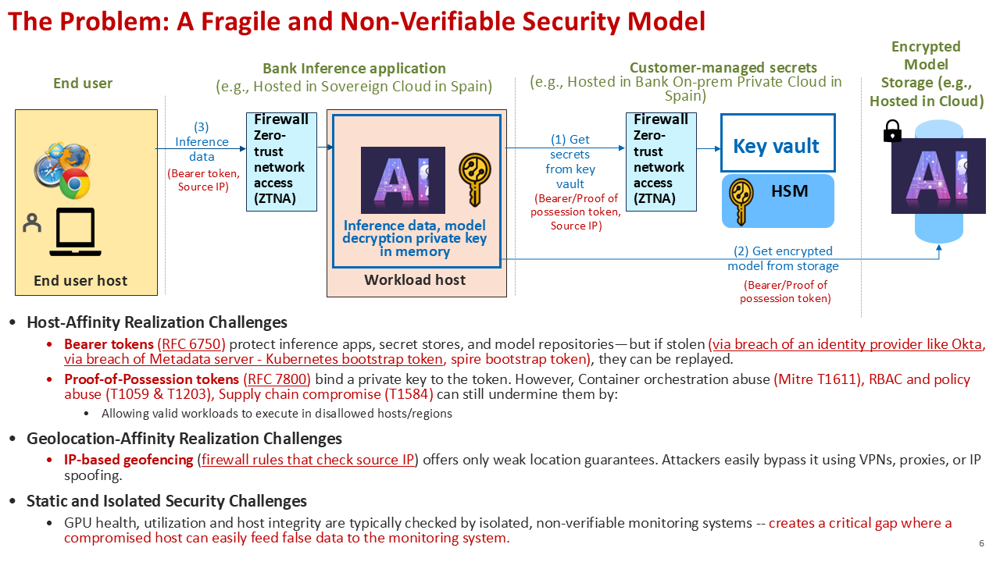
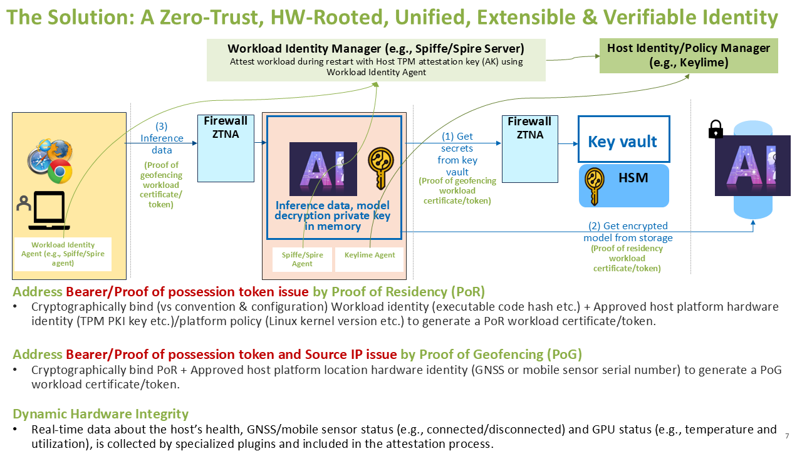
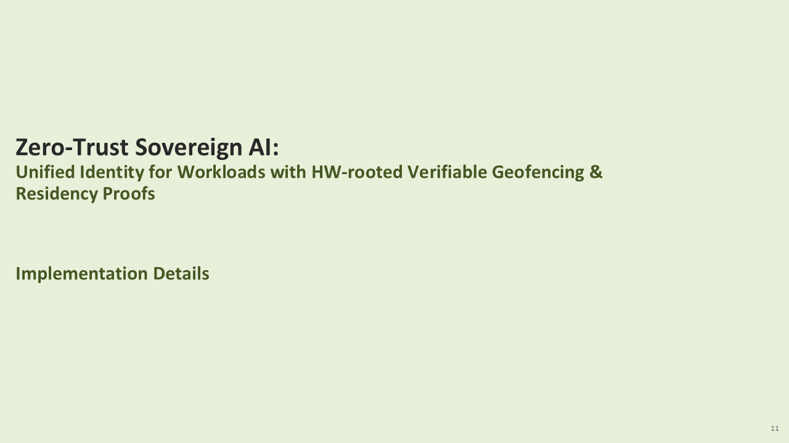

# Hybrid Cloud POC

## Overview
This directory contains a proof-of-concept implementation demonstrating hybrid cloud unified identity with hardware-rooted verifiable geofencing and residency proofs using SPIRE, Keylime, and Envoy addressing the challenges of the traditional non-verifiable security model.

**Slides:** [View Presentation](https://onedrive.live.com/?id=746ADA9DC9BA7CB7%21sa416cb345794427ab085a20f8ccc0edd&cid=746ADA9DC9BA7CB7&redeem=aHR0cHM6Ly8xZHJ2Lm1zL2IvYy83NDZhZGE5ZGM5YmE3Y2I3L0VUVExGcVNVVjNwQ3NJV2lENHpNRHQwQlh6U3djQ01HWDhjQS1xbGxLZm1Zdnc%5FZT1PTnJqZjE&parId=746ADA9DC9BA7CB7%21s95775661177f4ef5a4ba84313cd3795a&o=OneUp)

## The Problem: A Fragile and Non-Verifiable Security Model

Current security approaches for AI inference applications, secret stores, system agents, and model repositories face **critical gaps** that are amplified in edge AI deployments. The traditional security model relies on bearer tokens, proof-of-possession tokens, and IP-based geofencing, which are vulnerable to replay attacks, account manipulation, and location spoofing.

### Host-Affinity Realization Challenges

- **Bearer tokens (RFC 6750)**: Protect inference applications, secret stores, and model repositories but can be replayed if stolen through compromise of an identity provider (e.g., Okta) or metadata server (e.g., Kubernetes bootstrap token, SPIRE bootstrap token).

- **Proof-of-Possession tokens (RFC 7800)**: Bind a private key to the token, reducing replay risk, but remain vulnerable to:
  - Container orchestration abuse (MITRE T1611)
  - RBAC and policy abuse (T1059 & T1203)
  - Supply chain compromise (T1584)
  - These abuses can allow valid workloads to execute on disallowed hosts/regions

### Geolocation-Affinity Realization Challenges

- **IP-based geofencing**: Firewall rules based on source IP provide only weak location assurances — easily bypassed via VPNs, proxies, or IP spoofing.

### Static and Isolated Security Challenges

- GPU health, utilization, and host integrity are typically checked by isolated, non-verifiable monitoring systems. This creates a critical gap where a compromised host can easily feed false data to the monitoring system.



*Figure: Slide 6 - The Problem: A Fragile and Non-Verifiable Security Model. The diagram illustrates a traditional security architecture for AI inference applications showing: (1) End user host sending inference data with bearer tokens and source IP to Bank Inference application in Sovereign Cloud, (2) Workload host requesting secrets from Customer-managed key vault using bearer/proof-of-possession tokens, (3) Key vault retrieving encrypted models from storage. The diagram highlights three critical security challenges: Host-Affinity Realization Challenges (bearer token replay, proof-of-possession token vulnerabilities to orchestration/RBAC abuse), Geolocation-Affinity Realization Challenges (IP-based geofencing bypass via VPNs/proxies), and Static and Isolated Security Challenges (non-verifiable monitoring systems).*

## The Solution: A Zero-Trust, HW-Rooted, Unified, Extensible & Verifiable Identity

Our solution addresses these challenges through hardware-rooted cryptographic proofs that bind workload identity, host integrity, and geolocation into a unified, verifiable credential.

### Proof of Residency (PoR)

**Challenge addressed:** Weak bearer/proof-of-possession token models for system and AI agents in sensitive edge contexts.

**Approach:** Cryptographically bind — rather than rely on convention or configuration — the following elements to issue a PoR workload certificate/token:
- **Workload identity** (e.g., executable code hash)
- **Approved host platform hardware identity** (e.g., TPM PKI key)
- **Platform policy** (e.g., Linux kernel version, measured boot state)

### Proof of Geofencing (PoG)

**Challenge addressed:** Token misuse risks and unreliable Source IP checks for location-sensitive edge workloads.

**Approach:** Cryptographically bind the PoR attestation above **plus**:
- **Approved host platform location hardware identity** (e.g., GNSS module or mobile sensor hardware/firmware version)

This produces a PoG workload certificate/token, enabling verifiable enforcement of geographic policy at the workload level.

### Dynamic Hardware Integrity

Real-time data about the host's health, GNSS/mobile sensor status (e.g., connected/disconnected), and GPU status (e.g., temperature and utilization) is collected by specialized plugins and included in the attestation process.



*Figure: Slide 7 - The Solution: A Zero-Trust, HW-Rooted, Unified, Extensible & Verifiable Identity. The diagram shows the solution architecture with: (1) Workload Identity Agent sending inference data with Proof of Geofencing workload certificate/token to AI Inference Host, (2) AI Inference Host (with Spiffe/Spire Agent and Keylime Agent) requesting secrets from Key vault/HSM using Proof of Geofencing tokens, (3) Key vault retrieving encrypted models from storage using Proof of Residency tokens. The architecture includes Workload Identity Manager (SPIRE Server) and Host Identity/Policy Manager (Keylime) for continuous attestation. The solution cryptographically binds workload identity, host hardware identity (TPM), platform policy, and location hardware identity (GNSS/mobile sensor) into unified SVIDs, replacing fragile bearer tokens with hardware-rooted Proof of Residency (PoR) and Proof of Geofencing (PoG).*

## Unified Identity Architecture

For detailed information on the unified identity product architecture, including the complete end-to-end flow, attestation mechanisms, and component interactions, see:

**[README-arch-sovereign-unified-identity.md](README-arch-sovereign-unified-identity.md)**

This document covers:
- Complete end-to-end flow for SPIRE Agent Sovereign SVID attestation
- Workload SVID issuance flow
- Keylime Verifier on-demand verification
- Mobile location verification microservice
- Certificate chain structure
- Security mechanisms and design points

## Hybrid Cloud Unified Identity PoC End-to-End Solution Architecture

The current implementation demonstrates a hybrid cloud unified identity system connecting a Sovereign Cloud/Edge Cloud environment with a Customer on-Prem Private Cloud.

### Architecture Overview

**Sovereign Cloud Or Edge Cloud (Client Side):**
- **Identity Services:**
  - Host Identity (Keylime Verifier & Registrar)
  - Workload Identity (SPIRE Server)
- **Agents and Plugins:**
  - Keylime Agent
  - SPIRE Agent
  - SPIRE TPM Plugin
- **Client Application:**
  - Client App using unified identity
- **Hardware/Sensors:**
  - Mobile location sensor (e.g., USB tethered smartphone)
  - TPM (Trusted Platform Module)

**Customer on-Prem Private Cloud (Server Side):**
- **Gateway and Application:**
  - Envoy (API Gateway) with WASM plugin
  - Server App
- **Geolocation Service:**
  - Mobile Geolocation Service (CAMARA API)

### System Flow

1. **Sovereign Cloud Flow:**
   - SPIRE agent gets/refreshes unified identity with TPM-attested geolocation from SPIRE server
   - Client app inherits unified identity from SPIRE server – intermediate cert in cert hierarchy

2. **Inter-Cloud Communication:**
   - Client App communicates with Envoy (API Gateway) via HTTPS/mTLS using unified identity

3. **Customer on-Prem Cloud Flow:**
   - Envoy verifies unified identity signature using configured SPIRE server public key cert
   - Envoy verifies geolocation through Mobile Geolocation Service (CAMARA API)
   - Envoy communicates to Server App using standard mTLS



*Figure: Slide 12 - Hybrid Cloud Unified Identity PoC End-to-End Solution Architecture. The diagram shows the complete hybrid cloud unified identity architecture: **Sovereign Cloud/Edge Cloud (left, orange boundary)**: Contains Host Identity (Keylime Verifier & Registrar), Workload Identity (SPIRE Server), Keylime Agent, SPIRE Agent, SPIRE TPM Plugin, Mobile location sensor (USB tethered smartphone), TPM, and Client App. System flow: "SPIRE agent gets/refreshes unified identity with TPM-attested geolocation from SPIRE server". Client App flow: "Client app inherits unified identity from SPIRE server – intermediate cert in cert hierarchy". **Customer on-Prem Private Cloud (right, blue boundary)**: Contains Envoy (API Gateway) with WASM plugin, Server App, and Mobile Geolocation Service (CAMARA API). System flow: "Envoy verifies unified identity signature using configured SPIRE server public key cert and verifies geolocation through Mobile Geolocation Service". Server App flow: "Envoy communicates to Server App using standard mTLS". **Inter-Cloud Communication**: Client App connects to Envoy via HTTPS/mTLS using unified identity.*

## Quick Start Guide

This section provides a step-by-step guide to set up and run the complete hybrid cloud unified identity demonstration.

### Prerequisites

- Two machines:
  - **Physical with static IP address (e.g. 10.1.0.11)**: Sovereign Cloud/Edge Cloud (SPIRE Server, SPIRE Agent, Spire TPM Plugin, Keylime Verifier, Keylime Agent)
  - **Physical or Virtual with static IP address (e.g. 10.1.0.10)**: Customer On-Prem Private Cloud (Envoy Gateway, Mobile Location Service, mTLS Server)
- TPM 2.0 hardware (or TPM emulator for testing)
- Mobile location sensor (USB tethered smartphone) or GNSS module (optional, for geofencing demo)
- Root/sudo access on both machines
- CAMARA API credentials for mobile location service
- Add user to TSS group for TPM access
- Network connectivity between machines
- Python 3.10+ installed on both machines
- Rust toolchain installed on both machines
- Git installed on both machines

### Step 1: Setup SPIRE and Keylime (10.1.0.11)

This step sets up the identity services and agents on the sovereign cloud/edge cloud host.

**Run the complete setup script:**
```bash
cd ~/AegisEdgeAI/hybrid-cloud-poc
./test_complete.sh --no-pause
```

**What this script does:**
- Installs and configures SPIRE Server and Agent
- Sets up Keylime Verifier and Registrar
- Configures rust-keylime Agent with TPM support
- Creates SPIRE TPM Plugin server (sidecar)
- Registers agents with Keylime Registrar
- Creates SPIRE registration entries for workloads
- Tests the complete attestation flow
- Verifies workload SVID issuance with unified identity

**Expected output:**
- SPIRE Server running on port 8081
- SPIRE Agent running with Workload API on Unix socket
- Keylime Verifier running on port 8881
- Keylime Registrar running on port 8890
- rust-keylime Agent running on port 9002
- TPM Plugin Server running and ready for certification requests

**Monitor logs (optional):**
```bash
# In separate terminals, watch logs:
tail -f /tmp/spire-server.log          # SPIRE Server
tail -f /tmp/spire-agent.log            # SPIRE Agent
tail -f /tmp/keylime-verifier.log      # Keylime Verifier
tail -f /tmp/rust-keylime-agent.log     # rust-keylime Agent
tail -f /tmp/tpm-plugin-server.log      # SPIRE TPM Plugin
tail -f /tmp/mobile-sensor-microservice.log  # Mobile Location Service

# Or use the attestation watch script (filters for attestation events):
./watch-spire-agent-attestations.sh    # SPIRE Agent attestations only
```

**Verify setup:**
```bash
# Check SPIRE Agent health
spire-agent healthcheck

# Check SPIRE Server status
spire-server bundle show

# Verify Keylime Agent registration
curl http://localhost:8890/v2.2/agents
```

### Step 2: Setup Enterprise On-Prem Server (10.1.0.10)

This step sets up the gateway, mobile location service, and backend server on the customer on-prem private cloud host.

**Run the on-prem setup script:**
```bash
cd ~/AegisEdgeAI/hybrid-cloud-poc/enterprise-private-cloud
./test_onprem.sh
```

**What this script does:**
- Fetches SPIRE CA bundle from 10.1.0.11 (for verifying SPIRE client certificates)
- Generates Envoy certificates (separate from backend)
- Creates combined CA bundle (SPIRE + Envoy) for backend server
- Builds WASM filter with time-based caching for sensor verification
- Configures mobile location service with CAMARA credentials
- Auto-starts all services in background:
  - Mobile Location Service (port 5000)
  - mTLS Server (port 9443)
  - Envoy Proxy (port 8080)
- Verifies all services are running

**Expected output:**
- Envoy Proxy listening on port 8080
- Mobile Location Service running on port 5000
- mTLS Server running on port 9443
- WASM filter loaded and ready for sensor verification

**Monitor logs (optional):**
```bash
cd enterprise-private-cloud

# Option 1: Individual terminal windows
./watch-envoy-logs.sh          # Terminal 1 - Envoy logs
./watch-mtls-server-logs.sh    # Terminal 2 - mTLS server logs
./watch-mobile-sensor-logs.sh   # Terminal 3 - Mobile sensor service logs

# Option 2: All logs in one tmux session
./watch-all-logs.sh
```

**Verify setup:**
```bash
# Check Envoy is running
sudo netstat -tlnp | grep 8080

# Check Mobile Location Service
curl http://localhost:5000/health

# Check mTLS Server
curl -k https://localhost:9443/health
```

### Step 3: Start mTLS Client (10.1.0.11)

This step demonstrates a client application using SPIRE unified identity to connect to the on-prem server.

**Start the mTLS client:**
```bash
cd ~/AegisEdgeAI/hybrid-cloud-poc/python-app-demo

# Clean up old client log file
rm -f /tmp/mtls-client-app.log

# Set environment variables
export CLIENT_USE_SPIRE="true"
export SPIRE_AGENT_SOCKET="/tmp/spire-agent/public/api.sock"
export SERVER_HOST="10.1.0.10"  # Envoy on on-prem
export SERVER_PORT="8080"
export CA_CERT_PATH="~/.mtls-demo/envoy-cert.pem"

# Run the client
python3 mtls-client-app.py
```

**What happens:**
1. Client connects to SPIRE Agent Workload API
2. SPIRE Agent attests the client process and matches to registration entry
3. SPIRE Agent requests workload SVID from SPIRE Server
4. Workload SVID inherits unified identity claims from agent SVID (geolocation, TPM attestation)
5. Client uses workload SVID for mTLS connection to Envoy
6. Envoy verifies SPIRE certificate signature using SPIRE CA bundle
7. Envoy WASM filter extracts sensor ID from certificate chain
8. Envoy calls Mobile Location Service to verify geolocation
9. If verified, Envoy forwards request to backend mTLS server with X-Sensor-ID header
10. Backend server logs the sensor ID for audit trail

**Expected output:**
```
╔════════════════════════════════════════════════════════════════╗
║  mTLS Client Starting with SPIRE SVID (Automatic Renewal)      ║
╚════════════════════════════════════════════════════════════════╝
SPIRE Agent socket: /tmp/spire-agent/public/api.sock
Server: 10.1.0.10:8080

  Mode: SPIRE (automatic SVID renewal enabled)
  ✓ Got initial SVID: spiffe://example.org/mtls-client
  ✓ Connected to server
  📤 Sending: HELLO #1
  📥 Received: SERVER ACK: HELLO #1
```

**Monitor client logs (optional):**
```bash
# Watch client output in the same terminal, or in a separate terminal:
tail -f /tmp/mtls-client-app.log
```

### Step 4: Verify End-to-End Flow

**Check Envoy logs for sensor verification:**
```bash
# On 10.1.0.10
sudo tail -f /opt/envoy/logs/envoy.log | grep -E '(sensor|verification|cache|TTL)'
```

Expected log entries:
- "Extracted sensor_id: 12d1:1433"
- "Using cached verification" (after first request, within 15s)
- "Cache expired" (after 15s, re-verifying)
- "Sensor verification successful"

**Check Mobile Location Service logs:**
```bash
# On 10.1.0.10
tail -f /tmp/mobile-sensor.log | grep -E '(CAMARA|authorize|token|verify_location)'
```

**Check mTLS Server logs:**
```bash
# On 10.1.0.10
tail -f /tmp/mtls-server.log | grep -E '(Sensor ID|X-Sensor-ID)'
```

Expected log entries:
- "Client X HTTP GET /hello: HELLO #N [Sensor ID: 12d1:1433]"

**Check SPIRE Agent attestation:**
```bash
# On 10.1.0.11
./watch-spire-agent-attestations.sh
```

Expected log entries showing:
- Agent attestation with TPM App Key certification
- Unified identity SVID issuance with geolocation claims
- Workload SVID inheritance from agent SVID

### Step 5: Inspect Unified Identity Claims

**Dump workload SVID with AttestedClaims:**
```bash
cd ~/AegisEdgeAI/hybrid-cloud-poc/python-app-demo
python3 fetch-sovereign-svid-grpc.py

# Inspect the SVID and claims
../scripts/dump-svid-attested-claims.sh /tmp/svid-dump/svid.pem
```

**Expected output shows:**
- Workload SPIFFE ID
- Agent SVID in certificate chain
- AttestedClaims including:
  - `grc.geolocation.*` (sensor_id, type, latitude, longitude)
  - `grc.tpm-attestation.*` (App Key cert, TPM quote data)
  - `grc.workload.*` (workload ID, key source)

### Troubleshooting

**SPIRE Agent not attesting:**
- Check TPM is accessible: `ls -la /dev/tpm*`
- Verify TPM Plugin Server is running: `ps aux | grep tpm-plugin`
- Check SPIRE Agent logs: `tail -f /tmp/spire-agent.log`

**Envoy not verifying certificates:**
- Verify SPIRE bundle exists: `ls -la /opt/envoy/certs/spire-bundle.pem`
- Check Envoy config: `sudo envoy --config-path /opt/envoy/envoy.yaml --mode validate`

**Mobile Location Service failing:**
- Check CAMARA credentials: `echo $CAMARA_BASIC_AUTH`
- Verify sensor ID in database: `sqlite3 mobile-sensor-microservice/sensor_mapping.db "SELECT * FROM sensor_map;"`

**Client connection fails:**
- Verify Envoy certificate is copied: `ls -la ~/.mtls-demo/envoy-cert.pem`
- Check firewall rules: `sudo iptables -L -n | grep 8080`
- Verify SPIRE Agent socket: `ls -la /tmp/spire-agent/public/api.sock`

## Components

### SPIRE
- **Server**: Issues SVIDs with attested claims
- **Agent**: Provides Workload API to applications
- **TPM Plugin**: Integrates TPM attestation with SPIRE
- Location: `spire/`

### Keylime
- **Verifier**: Validates TPM attestation
- **Registrar**: Stores agent registration information
- **Agent**: Provides TPM attestation to SPIRE
- Location: `keylime/` and `rust-keylime/`

### Python Applications
- **Client**: mTLS client using SPIRE SVIDs
- **Server**: mTLS server for testing
- Location: `python-app-demo/`

### Enterprise Private Cloud
- **Envoy Proxy**: mTLS termination and routing
- **WASM Filter**: Sensor ID extraction and verification
- **Mobile Location Service**: CAMARA API integration
- Location: `enterprise-private-cloud/`

## Documentation

- [Unified Identity Architecture](README-arch-sovereign-unified-identity.md) - Complete end-to-end flow and architecture details
- [Enterprise Private Cloud README](enterprise-private-cloud/README.md) - Detailed setup and architecture
- [Python App Demo README](python-app-demo/README.md) - Client/server usage
- [test_complete.sh](test_complete.sh) - Complete integration test script

## Logs

### Log File Locations

**On 10.1.0.11 (Sovereign Cloud):**
- SPIRE Server: `/tmp/spire-server.log`
- SPIRE Agent: `/tmp/spire-agent.log`
- Keylime Verifier: `/tmp/keylime-verifier.log`
- rust-keylime Agent: `/tmp/rust-keylime-agent.log`
- TPM Plugin Server: `/tmp/tpm-plugin-server.log`

**On 10.1.0.10 (On-Prem):**
- Envoy: `/opt/envoy/logs/envoy.log` (requires sudo)
- mTLS Server: `/tmp/mtls-server.log`
- Mobile Location Service: `/tmp/mobile-sensor.log`

### Watch Logs During Demo

For monitoring logs during a demo, use the watch scripts:

**Option 1: Individual terminal windows**
```bash
cd enterprise-private-cloud

# Terminal 1 - Envoy logs
./watch-envoy-logs.sh

# Terminal 2 - mTLS server logs
./watch-mtls-server-logs.sh

# Terminal 3 - Mobile sensor service logs
./watch-mobile-sensor-logs.sh
```

**Option 2: Single tmux session (all logs in one window)**
```bash
cd enterprise-private-cloud
./watch-all-logs.sh
```

This creates a tmux session with 3 panes showing all logs simultaneously.
