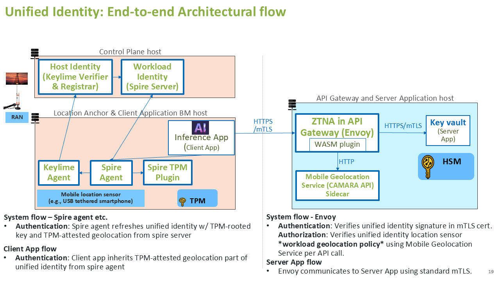

# Sovereign Hybrid Cloud PoC
**Demonstrating Verifiable Data Sovereignty across Public Cloud (e.g., Telefonica) and On-Premise Infrastructure**

This Proof of Concept implements the **AegisSovereignAI** architecture to create a contiguous Chain of Trust between a public cloud and a sovereign private cloud (on-premise).

## Overview

This directory contains a proof-of-concept implementation demonstrating sovereign hybrid cloud unified identity with hardware-rooted verifiable geofencing and residency proofs using SPIRE, Keylime, and Envoy. This POC addresses the challenges of the traditional non-verifiable security model by providing cryptographically verifiable proofs that bind workload identity, host integrity, and geolocation into unified credentials.

**Slides:** [View Presentation](https://onedrive.live.com/?id=746ADA9DC9BA7CB7%21sa416cb345794427ab085a20f8ccc0edd&cid=746ADA9DC9BA7CB7&redeem=aHR0cHM6Ly8xZHJ2Lm1zL2IvYy83NDZhZGE5ZGM5YmE3Y2I3L0VUVExGcVNVVjNwQ3NJV2lENHpNRHQwQlh6U3djQ01HWDhjQS1xbGxLZm1Zdnc%5FZT1PTnJqZjE&parId=746ADA9DC9BA7CB7%21s95775661177f4ef5a4ba84313cd3795a&o=OneUp)

## The Architecture Scenario
This PoC simulates a real-world regulated environment:
- **The Public Zone (Public Cloud - e.g., Telefonica):** Represents a scalable environment where initial processing occurs (the Client).
- **The Trusted Zone (On-Premise):** Represents the Sovereign Private Cloud where the Root of Trust is established and sensitive data (e.g., Banking Secrets) is stored (the Server).
- **The Trust Bridge (AegisSovereignAI):** A unified control plane that issues short-lived, hardware-rooted credentials allowing the two zones to communicate only if strict integrity and location policies are met.

## The Problem

Current security approaches for AI inference applications, secret stores, system agents, and model repositories face **critical gaps** that are amplified in edge AI deployments. The traditional security model relies on bearer tokens, proof-of-possession tokens, and IP-based geofencing, which are vulnerable to replay attacks, account manipulation, and location spoofing.


The diagram illustrates a traditional security architecture for AI inference applications showing:
1. End user host sending inference data with bearer tokens and source IP to Bank Inference application in Sovereign Cloud
2. Workload host requesting secrets from Customer-managed key vault using bearer/proof-of-possession tokens
3. Key vault retrieving encrypted models from storage

The diagram highlights three critical security challenges:
- **Host-Affinity Realization Challenges**: Bearer token replay, proof-of-possession token vulnerabilities to orchestration/RBAC abuse
- **Geolocation-Affinity Realization Challenges**: IP-based geofencing bypass via VPNs/proxies
- **Static and Isolated Security Challenges**: Non-verifiable monitoring systems

## The Solution

Our solution addresses these challenges through hardware-rooted cryptographic proofs that bind workload identity, host integrity, and geolocation into a unified, verifiable credential.


The diagram shows the solution architecture with:
1. **Workload Identity Agent** sending inference data with Proof of Geofencing workload certificate/token to AI Inference Host
2. **AI Inference Host** (with Spiffe/Spire Agent and Keylime Agent) requesting secrets from Key vault/HSM using Proof of Geofencing tokens
3. **Key vault** retrieving encrypted models from storage using Proof of Residency tokens

The architecture includes:
- **Workload Identity Manager** (SPIRE Server) and **Host Identity/Policy Manager** (Keylime) for continuous attestation
- Cryptographic binding of workload identity, host hardware identity (TPM), platform policy, and location hardware identity (GNSS/mobile sensor) into unified SVIDs
- Replacement of fragile bearer tokens with hardware-rooted **Proof of Residency (PoR)** and **Proof of Geofencing (PoG)**

## Unified Identity Architecture

For detailed information on the unified identity architecture, including the complete end-to-end flow, attestation mechanisms, and component interactions, see:

**[README-arch-sovereign-unified-identity.md](README-arch-sovereign-unified-identity.md)**

This document covers:
- Complete end-to-end flow for SPIRE Agent Sovereign SVID attestation
- Workload SVID issuance flow
- Keylime Verifier on-demand verification
- Mobile location verification microservice
- Certificate chain structure
- Security mechanisms and design points

## Hybrid Cloud Unified Identity PoC End-to-End Solution Architecture

The current implementation demonstrates a hybrid cloud unified identity system connecting a Sovereign Cloud/Edge Cloud environment with a Customer on-Prem Private Cloud.

### Architecture Overview

**Sovereign Cloud Or Edge Cloud (Client Side):**
- **Control Plane Identity Services:**
  - Host Identity (Keylime Verifier & Registrar)
  - Workload Identity (SPIRE Server)
- **Agents and Plugins:**
  - Keylime Agent
  - SPIRE Agent
  - SPIRE TPM Plugin
- **Client Application:**
  - Client App using unified identity
- **Hardware/Sensors:**
  - Mobile location sensor (e.g., USB tethered smartphone)
  - TPM (Trusted Platform Module)

**Customer on-Prem Private Cloud (Server Side):**
- **Gateway and Application:**
  - Envoy (API Gateway) with WASM plugin
  - Server App
- **Geolocation Service:**
  - Mobile Geolocation Service (CAMARA API)



**Sovereign Cloud/Edge Cloud (left, orange boundary):**
- Control Plane Identity Services: Host Identity (Keylime Verifier & Registrar), Workload Identity (SPIRE Server)
- Agents and Plugins: Keylime Agent, SPIRE Agent, SPIRE TPM Plugin, Mobile location sensor (USB tethered smartphone), TPM, and Client App using unified identity (SPIRE SVID)
- System flow: SPIRE agent gets/refreshes unified identity with TPM-attested geolocation from SPIRE server
- Client App flow: Client app inherits unified identity from SPIRE server – intermediate cert in cert hierarchy

**Customer on-Prem Private Cloud (right, blue boundary):**
- Contains: Envoy (API Gateway) with WASM plugin, Server App, and Mobile Geolocation Service (CAMARA API)
- System flow: Envoy verifies unified identity signature using configured SPIRE server public key cert and verifies geolocation through Mobile Geolocation Service
- Server App flow: Envoy communicates to Server App using standard mTLS

**Inter-Cloud Communication:**
- Client App connects to Envoy via HTTPS/mTLS using unified identity

## Quick Start Guide

This section provides a step-by-step guide to set up and run the complete hybrid cloud unified identity demonstration.

### Prerequisites

#### System Requirements

- Two machines:
  - **Physical with static IP address (e.g. 10.1.0.11)**: Sovereign Cloud/Edge Cloud (SPIRE Server, SPIRE Agent, Spire TPM Plugin, Keylime Verifier, Keylime Agent)
  - **Physical or Virtual with static IP address (e.g. 10.1.0.10)**: Customer On-Prem Private Cloud (Envoy Gateway, Mobile Location Service, mTLS Server)
- TPM 2.0 hardware (or TPM emulator for testing)
- Mobile location sensor (USB tethered smartphone) or GNSS module (optional, for geofencing demo)
- Root/sudo access on both machines
- CAMARA API credentials for mobile location service
- Network connectivity between machines
- Git installed on both machines

#### Operating System

- **Ubuntu 22.04 LTS** (tested) or compatible Debian-based distribution
- Other Linux distributions may work but are not tested

#### Required Linux Packages

**Essential System Packages:**
```bash
curl wget git vim net-tools iproute2 iputils-ping dnsutils ca-certificates
```

**TPM2 Tools and Libraries:**
```bash
tpm2-tools tpm2-abrmd libtss2-dev libtss2-esys-3.0.2-0 libtss2-sys1 \
libtss2-tcti-device0 libtss2-tcti-swtpm0
```

**Software TPM (for testing without hardware TPM):**
```bash
swtpm swtpm-tools
```

**Build Tools:**
```bash
build-essential gcc g++ make cmake pkg-config libclang-dev libclang-14-dev
```

**OpenSSL Development Libraries:**
```bash
libssl-dev
```

**Python Development Packages:**
```bash
python3 python3-dev python3-pip python3-venv python3-distutils
```

#### Required Programming Language Toolchains

**Python:**
- Python 3.10+ (tested with Python 3.10.12)
- Required Python packages (installed via pip):
  - `spiffe>=0.2.0` - SPIFFE Workload API client library
  - `cryptography>=41.0.0` - Cryptographic primitives
  - `grpcio>=1.60.0` - gRPC library
  - `grpcio-tools>=1.60.0` - gRPC tools
  - `protobuf>=4.25.0` - Protocol buffers
  - `requests>=2.31.0` - HTTP library

**Rust:**
- Rust toolchain (tested with rustc 1.91.1)
- Install via [rustup](https://rustup.rs/):
  ```bash
  curl --proto '=https' --tlsv1.2 -sSf https://sh.rustup.rs | sh
  ```

**Go:**
- Go 1.20+ (tested with Go 1.22.0)
- Download from [golang.org](https://golang.org/dl/)
- Extract to `/usr/local/go` and add `/usr/local/go/bin` to PATH

#### System Configuration

**TPM Access:**
- User must be in the `tss` group for TPM access:
  ```bash
  sudo groupadd -r tss  # If group doesn't exist
  sudo usermod -a -G tss $USER
  ```
- Log out and back in for group changes to take effect

#### Installation Scripts

Two helper scripts are provided to simplify setup:

1. **`check_packages.sh`** - Check installed packages and versions:
   ```bash
   ./check_packages.sh              # Check local system
   ./check_packages.sh 10.1.0.10    # Check remote system via SSH
   ```

2. **`install_prerequisites.sh`** - Install all required packages:
   ```bash
   ./install_prerequisites.sh              # Install on local system
   ./install_prerequisites.sh 10.1.0.10     # Install on remote system via SSH
   ```

**Note:** The installation script will:
- Update package lists
- Install all required Linux packages
- Install/update Rust toolchain (if not present)
- Install/update Go toolchain (if not present or version < 1.20)
- Install required Python packages
- Set up TSS group and add user to it

**Important:** After running the installation script, you may need to:

1. **For Rust:** Run `source $HOME/.cargo/env` or add to `~/.bashrc`:
   ```bash
   echo 'source $HOME/.cargo/env' >> ~/.bashrc
   ```

2. **For Go:** Ensure `/usr/local/go/bin` is in your PATH. Add to `~/.bashrc`:
   ```bash
   echo 'export PATH=$PATH:/usr/local/go/bin' >> ~/.bashrc
   ```

3. **For TSS group:** Log out and back in if you were added to the `tss` group

4. **Reload shell configuration:**
   ```bash
   source ~/.bashrc
   ```

5. **Verify installation:**
   ```bash
   ./check_packages.sh
   ```

For detailed prerequisite information, see [PREREQUISITES.md](PREREQUISITES.md).

### Installation Steps

#### Step 1: Check Current Package Status

Before installing, check what's already installed:

```bash
# Check local system
./check_packages.sh

# Check remote system (if needed)
./check_packages.sh 10.1.0.10
```

#### Step 2: Install Prerequisites

Install all required packages using the automated script:

```bash
# Install on local system
./install_prerequisites.sh

# Install on remote system via SSH
./install_prerequisites.sh 10.1.0.10
```

**Note:** The installation script requires sudo access and will prompt for your password.

#### Step 3: Post-Installation Configuration

After installation, configure your environment:

```bash
# Add Rust to PATH (if Rust was just installed)
echo 'source $HOME/.cargo/env' >> ~/.bashrc

# Add Go to PATH (if Go was just installed/updated)
echo 'export PATH=$PATH:/usr/local/go/bin' >> ~/.bashrc

# Reload shell configuration
source ~/.bashrc
```

**Important:** If you were added to the `tss` group during installation, **log out and back in** for the group changes to take effect. This is required for TPM access.

#### Step 4: Verify Prerequisites

Ensure all prerequisites are installed correctly:

```bash
# Verify system packages
dpkg -l | grep -E "(tpm2|swtpm|libtss2|libssl-dev|python3-dev|build-essential|libclang)"

# Verify toolchains
python3 --version    # Should show 3.10+
rustc --version      # Should show 1.91+ (if installed)
go version           # Should show go1.22+ (if installed)

# Verify Python packages
python3 -m pip list | grep -E "(spiffe|cryptography|grpcio|protobuf)"

# Verify TPM access
groups | grep tss    # Should show tss group
```

#### Step 5: Build SPIRE and Keylime Components

After prerequisites are installed, build the required components (if not already built):

```bash
# Build SPIRE server and agent
cd spire
make bin/spire-server bin/spire-agent
cd ..

# Build rust-keylime agent
cd rust-keylime
cargo build --release
cd ..
```

**Note:** Building SPIRE and rust-keylime may take several minutes the first time. Subsequent builds will be faster due to caching.

#### Troubleshooting Installation

If you encounter issues during installation:

1. **Check package versions:** Run `./check_packages.sh` to see what's installed
2. **Verify PATH:** Ensure Rust and Go are in your PATH after installation
3. **Check TSS group:** Verify you're in the `tss` group: `groups | grep tss`
4. **Review logs:** Check installation script output for specific errors
5. **Manual installation:** If automated script fails, install packages manually (see [PREREQUISITES.md](PREREQUISITES.md))

For detailed prerequisite information and troubleshooting, see [PREREQUISITES.md](PREREQUISITES.md).

### Port Configuration

This section documents all port numbers used by the test scripts. All ports are unique with no conflicts between hosts.

#### On 10.1.0.11 (Sovereign Cloud/Edge Cloud)

**Started by `test_control_plane.sh`:**
- **8881** - Keylime Verifier (HTTPS)
- **8890** - Keylime Registrar (HTTP)
- **8891** - Keylime Registrar (HTTPS/TLS)
- **9050** - Mobile Sensor Microservice (used by control plane for location verification)

**Started by `test_agents.sh`:**
- **9002** - rust-keylime Agent (HTTP/HTTPS)
- **8081** - SPIRE Server (mentioned in health checks, uses Unix socket for API)

**Note:** SPIRE Server and SPIRE Agent primarily use Unix domain sockets (`/tmp/spire-server/private/api.sock` and `/tmp/spire-agent/public/api.sock`) rather than TCP ports for their primary API.

#### On 10.1.0.10 (Customer On-Prem Private Cloud)

**Started by `test_onprem.sh`:**
- **5000** - Mobile Location Service (HTTP)
- **9443** - mTLS Server (HTTPS)
- **8080** - Envoy Proxy (HTTP/HTTPS)

#### Port Summary Table

| Port | Service | Host | Script | Protocol |
|------|---------|------|--------|----------|
| 5000 | Mobile Location Service | 10.1.0.10 | test_onprem.sh | HTTP |
| 8080 | Envoy Proxy | 10.1.0.10 | test_onprem.sh | HTTP/HTTPS |
| 8081 | SPIRE Server | 10.1.0.11 | test_agents.sh | Unix Socket (health checks) |
| 8881 | Keylime Verifier | 10.1.0.11 | test_control_plane.sh | HTTPS |
| 8890 | Keylime Registrar | 10.1.0.11 | test_control_plane.sh | HTTP |
| 8891 | Keylime Registrar | 10.1.0.11 | test_control_plane.sh | HTTPS |
| 9002 | rust-keylime Agent | 10.1.0.11 | test_agents.sh | HTTP/HTTPS |
| 9050 | Mobile Sensor Microservice | 10.1.0.11 | test_control_plane.sh | HTTP |
| 9443 | mTLS Server | 10.1.0.10 | test_onprem.sh | HTTPS |

**Port Conflict Analysis:** ✅ No conflicts detected. All ports are unique and assigned to different services on different hosts.

### Demo Act 1: Trusted Infrastructure Setup

*See Slide 19 for the architecture diagram*

**SOVEREIGN PUBLIC/EDGE CLOUD CONTROL PLANE WINDOW:** (e.g., 10.1.0.11)
```bash
cd ~/AegisSovereignAI/hybrid-cloud-poc
./test_control_plane.sh --no-pause

# Verify processes are running
ps -aux | grep spire-server
ps -aux | grep keylime.cmd.verifier
ps -aux | grep keylime.cmd.registrar

# Health checks (optional but recommended)
# Check SPIRE Server health
./spire/bin/spire-server healthcheck -socketPath /tmp/spire-server/private/api.sock

# Check Keylime Verifier endpoint
curl -k https://localhost:8881/version || curl http://localhost:8881/version

# Check Keylime Registrar endpoint
curl http://localhost:8890/version

# Check service logs for errors
tail -20 /tmp/spire-server.log
tail -20 /tmp/keylime-verifier.log
tail -20 /tmp/keylime-registrar.log
```

**ON PREM API GATEWAY WINDOW:** (e.g., 10.1.0.10)
```bash
cd ~/AegisSovereignAI/hybrid-cloud-poc/enterprise-private-cloud
./test_onprem.sh --no-pause

# Verify processes are running
ps -aux | grep envoy
ps -aux | grep mobile-sensor-microservice
ps -aux | grep mtls-server

# Health checks (optional but recommended)
# Check Envoy is listening on port 8080
sudo ss -tlnp | grep :8080 || sudo netstat -tlnp | grep :8080

# Check Mobile Location Service endpoint
curl http://localhost:5000/verify -X POST -H "Content-Type: application/json" -d '{}'

# Check mTLS Server is listening on port 9443
sudo ss -tlnp | grep :9443 || sudo netstat -tlnp | grep :9443

# Check service logs for errors
tail -20 /opt/envoy/logs/envoy.log
tail -20 /tmp/mobile-sensor.log
tail -20 /tmp/mtls-server.log
```

**Quick Verification Summary:**

After running both setup scripts, verify all services are healthy:

**On Control Plane (10.1.0.11):**
```bash
# All services should show running processes
ps aux | grep -E "spire-server|keylime.cmd.verifier|keylime.cmd.registrar" | grep -v grep

# Quick health check one-liner
echo "SPIRE Server: $(./spire/bin/spire-server healthcheck -socketPath /tmp/spire-server/private/api.sock 2>&1 | head -1)"
echo "Keylime Verifier: $(curl -s -k https://localhost:8881/version 2>&1 | head -1 || echo 'not responding')"
echo "Keylime Registrar: $(curl -s http://localhost:8890/version 2>&1 | head -1 || echo 'not responding')"
```

**On On-Prem Gateway (10.1.0.10):**
```bash
# All services should show running processes
ps aux | grep -E "envoy|mobile-sensor|mtls-server" | grep -v grep

# Quick health check one-liner
echo "Envoy (port 8080): $(sudo ss -tlnp 2>/dev/null | grep :8080 >/dev/null && echo 'listening' || echo 'not listening')"
echo "Mobile Service (port 5000): $(curl -s -X POST http://localhost:5000/verify -H 'Content-Type: application/json' -d '{}' 2>&1 | head -1 || echo 'not responding')"
echo "mTLS Server (port 9443): $(sudo ss -tlnp 2>/dev/null | grep :9443 >/dev/null && echo 'listening' || echo 'not listening')"
```

**Common Issues:**
- If services don't start: Check logs in `/tmp/` (control plane) or `/opt/envoy/logs/` and `/tmp/` (on-prem)
- If ports are in use: Run cleanup scripts or manually stop conflicting services
- If health checks fail: Wait a few seconds for services to fully initialize, then retry

### Demo Act 2: The Happy Path (Proof of Geofencing)

*See Slides 7 and 19 for solution architecture and implementation details*

This act demonstrates the complete flow from workload attestation through successful geolocation verification.

#### Step 1: Start SPIRE Agent and Workload Services (e.g., 10.1.0.11)

**SOVEREIGN PUBLIC/EDGE CLOUD AGENT WINDOW:** (e.g., 10.1.0.11)
```bash
cd ~/AegisSovereignAI/hybrid-cloud-poc
./test_agents.sh --no-pause
```

**What this script does:**
- Configures SPIRE Agent with TPM support
- Configures rust-keylime Agent with TPM support
- Creates SPIRE TPM Plugin server (sidecar)
- Registers agents with Keylime Registrar
- Creates SPIRE registration entries for workloads
- Tests the complete attestation flow
- Verifies workload SVID issuance with unified identity

**Expected output:**
- SPIRE Agent running with Workload API on Unix socket
- rust-keylime Agent running on port 9002
- TPM Plugin Server running and ready for certification requests

**Monitor logs (optional):**
```bash
# In separate terminals, watch logs:
tail -f /tmp/spire-agent.log            # SPIRE Agent
tail -f /tmp/rust-keylime-agent.log     # rust-keylime Agent
tail -f /tmp/tpm-plugin-server.log      # SPIRE TPM Plugin

# Or use the attestation watch script (filters for attestation events):
./watch-spire-agent-attestations.sh    # SPIRE Agent attestations only
```

**Verify setup:**
```bash
# Check SPIRE Agent health
spire-agent healthcheck

# Check SPIRE Server status
spire-server bundle show
```

#### Step 2: Start mTLS Client and Verify End-to-End Flow (e.g., 10.1.0.11)

**SOVEREIGN PUBLIC/EDGE CLOUD CLIENT APP WINDOW:** (e.g., 10.1.0.11)
```bash
cd ~/AegisSovereignAI/hybrid-cloud-poc
./test_mtls_client.sh
```

**Note:** The client automatically saves the workload SVID certificate chain to `/tmp/svid-dump/svid.pem` for inspection.

**What happens:**

1. Client connects to SPIRE Agent Workload API
2. SPIRE Agent attests the client process and matches to registration entry
3. SPIRE Agent requests workload SVID from SPIRE Server
4. Workload SVID inherits unified identity claims from agent SVID (geolocation, TPM attestation)
5. Client uses workload SVID for mTLS connection to Envoy
6. Envoy verifies SPIRE certificate signature using SPIRE CA bundle
7. Envoy WASM filter extracts sensor ID and type from certificate chain
8. Envoy WASM filter behavior:
    - GPS/GNSS sensors: Trusted hardware, bypass mobile location service (allow directly)
    - Mobile sensors: Calls Mobile Location Service to verify geolocation
      - Mobile Location Service handles CAMARA API caching (15-min TTL, configurable)
      - CAMARA API is called at most once per TTL period; cached results are reused
9. If verified, Envoy forwards request to backend mTLS server with `X-Sensor-ID` header
10. Backend server logs the sensor ID for audit trail

**Expected output:**
```
╔════════════════════════════════════════════════════════════════╗
║  mTLS Client Starting with SPIRE SVID (Automatic Renewal)      ║
╚════════════════════════════════════════════════════════════════╝
SPIRE Agent socket: /tmp/spire-agent/public/api.sock
Server: e.g., 10.1.0.10:8080

  Mode: SPIRE (automatic SVID renewal enabled)
  ✓ Got initial SVID: spiffe://example.org/mtls-client
  ✓ Connected to server
  📤 Sending: HELLO #1
  📥 Received: SERVER ACK: HELLO #1
```

**Monitor client logs (optional):**
```bash
# Watch client output in the same terminal, or in a separate terminal:
tail -f /tmp/mtls-client-app.log
```

#### Step 3: Verify End-to-End Flow and Inspect Unified Identity Claims

**ON PREM API GATEWAY WINDOW:** (e.g., 10.1.0.10)
```bash
cd ~/AegisSovereignAI/hybrid-cloud-poc/enterprise-private-cloud
./watch-envoy-logs.sh
```

**Check Envoy logs for sensor verification:**
```bash
# On e.g., 10.1.0.10
sudo tail -f /opt/envoy/logs/envoy.log | grep -E '(sensor|verification|cache|TTL)'
```

**Expected log entries:**
- For mobile sensors:
  - `[LOCATION VERIFY] Initiating location verification...`
  - `[CACHE MISS]` or `[API CALL]` (first call)
  - `[CACHE HIT]` (subsequent calls within cache TTL)
  - `[LOCATION VERIFY] Location verification completed: result=true`
- For GPS/GNSS sensors:
  - `GPS/GNSS sensor: Trusted hardware, no mobile location service call needed - allowing request`
- `Sensor verification successful`

**ON PREM MOBILE LOCATION SERVICE WINDOW:** (e.g., 10.1.0.10)
```bash
cd ~/AegisSovereignAI/hybrid-cloud-poc/enterprise-private-cloud
./watch-mobile-sensor-logs.sh
```

**Check Mobile Location Service logs:**
```bash
# On e.g., 10.1.0.10
tail -f /tmp/mobile-sensor.log | grep -E '(CAMARA|authorize|token|verify_location|\[CACHE|\[LOCATION VERIFY|\[API)'
```

**Expected log entries:**
- `CAMARA verify_location caching: ENABLED (TTL: 900 seconds = 15.0 minutes)`
- `[LOCATION VERIFY] Initiating location verification...`
- `[CACHE MISS]` or `[API CALL]` (first call)
- `[CACHE HIT]` (subsequent calls within cache TTL)
- `[API RESPONSE] CAMARA verify_location API response... [CACHED for 900 seconds]`

**ON PREM SERVER APP WINDOW:** (e.g., 10.1.0.10)
```bash
cd ~/AegisSovereignAI/hybrid-cloud-poc/enterprise-private-cloud
./watch-mtls-server-logs.sh
```

**Check mTLS Server logs:**
```bash
# On e.g., 10.1.0.10
tail -f /tmp/mtls-server.log | grep -E '(Sensor ID|X-Sensor-ID)'
```

**Expected log entries:**
- `Client X HTTP GET /hello: HELLO #N [Sensor ID: 12d1:1433]`

**Check SPIRE Agent attestation:**
```bash
# On e.g., 10.1.0.11
./watch-spire-agent-attestations.sh
```

**Expected log entries showing:**
- Agent attestation with TPM App Key certification
- Unified identity SVID issuance with geolocation claims
- Workload SVID inheritance from agent SVID

**Inspect Unified Identity Claims:**
```bash
# On e.g., 10.1.0.11
# The SVID is automatically saved by test_mtls_client.sh to /tmp/svid-dump/svid.pem
# Inspect the SVID and claims
./scripts/dump-svid-attested-claims.sh /tmp/svid-dump/svid.pem
```

**Expected output shows:**
- Workload SPIFFE ID
- Agent SVID in certificate chain
- **AttestedClaims** including:
  - `grc.geolocation.*` (sensor_id, type, latitude, longitude)
  - `grc.tpm-attestation.*` (App Key cert, TPM quote data)
  - `grc.workload.*` (workload ID, key source)

### Demo Act 3: The Defense (The Rogue Admin)

*This demonstrates protection against insider threats as described in Slide 6*

This act demonstrates how the system detects and blocks insider threats when hardware integrity is compromised.

**SOVEREIGN PUBLIC/EDGE CLOUD AGENT WINDOW:** (e.g., 10.1.0.11)
```bash
cd ~/AegisSovereignAI/hybrid-cloud-poc
./watch-spire-agent-attestations.sh
```
**SOVEREIGN PUBLIC/EDGE CLOUD CLIENT APP WINDOW:** (e.g., 10.1.0.11)
```bash
cd ~/AegisSovereignAI/hybrid-cloud-poc
./test_mtls_client.sh
```
**SOVEREIGN PUBLIC/EDGE CLOUD ROGUE ADMIN WINDOW:** (e.g., 10.1.0.11)
```bash
cd ~/AegisSovereignAI/hybrid-cloud-poc
./test_rogue_admin.sh

# Simulate rogue admin disconnecting the USB Mobile Sensor
sudo ./test_toggle_huawei_mobile_sensor.sh off

# Wait for system to detect the change and issue degraded SVID
# Then reconnect sensor to restore normal operation
sudo ./test_toggle_huawei_mobile_sensor.sh on
```

**What happens:**
1. Rogue admin disconnects USB Mobile Sensor (simulating physical tampering)
2. Keylime Agent detects the USB disconnect event via Dynamic Hardware Integrity monitoring
3. Hardware integrity score drops, triggering degraded attestation
4. SPIRE Agent attempts to refresh SVID but receives Degraded SVID (valid for network, missing Proof of Residency)
5. Client retries connection with degraded SVID
6. Envoy WASM Plugin verifies certificate and detects missing geolocation claim
7. **Key demonstration**: Envoy returns **403 Forbidden** with error **"Geo Claim Missing"**
8. System successfully blocks the request, proving protection against insider threats

**ON PREM API GATEWAY WINDOW:** (e.g., 10.1.0.10)
```bash
cd ~/AegisSovereignAI/hybrid-cloud-poc/enterprise-private-cloud
./watch-envoy-logs.sh
```
**ON PREM MOBILE LOCATION SERVICE WINDOW:** (e.g., 10.1.0.10)
```bash
cd ~/AegisSovereignAI/hybrid-cloud-poc/enterprise-private-cloud
./watch-mobile-sensor-logs.sh
```
**ON PREM SERVER APP WINDOW:** (e.g., 10.1.0.10)
```bash
cd ~/AegisSovereignAI/hybrid-cloud-poc/enterprise-private-cloud
./watch-mtls-server-logs.sh
```

**Expected log entries:**
- Envoy logs show: `403 Forbidden` with `Geo Claim Missing` error
- SPIRE Agent logs show: Degraded SVID issuance (missing geolocation claims)
- Keylime Agent logs show: USB sensor disconnect detection

### Troubleshooting

**SPIRE Agent not attesting:**
- Check TPM is accessible: `ls -la /dev/tpm*`
- Verify TPM Plugin Server is running: `ps aux | grep tpm-plugin`
- Check SPIRE Agent logs: `tail -f /tmp/spire-agent.log`

**Envoy not verifying certificates:**
- Verify SPIRE bundle exists: `ls -la /opt/envoy/certs/spire-bundle.pem`
- Check Envoy config: `sudo envoy --config-path /opt/envoy/envoy.yaml --mode validate`

**Mobile Location Service failing:**
- Check CAMARA credentials: `echo $CAMARA_BASIC_AUTH`
- Verify sensor ID in database: `sqlite3 mobile-sensor-microservice/sensor_mapping.db "SELECT * FROM sensor_map;"`

**Client connection fails:**
- Verify Envoy certificate is copied: `ls -la ~/.mtls-demo/envoy-cert.pem`
- Check firewall rules: `sudo iptables -L -n | grep 8080`
- Verify SPIRE Agent socket: `ls -la /tmp/spire-agent/public/api.sock`

## Components

### SPIRE
- **Server**: Issues SVIDs with attested claims
- **Agent**: Provides Workload API to applications
- **TPM Plugin**: Integrates TPM attestation with SPIRE
- **Open Source**: [SPIRE Project](https://spiffe.io/spire/)
- Location: `spire/`

### Keylime
- **Verifier**: Validates TPM attestation
- **Registrar**: Stores agent registration information
- **Agent**: Provides TPM attestation to SPIRE
- **Open Source**: [Keylime Project](https://keylime.dev/)
- Location: `keylime/` and `rust-keylime/`

### Python Applications
- **Client**: mTLS client using SPIRE SVIDs
- **Server**: mTLS server for testing
- Location: `python-app-demo/`

### Enterprise Private Cloud
- **Envoy Proxy**: mTLS termination and routing
- **WASM Filter**: Sensor ID extraction and verification
- **Mobile Location Service**: CAMARA API integration
- **Open Source**: [Envoy Proxy](https://www.envoyproxy.io/)
- Location: `enterprise-private-cloud/`

## Documentation

- [Unified Identity Architecture](README-arch-sovereign-unified-identity.md) - Complete end-to-end flow and architecture details
- [Enterprise Private Cloud README](enterprise-private-cloud/README.md) - Detailed setup and architecture
- [Python App Demo README](python-app-demo/README.md) - Client/server usage
- [test_agents.sh](test_agents.sh) - Agent services integration test script
- [test_control_plane.sh](test_control_plane.sh) - Control plane services test script
- [test_integration.sh](test_integration.sh) - Complete integration test script

## Logs

### Log File Locations

**On 10.1.0.11 (Sovereign Cloud):**
- SPIRE Server: `/tmp/spire-server.log`
- SPIRE Agent: `/tmp/spire-agent.log`
- Keylime Verifier: `/tmp/keylime-verifier.log`
- rust-keylime Agent: `/tmp/rust-keylime-agent.log`
- TPM Plugin Server: `/tmp/tpm-plugin-server.log`

**On e.g., 10.1.0.10 (On-Prem):**
- Envoy: `/opt/envoy/logs/envoy.log` (requires sudo)
- mTLS Server: `/tmp/mtls-server.log`
- Mobile Location Service: `/tmp/mobile-sensor.log`

### Watch Logs During Demo

For monitoring logs during a demo, use the watch scripts:

**Option 1: Individual terminal windows**
```bash
cd enterprise-private-cloud

# Terminal 1 - Envoy logs
./watch-envoy-logs.sh

# Terminal 2 - mTLS server logs
./watch-mtls-server-logs.sh

# Terminal 3 - Mobile sensor service logs
./watch-mobile-sensor-logs.sh
```

**Option 2: Single tmux session (all logs in one window)**
```bash
cd enterprise-private-cloud
./watch-all-logs.sh
```

This creates a tmux session with 3 panes showing all logs simultaneously.

## Demo Script: 3-Act Presentation

For a guided demonstration following the slide deck structure, use the 3-Act demo script:

```bash
./demo-3-act-presentation.sh
```

This script guides the audience through the presentation slides:

### **Introduction: The Sovereign Challenge**
*Refer to Slides 1-6*

- **Slide 1-5**: Introduction and context
- **Slide 6**: The Problem - A Fragile and Non-Verifiable Security Model
  - Explains the problem: fragile IP-based geofencing and insider threats
  - Introduces the Unified Identity solution

### **Act 1: The Setup (Trusted Infrastructure)**
*Refer to Slide 12: Implementation Architecture*

- Shows the architecture (Sovereign Cloud ↔ On-Prem Private Cloud)
- Demonstrates Keylime Verifier establishing hardware root of trust with TPM
- Verifies all services are running
- **Slide 12** displays the complete end-to-end solution architecture

### **Act 2: The Happy Path (Proof of Geofencing)**
*Refer to Slides 7 and 19*

- **Slide 7**: The Solution - Zero-Trust, HW-Rooted, Unified Identity
- Shows SPIRE Agent fetching Unified SVID with:
  - Workload Attestation (Software identity)
  - Host Attestation (TPM proof)
  - Geolocation Proof (From Keylime Agent Plugin)
- Decodes and displays the SVID certificate structure
- Demonstrates successful client connection with 200 OK from Envoy
- Shows WASM Plugin verification of Proof of Geofencing (PoG)
- **Slide 19** shows the implementation flow

### **Act 3: The Defense (The Rogue Admin)**
*Refer to Slide 6: Problem - Insider Threats*

- Simulates rogue admin disconnecting USB Mobile Sensor
- Shows Keylime Agent detecting the USB disconnect event
- Demonstrates Degraded SVID issuance (valid for network, missing PoR)
- Shows client reconnection attempt
- **Key demonstration**: Envoy WASM Plugin returns **403 Forbidden** with error **"Geo Claim Missing"**
- Proves the system blocks requests when geolocation proof is missing
- Addresses the insider threat scenario from **Slide 6**

### **Conclusion: Value Delivered**
*Refer to Slides 13-18*

- Summarizes the move from Phase I (replayable credentials) to Phase II (HW-anchored proofs)
- Highlights three key achievements:
  1. Strong Residency Guarantees (auditable)
  2. Protection against Insider Threats
  3. Unified Identity bound to physical hardware

**Prerequisites for Demo:**
- All services running on both machines (see Quick Start Guide above)
- USB Mobile Sensor connected (for Act 2)
- Root/sudo access for sensor toggle script

**Note:** The demo script automatically handles sensor disconnection/reconnection for Act 3.
