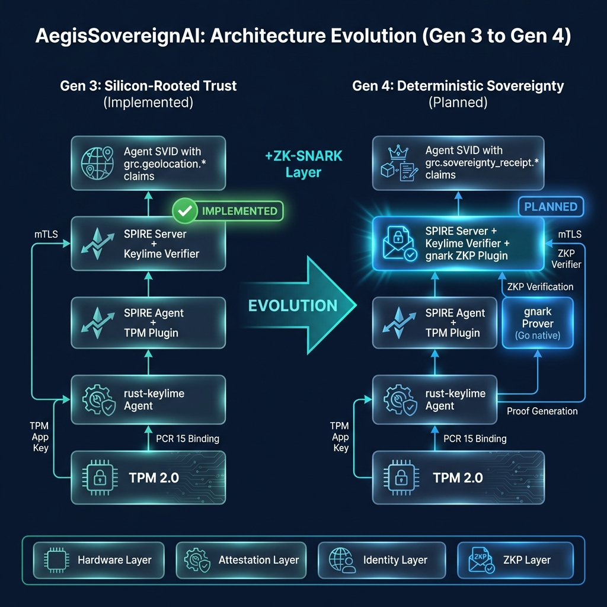

# Verifiable Policy Enforcement for Data Sovereignty

**Status:** Draft / RFC

---

## Executive Summary

**Problem:** Current cloud geofencing is contractual — enterprises rely on SLA promises, not cryptographic proof, that data stays in a specific region.

**Solution:** AegisSovereignAI's **Verifiable Policy Enforcement (VPE)** combines **TPM-attested hardware evidence** with **ZK-SNARK proofs** to mathematically prove both sensor integrity and location compliance — without revealing exact coordinates.

**Key Innovation:**
- **Gen 3 (Implemented):** TPM-attested sensors (GPS, Mobile) provide hardware-rooted evidence
- **Gen 4 (This Proposal):** Noir ZK-Circuit wraps evidence into privacy-preserving compliance proof

**Two Verification Layers:**
1. **ZKP Compliance** — Proves location within policy boundary (privacy-preserving)
2. **Hardware Integrity** — TPM-attested mobile sensor (IMEI, IMSI), GPS sensor (serial, location), OS, SPIRE Agent

**Result:** Workloads cannot communicate via mTLS unless they provide mathematical proof of physical residency. Non-compliant workloads are network-isolated ("Black Cloud").

---

## 1. The Evolution of Sovereign Trust

To understand the value of **AegisSovereignAI**, we must view it as the final evolution in the timeline of geofencing and residency.

| Era | Enforcement Model | Underlying Mechanism | Trust Level |
| --- | --- | --- | --- |
| **Gen 1** | **Contractual** | SLAs & Cloud Provider Promises | **Blind Trust:** "We promise it's in Germany." |
| **Gen 2** | **Administrative** | IP Geolocation & Rounding (Obfuscation) | **Soft Trust:** Easily spoofed via VPNs or misconfigurations. |
| **Gen 3 (AegisSovereignAI)** | **Silicon-Rooted** | **TPM Attestation** of Hardware Sensors | **Hard Trust:** Verified silicon identity; no virtualization spoofing. |
| **Gen 4 (AegisSovereignAI)** | **Deterministic** | **Silicon + ZKP (Sovereignty Receipt)** | **Zero Trust:** Mathematically enforced; absolute privacy via zero disclosure. |

---

## 2. The Gap: Why "Proof of Geofencing" is Missing Today

Current geofencing is **contractual**, not **verifiable**. Enterprises rely on Cloud Provider SLAs—essentially a "promise" that data stays in a region. AegisSovereignAI replaces this with **Deterministic Geofencing**, where the AI workload cannot execute unless it provides a mathematical receipt of its physical residency.

### Legacy Rounding vs. AegisSovereignAI ZKP

| Feature | Rounding (Legacy) | AegisSovereignAI ZKP (VPE) |
| --- | --- | --- |
| **Integrity** | Software-based (Spoofable) | **Silicon-rooted (TPM-signed)** |
| **Privacy** | Obscurity (De-anonymization risk) | **Mathematical (Zero Disclosure)** |
| **Precision** | Coarse (Loses detail) | **Infinite (Precise check, Boolean result)** |
| **Assurance** | SLA (Assertion) | **SNARK (Evidence)** |

---

## 3. Three Cases for Verifiable Location Attestation

AegisSovereignAI supports three distinct sensing modes, all rooted in **TPM-attested evidence** (Sensor ID, Serial Number, and IMEI/IMSI) as demonstrated in the [Hybrid Cloud PoC](https://github.com/lfedgeai/AegisSovereignAI/tree/main/hybrid-cloud-poc).

### Case 1: GPS + Mobile (Full Triangulation)

* **Evidence:** TPM-signed GPS (Precise) + MNO-signed Tower ID (Anchor).
* **Value:** The "Gold Standard" for high-compliance workloads (e.g., global banks, insurance firms).

### Case 2: GPS Only (Infrastructure Residency)

* **Evidence:** TPM-attested Sensor ID + GPS Serial Number + Coordinates.
* **Value:** Used for on-prem data centers or private sovereign clouds where mobile connectivity is restricted.

### Case 3: Mobile Only (The Hybrid Cloud PoC)

* **Evidence:** TPM-attested Mobile Sensor ID + IMEI + IMSI + MNO Tower ID.
* **Value:** Specifically designed for edge deployments and sovereign cloud nodes where GPS may be unavailable or jammed. Verification relies on the **MNO-signed endorsement** of the hardware's physical connection.

---

## 4. The Verifiable Workflow: From Silicon to Receipt

The workflow is a synchronized sequence where the **Sovereign Cloud Owner (SCO)** generates a proof that is validated by the **Enterprise Auditor**.

### Step 1: Evidence Gathering (Hardware-Rooted)

The server captures its internal ground truth. The **TPM 2.0** measures and signs the sensor data:

* **Mobile Sensor:** Signed IMEI/IMSI + Tower Signal.
* **GPS Sensor:** Signed Serial Number + Precise Coordinates.

### Step 2: Network Endorsement (For Cases 1 & 3)

The **MNO** (Carrier) detects the server's network attachment and provides a **Signed Coarse-Location Packet**. This acts as a "sanity check" to ensure the hardware isn't spoofing its internal sensor data.

### Step 3: ZK-Proof Generation (SPIRE Server)

The **AegisSovereignAI ZKP Plugin** on SPIRE Server runs the **Noir Logic**. It feeds in the private TPM evidence and the private MNO anchor.

* **Logic:** Does `Measured_IMEI/IMSI` match `Carrier_IMEI/IMSI`? Does `Measured_Location` fall inside `ENTERPRISE_POLICY_BOUNDARY`?
* **Artifact:** A 1KB **SNARK** (Sovereignty Receipt).

### Step 4: Identity-Residency Binding (SVID Issuance)

SPIRE Server embeds the Sovereignty Receipt in the Agent SVID claims. If the proof fails or expires, the SVID is not issued/renewed, effectively revoking the agent's ability to communicate via mTLS. This creates a hard link between **Physical Residency** and **Digital Identity**.

### Step 5: Verification (Two Layers, Two Options)

Verification covers **both** compliance and authenticity:

| Layer | What's Verified | SVID Claim |
|-------|-----------------|------------|
| **ZKP (Compliance)** | Location within policy boundary | `grc.sovereignty_receipt.*` |
| **Integrity (Authenticity)** | TPM-attested mobile sensor (IMEI, IMSI), GPS sensor (serial, location), OS, SPIRE Agent | `grc.geolocation.*`, `grc.tpm-attestation.*` |

**Verification Options:**

| Option | Use Case | Mechanism |
|--------|----------|-----------|
| **Automated (Envoy)** | Real-time enforcement on every mTLS request | WASM routes to ZKP verifier + validates integrity claims |
| **Manual (CLI)** | On-demand audit by external auditors | `aegis-cli verify-receipt <svid>` |

* **Automated:** Envoy verifies ZKP (routes to verifier service) AND validates hardware attestation claims → allows or blocks traffic.
* **Manual:** External auditor runs CLI to verify both layers independently, receives **"COMPLIANT"** status without seeing raw GPS or IMEI/IMSI data.

---

## 5. The Noir "Sovereignty" Circuit (Example)

This code demonstrates how the **TPM-attested sensor data** is used as a private witness.

```rust
// vpe_residency/src/main.nr

// Formalized MNO Anchor prevents mix-and-match attacks
struct MNOAnchor {
    tower_id: Field,
    device_id_hash: Field,  // Bound to IMEI/IMSI
    timestamp: u64,
    signature: [u64; 8],    // EdDSA signature from MNO
}

fn main(
    secret_gps: Private,        // GPS from TPM (Case 1 & 2)
    secret_imei: Private,       // IMEI from TPM (Case 1 & 3)
    secret_imsi: Private,       // IMSI from TPM (Case 1 & 3)
    mno_anchor: MNOAnchor,      // Signed Tower ID (Case 1 & 3)
    mno_pub_key: pub [u64; 4],  // MNO's public key
    public_nonce: pub Field,    // Freshness binding (prevents replay)
    public_zone: pub Area       // Public Bounding Box
) {
    // 1. Verify MNO Signature (prevents mix-and-match attacks)
    assert(verify_signature(mno_pub_key, mno_anchor.signature, 
           [mno_anchor.tower_id, mno_anchor.device_id_hash]));

    // 2. Freshness Constraint (prevents replay attacks)
    assert(is_fresh(mno_anchor.timestamp, public_nonce));

    // 3. Hardware-to-Network Binding (Case 3 logic)
    assert(hash(secret_imei, secret_imsi) == mno_anchor.device_id_hash);

    // 4. Geofencing Constraint
    assert(public_zone.contains(secret_gps));
    
    // Outcome: A 1KB proof of physical residency.
}
```

---

## 6. Sovereignty Receipt Workflow: The Dual-Identity Pattern

To prevent the high overhead of generating a new ZKP for every short-lived Workload SVID (TTL ~1hr), AegisSovereignAI utilizes a **Dual-Identity Pattern**. The expensive ZK-Prover runs once for the SPIRE Agent to generate a **Long-Lived Residency Token (LLRT)**, which workloads then reference.

```
┌───────────────────────────────────────────────────────────────────────────┐
│                     SOVEREIGNTY RECEIPT DATA FLOW                          │
├───────────────────────────────────────────────────────────────────────────┤
│                                                                           │
│  ┌─────┐  TPM-Signed GPS/IMEI/IMSI  ┌──────────────┐                     │
│  │ TPM │ ──────────────────────────→│              │                     │
│  └─────┘                            │    SPIRE     │                     │
│                                     │    Server    │                     │
│  ┌─────┐  Signed Tower ID           │              │                     │
│  │ MNO │ ──────────────────────────→│  ┌────────┐  │                     │
│  └─────┘                            │  │  ZKP   │  │  Noir    ┌───────┐  │
│                                     │  │ Plugin │──┼─Prover──→│ SNARK │  │
│                                     │  └────────┘  │          └───┬───┘  │
│                                     └──────────────┘              │      │
│                                            │                      │      │
│                                            ▼                      ▼      │
│                               ┌─────────────────────────────────────┐    │
│                               │         Agent SVID (LLRT)            │    │
│                               │  • Full SNARK (sovereignty_receipt)  │    │
│                               │  • H(SNARK) = Residency Hash         │    │
│                               └─────────────────────────────────────┘    │
│                                            │                             │
│                                            ▼                             │
│                               ┌─────────────────────────────────────┐    │
│                               │       Workload SVID (Lightweight)    │    │
│                               │  • grc.residency_hash = H(SNARK)     │    │
│                               │  • grc.compliance_zone (readable)    │    │
│                               │  (inherits via claims - implemented) │    │
│                               └─────────────────────────────────────┘    │
│                                            │                             │
│                                            ▼                             │
│                               ┌─────────────────────────────────────┐    │
│                               │         Envoy WASM                   │    │
│                               │  (routes to ZKP verifier service)    │    │
│                               └─────────────────────────────────────┘    │
│                                                                           │
└───────────────────────────────────────────────────────────────────────────┘
```

**Flow Summary:**
1. **SPIRE Agent** sends TPM-signed evidence to **SPIRE Server**
2. **MNO** provides signed Tower ID anchor
3. **SPIRE Server** runs Noir prover → generates **SNARK**
4. **Agent SVID** contains full SNARK + `H(SNARK)` residency hash
5. **Workload SVID** inherits lightweight `residency_hash` via claims (already implemented in [hybrid-cloud-poc](https://github.com/lfedgeai/AegisSovereignAI/tree/main/hybrid-cloud-poc))
6. **Envoy** routes to ZKP verifier → allows or blocks traffic

### X.509 Certificate Encoding (Interoperability)

| Feature | Encoding Location | OID |
|---------|-------------------|-----|
| **Sovereignty Receipt (SNARK)** | `Extension` (Octet String) | `1.3.6.1.4.1.58156.1.1` (AegisSovereignAI Arc) |
| **Residency Hash** | `SubjectAlternativeName` (otherName) | `1.3.6.1.4.1.58156.1.2` |
| **Hardware Evidence** | `Extension` (Keylime/TPM) | `1.3.6.1.4.1.55744.1.1` (Unified Identity) |

### Residency Hash Algorithm

To prevent "Proof Mirroring" (copying a valid SNARK from one agent to another):

```
H_res = SHA256(SNARK || Agent_SPIFFE_ID)
```

Including the Agent's SPIFFE ID cryptographically binds the receipt to that specific agent.

### Envoy WASM Cache Logic

The Envoy WASM filter caches ZKP verification results. If multiple workloads share the same `H_res`, Envoy verifies the SNARK once and stores the result in its shared-data store, avoiding redundant verification calls.

### MNO Signing Key Rotation

SPIRE Server fetches and rotates MNO public verification keys via a configured endpoint (e.g., `/.well-known/mno-keys.json`). Key rotation follows standard JWKS patterns with overlap periods to ensure continuity.

---

## 7. Strategic Value: The Sovereignty Receipt

For global financial services firms (e.g., JPMC, Citi), this proposal replaces a massive manual audit log with a single, cryptographic receipt.

* **For the Auditor:** A 1KB proof that mathematically guarantees the workload was physically in the Chennai Sovereign Zone, running on enterprise-approved silicon.
* **For the Provider:** Complete privacy of the data center's physical coordinates.
* **For the Regulator:** Real-time evidence that the **EU AI Act** or other residency laws are being enforced by the silicon itself, not just by a contractual promise.

### Privacy Guarantee: Approximate Location Without Disclosure

The core value of ZKP is **proving compliance without revealing exact coordinates**:

| Gen 3 (Today) | Gen 4 (With ZKP) |
|---------------|------------------|
| SVID contains exact GPS: `lat: 13.0827, lon: 80.2707` | SVID contains only: `zone: Chennai Sovereign ✓` |
| Every verifier sees precise location | Zero disclosure to Envoy, auditors, or relying parties |
| Privacy leak on every mTLS handshake | Mathematical proof, no data exposure |

This solves the **Audit Paradox**: regulators can verify residency compliance while the data center's physical location remains confidential.

### What On-Prem (Enterprise Gateway) Verifies

When a workload connects via mTLS, the on-prem Envoy gateway verifies **two distinct layers**:

| Verification Layer | What's Verified | SVID Claim | Purpose |
|-------------------|-----------------|------------|---------|
| **(1) ZKP Compliance** | Workload is within approved zone | `grc.sovereignty_receipt.*` | Proves **location policy compliance** (privacy-preserving) |
| **(2) Hardware Genuineness** | GPS sensor, mobile sensor, TPM, OS integrity | `grc.geolocation.*` + `grc.tpm-attestation.*` | Proves **evidence is from real silicon** |

**Single mTLS Handshake = Complete Trust Chain:**
- ✅ Certificate signed by trusted SPIRE CA (identity)
- ✅ Hardware attestation claims from Keylime (authenticity)
- ✅ ZK compliance proof from AegisSovereignAI ZKP Plugin (policy)

---

## 8. Implementation Path: From Gen 3 to Gen 4

The [Hybrid Cloud PoC](https://github.com/lfedgeai/AegisSovereignAI/tree/main/hybrid-cloud-poc) provides the **Gen 3 foundation** (Silicon-Rooted Trust). The VPE layer builds on top:



| Layer | Status | Component |
| --- | --- | --- |
| **Gen 3 (Silicon)** | ✅ Implemented | TPM App Key, PCR 15 binding, Unified Identity SVIDs |
| **Gen 4 (ZKP)** | 🔜 Planned | gnark ZK-Circuit, Sovereignty Receipt in SVID |

### ZKP Technology: gnark (Recommended)

For SPIRE Server plugin compatibility, we recommend [gnark](https://github.com/Consensys/gnark)—a Go-native ZK-SNARK library:

| Option | Pros | Cons |
|--------|------|------|
| **gnark (Go)** | Native SPIRE Plugin SDK; no FFI | Circuit written in Go |
| Noir → ACIR → gnark | Portable Noir circuits | FFI complexity (Rust → Go) |

### SPIRE Integration Architecture

The VPE ZKP generation happens **server-side** as a SPIRE Server plugin, integrating cleanly with the [Unified Identity Architecture](https://github.com/lfedgeai/AegisSovereignAI/blob/main/hybrid-cloud-poc/README-arch-sovereign-unified-identity.md).

```
┌─────────────────────────────────────────────────────────────────────┐
│                         SPIRE SERVER                                 │
├─────────────────────────────────────────────────────────────────────┤
│                                                                     │
│  ┌────────────────┐   ┌────────────────┐   ┌────────────────────┐  │
│  │    Keylime     │   │   AegisSovereignAI ZKP    │   │  unifiedidentity   │  │
│  │    Verifier    │   │    Plugin      │   │  CredentialComposer│  │
│  │    Plugin      │   │  (Noir Prover) │   │                    │  │
│  └───────┬────────┘   └───────┬────────┘   └─────────┬──────────┘  │
│          │                    │                      │             │
│          └────────────────────┴──────────────────────┘             │
│                               │                                    │
│                    ┌──────────▼──────────┐                        │
│                    │  Agent SVID with    │                        │
│                    │  Sovereignty Receipt│                        │
│                    │  (ZKP in claims)    │                        │
│                    └──────────┬──────────┘                        │
└───────────────────────────────┼─────────────────────────────────────┘
                                │
                                ▼
┌─────────────────────────────────────────────────────────────────────┐
│                         SPIRE AGENT                                  │
├─────────────────────────────────────────────────────────────────────┤
│  Receives Agent SVID → Serves Workload API                         │
│                                                                     │
│  ┌──────────────────────────────────────────────────────────────┐  │
│  │  Workload SVID inherits Agent claims via certificate chain   │  │
│  │  → grc.geolocation.*                                         │  │
│  │  → grc.sovereignty_receipt.* (Gen 4)                         │  │
│  └──────────────────────────────────────────────────────────────┘  │
└─────────────────────────────────────────────────────────────────────┘
```

**Key Design Decisions:**
1. **Server-Side ZKP** — gnark prover runs on SPIRE Server (trusted compute, cleaner audit)
2. **HW-Rooted Evidence** — Agent sends TPM-signed evidence; Server generates ZKP from already-attested data
3. **No Circular Signing** — ZKP is derived from TPM-signed evidence, not re-signed by TPM
4. **Claim Inheritance** — Workload SVIDs inherit Sovereignty Receipt via existing certificate chain pattern
5. **Plugin Model** — AegisSovereignAI ZKP Plugin follows SPIRE Plugin SDK (Go/gRPC) for upstream compatibility

### Implementation Timeline

| Phase | Deliverable | Effort |
|-------|-------------|--------|
| **P1** | gnark circuit + SPIRE Plugin scaffold | 2-3 weeks |
| **P2** | Integration with `unifiedidentity/claims.go` | 1 week |
| **P3** | WASM Filter `zkp` verification mode | 1-2 weeks |
| **Total** | **Production-Ready Gen 4** | **~6 weeks** |

---

## 9. Final Outcome

This moves the project from "Trust but Verify" to **"Verify then Execute."** The AI agent is only granted its Layer 2 (SPIFFE) identity if the Layer 3 (ZKP) residency proof is successfully generated, ensuring data sovereignty is a technical impossibility to bypass.

**The "Black Cloud" Enforcement:** Because Envoy (the gateway) verifies the Sovereignty Receipt, a non-compliant workload doesn't just "fail an audit"—it is **network-isolated**. It becomes part of a "Black Cloud" that cannot reach on-prem databases, secret stores, or any protected resource.

---

## References

- [Hybrid Cloud PoC Implementation](https://github.com/lfedgeai/AegisSovereignAI/tree/main/hybrid-cloud-poc)
- [Noir Programming and Zero-Knowledge Circuits Full Course](https://www.youtube.com/watch?v=psrIXF85bgA) - Underlying ZK-SNARK principles and Noir programming for "Policy-as-Circuit" model

---

# Appendix A: Implementation Status vs. Hybrid-Cloud-PoC

## Summary

The [hybrid-cloud-poc](https://github.com/lfedgeai/AegisSovereignAI/tree/main/hybrid-cloud-poc) implements **Gen 3 (Silicon-Rooted Trust)** from Section 1's evolution table. Gen 4 (Deterministic/ZKP) remains the primary gap.

---

## Status by Attestation Case (Section 3)

| Case | PoC Status | Notes |
|------|-----------|-------|
| **Case 1: GPS + Mobile** | ⚠️ Partial | GPS sensor support ✅, MNO signed endorsement ❌ |
| **Case 2: GPS Only** | ✅ Complete | GNSS sensors bypass sidecar as trusted hardware |
| **Case 3: Mobile Only** | ✅ Complete | IMEI/IMSI TPM-attested, CAMARA API integrated |

---

## Status by Workflow Step (Section 4)

| Step | Description | PoC Component | Status |
|------|-------------|--------------|--------|
| **Step 1** | Evidence Gathering | rust-keylime Agent + TPM | ✅ |
| **Step 2** | Network Endorsement | Mobile Sensor Microservice | ⚠️ Verification only, no signed packet |
| **Step 3** | ZK-Proof Generation | *AegisSovereignAI ZKP Plugin (proposed)* | ❌ Not implemented |
| **Step 4** | Verification | Envoy WASM routes to ZKP verifier | ❌ Not implemented |
| **Step 5** | Identity-Residency Binding | unifiedidentity plugin | ✅ (claims inheritance ready) |

---

## Gen 3 → Gen 4 Bridge

| Gen 3 (Implemented) | Gen 4 (Gap) |
|---------------------|-------------|
| TPM App Key for mTLS | Noir ZK-Circuit (SPIRE Server Plugin) |
| PCR 15 geolocation binding | Server-generated SNARK |
| `grc.geolocation.*` claims | `grc.sovereignty_receipt.*` claims |
| Envoy WASM Trust/Runtime/Strict | Envoy WASM routes to ZKP verifier |

---

## Next Steps

1. **Noir Circuit** — Implement Section 5's `vpe_residency/src/main.nr` pattern with freshness binding
2. **AegisSovereignAI ZKP Plugin** — SPIRE Server plugin following Plugin SDK (Go/gRPC)
3. **WASM Extension** — Add `zkp` mode alongside Trust/Runtime/Strict
4. **MNO Endorsement** — See [camara-hardware-location.md](./camara-hardware-location.md) proposal

---

# Appendix B: Security Considerations & Implementation Roadmap

## 1. Proof Caching (Performance Optimization)

ZK proof generation is computationally expensive. Do not regenerate on every SVID rotation.

**Cache Invalidation Triggers:**
- Agent's hardware evidence (PCR values) changes
- Sovereignty Receipt expires (e.g., every 4 hours)
- Manual "Re-Attest" signal from Enterprise Auditor

## 2. SVID Size Constraints

Standard X.509 SVIDs have size limits. Multiple proofs can bloat certificates.

**Mitigation:**
- Use **Recursive Proofs** (Noir's UltraHonk backend) to wrap GPS + Mobile evidence into single fixed-size SNARK
- Consider **LSVID** (Lightweight SVID) format if X.509 bloat becomes an issue

## 3. MNO Oracle Failsafe

In Case 3 (Mobile Only), MNO dependency introduces third-party risk.

**Fail-Safe Policy:**
- Envoy WASM `STRICT_RESIDENCY` mode required
- If SVID lacks valid `grc.sovereignty_receipt.*` (MNO offline), workload moves to **"Black Cloud"** (isolated VLAN)
- Never fall back to Gen 2 IP-based geolocation

## 4. Implementation Roadmap

| Phase | Milestone | Focus |
|-------|-----------|-------|
| **P1** | Noir Optimization | Move from Groth16 to **UltraHonk** for faster server-side proving |
| **P2** | SVID Claims | Use recursive proofs; consider LSVID if needed |
| **P3** | Hardware Binding | Lock Noir Prover keys to TPM 2.0 PCR 15 state |

## 5. Verification Key Distribution

The **Noir Verification Key (VK)** must be distributed to all Envoy gateways for SNARK verification.

**Mechanism:** SPIRE Server distributes the VK as part of the **SPIFFE Trust Bundle**. This allows policy updates (new Noir circuits) to automatically propagate to thousands of Envoys without restarts.

---

# Appendix C: Threat Model

| Attack Vector | Mitigation in VPE |
|---------------|-------------------|
| **Relocation Attack** | Binding of MNO Tower ID to TPM-Signed IMEI/IMSI via `device_id_hash` |
| **Replay Attack** | `public_nonce` (Freshness Binding) in Noir circuit |
| **Mix-and-Match Attack** | MNOAnchor struct with EdDSA signature verification |
| **Virtualization Spoofing** | Silicon-rooted TPM Attestation (PCR 15) |
| **Proof Forgery** | ZK-SNARK mathematical hardness (Noir/UltraHonk) |
| **MNO Offline** | "Black Cloud" isolation — never fall back to IP geolocation |
| **SVID Revocation Bypass** | H(SNARK) binding — Agent revocation invalidates all Workload SVIDs |
