# Edge AI Architecture with Verifiable Geofencing Proofs

## Problem Statement
Current security approaches for inference applications, secret stores, system agents, and model repositories face critical gaps:
* Bearer tokens ([RFC 6750]) safeguard resources but can be replayed if stolen — for example, through compromise of an identity provider (e.g., Okta) or a metadata server (e.g., Kubernetes bootstrap token).
* Proof‑of‑Possession (PoP) tokens ([RFC 7800]) bind a token to a private key, reducing replay risk. However, they remain vulnerable to Account manipulation (e.g., MITRE T1098). These attacks can 
  * Run invalid workload versions
  * Run valid workloads on disallowed hosts or in disallowed regions
* IP‑based geofencing (firewall rules based on source IP) provides only weak location assurances — easily bypassed via VPNs, proxies, or IP spoofing.
* Data provenance gaps — No cryptographically verifiable link between measurement location, device identity, and collected data.

These challenges are documented in the [IETF Verifiable Geofencing draft](https://datatracker.ietf.org/doc/draft-klspa-wimse-verifiable-geo-fence/), which outlines broad use cases and deployment patterns, including edge computing.

## Solution Overview
The [IETF Verifiable Geofencing draft](https://datatracker.ietf.org/doc/draft-klspa-wimse-verifiable-geo-fence/) defines an architecture for cryptographically verifiable geofencing and residency proofs. Below is an edge‑focused instantiation — a production‑ready prototype microservice design for secure, verifiable data (e.g., operational metrics, federated learning, etc.) collection at the edge. This approach is already under discussion with the LF Edge AI community as part of the [InfiniEdge AI vision](https://lfedge.org/infiniedge-ai-release-2-0-scaling-ai-to-the-edge/) for scalable, privacy‑preserving edge deployments.

**Address Bearer/Proof of possession token issue by Proof of Residency (PoR)** 
* For system agents (e.g., Kubelet, metrics gathering, etc.) and AI agents handling sensitive data (e.g., Federated Learning participants, etc.) in the edge, Cryptographically bind (vs convention & configuration) Workload identity (executable code hash etc.) + Approved host platform hardware identity (TPM PKI key etc.)/platform policy (Linux kernel version etc.) to generate a PoR workload certificate/token.

**Address Bearer/Proof of possession token and Source IP issue by Proof of Geofencing (PoG)**
* For system agents (e.g., Kubelet, metrics gathering, etc.) and AI agents handling sensitive data (e.g., Federated Learning participants, etc.) in the edge, Cryptographically bind PoR + Approved host platform location hardware identity (GNSS or mobile sensor hardware/firmware version) to generate a PoG workload certificate/token.

## Security Highlights for Edge AI for the first iteration
* **Proof of Residency** at the edge → The metrics agent is cryptographically bound to the host platform hardware TPM identity. All the data from the edge metrics agent, including replay protection, is signed by a host TPM resident key which is verified by the collector. The host TPM resident signing key is certified by the host TPM attestation key (AK) which is certified by the host TPM endorsement key (EK). TPM AK is a ephemeral host identity. TPM EK is the permanent host identity.

* **Proof of Geofencing** at the edge → The geographic region is included in the payload from the edge metrics agent and is signed by host TPM. The geographic region verification is done by collector before data is ingested into the system.

## Security Architecture: HTTP Headers vs Payload Signature

The system implements a clean separation of security concerns between HTTP headers and payload signature:

### **HTTP Headers: Agent Identification and Context**
- **Purpose**: Agent identification, context, and policy enforcement routing
- **Content**: 
  - `Signature-Input`: Agent public key hash for identification
  - `Signature`: HTTP signature for header integrity
  - `Workload-Geo-ID`: Geographic location for policy enforcement
  - `Content-Type`: Request content type
- **Security Level**: Identification and context only
- **Validation**: Basic format and allowlist checks
- **Nonce**: Not included in HTTP headers (clean separation)

### **Payload Signature: Actual Security Validation**
- **Purpose**: Cryptographic integrity and authenticity verification
- **Content**: 
  - Complete request payload (metrics data, geographic region, timestamp)
  - Nonce for replay protection
  - Agent identity and context
- **Security Level**: Full cryptographic verification
- **Validation**: Complete signature verification with proper nonce
- **Nonce**: Included in payload for replay protection

### **Clean Separation Benefits**
- **Clear Security Boundaries**: No overlap between HTTP headers and payload validation
- **Simplified Debugging**: Easy to distinguish identification vs security validation
- **Reduced Complexity**: HTTP headers focus on routing, payload focuses on security
- **Better Observability**: Clear separation makes policy enforcement debuggable 

## How to test Edge AI prototype
Refer [README_demo.md](README_demo.md)

## 🧪 Test Modes

The system supports two test modes reflecting different deployment architectures:

### **Standard Test Mode (Collector-Only Validation)**
```bash
./test_end_to_end_flow.sh
# or
./test_end_to_end_flow.sh full
```

**Trust Boundary**: Collector only (gateway acts as pure proxy)

**Test Scenarios**:
1. **Happy Path**: agent-001 successfully sends metrics
2. **Geographic Policy Violation**: agent-geo-policy-violation-002 rejected by collector for location mismatch
3. **Unregistered Agent**: agent-unregistered-003 rejected by collector for not being in allowlist

**Validation Layer**: Collector performs all validation

**Debugging**: Complete HTTP header visibility and structured logging

### **Gateway Policy Enforcement Test Mode (Cloud Deployment Model)**
```bash
./test_end_to_end_flow.sh gateway-policy-enforcement
```

**Trust Boundary**: API Gateway + Collector (same internal network)

**Test Scenarios**: Same as standard mode
1. **Happy Path**: agent-001 successfully sends metrics
2. **Geographic Policy Violation**: agent-geo-policy-violation-002 rejected by gateway for location mismatch
3. **Unregistered Agent**: agent-unregistered-003 rejected by gateway for not being in allowlist

**Validation Layer**: Gateway performs first-layer validation, collector performs second-layer validation

**Debugging**: Complete HTTP header visibility and structured logging

### **Cloud Deployment Model Details**

**Gateway Enforcement** (First Layer):
- ✅ **Geolocation Policy**: Rejects if location doesn't match allowlist
- ✅ **Public Key Hash**: Rejects unregistered agents
- ✅ **Cryptographic Signature Verification**: Fully verifies Workload-Geo-ID header signature using TPM2 verification
- ✅ **Timestamp Proximity**: Rejects if agent time is too far from gateway time

**Collector Enforcement** (Second Layer):
- ✅ **Nonce Validity**: Existence, expiration, reuse prevention
- ✅ **Payload Signature**: Full cryptographic verification

**Header Handling**: New headers are NOT passed by gateway to collector

### **Key Differences**

| Aspect | Standard Mode (Collector Policy Enforcement - Default) | Gateway Policy Enforcement Mode |
|--------|---------------|------------------------|
| Trust Boundary | Collector only | Gateway + Collector |
| Gateway Validation | Disabled | Enabled |
| Rejection Point | Collector | Gateway (first layer) |
| Header Passing | All headers | Filtered headers |
| Nonce Validation | Collector only | Collector only |
| Test Scenarios | Identical | Identical |
| Expected Results | Identical | Identical |

## 🔐 Gateway Validation Architecture

The system supports two validation modes reflecting different deployment architectures:

### **Standard Flow** (Collector-Only Validation)
**Trust Boundary**: Collector only (gateway acts as pure proxy)

- **Gateway**: Acts as pure proxy, no validation
- **Collector**: Performs all validation:
  - ✅ **Public Key Hash**: Validates agent is in allowlist
  - ✅ **Cryptographic Signature Verification**: Full TPM2 signature verification of payload data
  - ✅ **Geolocation**: Compares reported vs allowlist location
  - ✅ **Nonce Validation**: Existence, expiration, reuse prevention
  - ✅ **End-to-End Integrity**: Complete request validation
- **Header Handling**: All headers passed to collector
- **Error Handling**: Aligned format with `rejected_by: "collector"`

### **Gateway Policy Enforcement Flow** (Cloud Deployment Model)
**Trust Boundary**: API Gateway + Collector (same internal network)

- **Gateway**: Performs first-layer validation:
  - ✅ **Public Key Hash**: Validates agent is in gateway agent allowlist
  - ✅ **Cryptographic Signature Verification**: Full TPM2 signature verification of Workload-Geo-ID header using same method as collector
  - ✅ **Geographic Policy**: Enforces location-based access rules (Workload-Geo-ID header) - **except for nonce requests**
  - ✅ **Timestamp Proximity**: Ensures request timestamp is close to gateway time
  - ✅ **Rejects**: Unregistered agents, geolocation mismatches, invalid signatures
  - ✅ **Nonce Requests**: Only validates public key hash in allowlist (same as collector)
- **Collector**: Performs second-layer validation:
  - ✅ **Nonce Validation**: Existence, expiration, reuse prevention
  - ✅ **Payload Signature**: Full cryptographic signature verification
  - ✅ **End-to-End Integrity**: Complete request validation
- **Header Handling**: New headers are NOT passed to collector
- **Error Handling**: Aligned format with `rejected_by: "gateway"` or `rejected_by: "collector"`

> Policy enforcement is implemented via the gateway agent allowlist and the collector agent allowlist.

### **Gateway Validation Limitations**

The gateway **CANNOT** validate:
- ❌ **Nonce Validity**: Gateway doesn't maintain nonce state
- ❌ **Nonce Expiration**: Gateway doesn't track nonce timestamps
- ❌ **Nonce Reuse**: Gateway doesn't track used nonces
- ❌ **Payload Signature**: Gateway validates header signatures only, collector validates payload signatures

### **Security Flow Comparison**

| Validation Type | Standard Flow | Gateway Policy Enforcement Flow |
|----------------|---------------|------------------------|
| Public Key Hash | Collector | Gateway + Collector |
| Signature Verification | Collector | Gateway (full cryptographic verification) + Collector (full verification) |
| Geographic Policy | Collector | Gateway + Collector (except nonce requests) |
| Timestamp Proximity | Collector | Gateway + Collector |
| Nonce Validation | Collector | Collector only |
| Nonce Expiration | Collector | Collector only |
| Nonce Reuse | Collector | Collector only |
| Payload Signature | Collector | Collector only |
| **Error Handling** | **Aligned Format** | **Aligned Format** |
| **Error Response** | **Consistent Structure** | **Consistent Structure** |
| **Validation Types** | **Standardized Names** | **Standardized Names** |

### **Configuration**

**Standard Flow** (Collector-Only Validation - Default):
```bash
./test_end_to_end_flow.sh
# Gateway validation disabled by default
```

**Gateway Policy Enforcement Flow** (Cloud Deployment Model):
```bash
./test_end_to_end_flow.sh gateway-policy-enforcement
# (alias supported: gateway-allowlist) Gateway validation explicitly enabled
```

### **Aligned Error Handling Benefits**

Both deployment modes now provide **consistent error response formats**:

**🔄 Unified Error Structure**:
- **`rejected_by` field**: Clearly indicates which service performed validation
- **`validation_type` field**: Standardized validation type names (geolocation_policy, agent_verification, etc.)
- **`details` structure**: Same detailed error information format
- **`timestamp` field**: ISO format timestamps in all responses

**📊 Operational Benefits**:
- **Consistent Debugging**: Same error format across both deployment modes
- **Unified Monitoring**: Single monitoring system can handle both modes
- **Simplified Development**: Developers work with consistent error structures
- **Easier Troubleshooting**: Familiar error format regardless of deployment mode
- **Better Observability**: Consistent logging and error tracking across modes

### **Use Cases**

- **Standard Flow**: When you want all validation centralized at the collector (simpler deployment)
- **Gateway Policy Enforcement Flow**: Cloud deployment model where API Gateway and Collector are in the same trust boundary, with gateway providing first-layer security enforcement

**Both modes provide aligned error handling for consistent operational experience.**

## 🔐 Gateway Signature Verification

### **Enhanced Security Implementation**

The gateway now implements **full cryptographic signature verification** of HTTP headers, providing genuine security at the gateway layer:

**Implementation Details:**
- **Same TPM2 Verification Method**: Gateway uses identical `verify_app_message_signature.sh` script as collector
- **Individual Agent Keys**: Each agent's signature is verified using their specific public key from allowlist
- **Canonical JSON Processing**: Ensures consistent JSON formatting between signing and verification
- **Shell Script Consistency**: Maintains verification consistency across gateway and collector

**Security Benefits:**
- **Genuine Cryptographic Security**: Not just format validation, but actual signature verification
- **Early Rejection**: Invalid signatures rejected at gateway layer before reaching collector
- **Consistent Verification**: Same verification logic as collector ensures compatibility
- **Individual Agent Authentication**: Each agent verified with their unique TPM2 key

**Technical Architecture:**
```bash
Agent → Signs Workload-Geo-ID with TPM2 → Gateway → Verifies with verify_app_message_signature.sh → Collector
```

This enhancement transforms the gateway from a simple proxy to a **genuine security enforcement point** while maintaining full compatibility with existing agent and collector implementations.

## Enhanced Debugging and Monitoring

The system provides comprehensive debugging capabilities for end-to-end policy enforcement troubleshooting:

### **Gateway Header Logging**
The gateway provides complete HTTP header visibility for every API call with case-insensitive parsing:

**Real-time Logs**:
```
INFO:__main__:2025-08-27T21:34:42.812074Z [info     ] 🔍 [GATEWAY] Full relevant headers for policy enforcement debugging
Content-Type=application/json Signature=6e2e9bceda6d96ad8cb9cbb82bd1a6f3ab8880cd9b98230c662adecacda8638f6c15596651fa1ff1d3e3a08d508de79e20582691526e1938778eeb7630febb608511fb1417f5a574a90cda53e491b51e2e0836c49ef925204f720700e57599ae3c7ecc041528a0f834a90883c94b8e3ee220ad6d5172a01c449a3d6e010712dc9c6debebc4aa1db85de836db406dbc085dfca313daa371bb18257e4beaf83cdf5f84e2e413c199e6bdf0ba61f74653c6bc1b64186a9b018ac76411e217942c0e66411a8f9b13c25fd48d4eb56373d992e3fef45627ba5e8ee3bbdb72799ffe72616e20beed057f4e14816c055dcf0b5944c32b34871ceecf9355b5e4b6c2925f Signature-Input=keyid="716d79b029c9c7bf4813fc487eb8e02529475878d8b2024eb2dc6f3424e58baf", created=1756330482, expires=1756330782, alg="Ed25519" Workload-Geo-ID={"client_workload_id":"agent-001","client_workload_location":{"region":"US","state":"California","city":"Santa Clara"},"client_workload_location_type":"geographic-region","client_workload_location_quality":"GNSS","client_type":"thick"} endpoint=/metrics method=POST
```

**Policy Enforcement Summary**:
```
INFO:__main__:2025-08-27T21:34:42.925596Z [info     ] 📋 [GATEWAY] Policy enforcement header summary
endpoint=/nonce geolocation_header_present=False policy_enforcement_ready=True signature_header_present=False signature_input_present=True
```

**Persistent Logs** (in `logs/gateway_headers.log`):
```json
{
  "ts": "2025-08-27T21:34:42.530442",
  "endpoint": "/metrics",
  "method": "POST",
  "path": "/metrics",
  "query_params": {},
  "headers": {
    "Workload-Geo-ID": "{\"client_workload_id\":\"agent-001\",\"client_workload_location\":{\"region\":\"US\",\"state\":\"California\",\"city\":\"Santa Clara\"},\"client_workload_location_type\":\"geographic-region\",\"client_workload_location_quality\":\"GNSS\",\"client_type\":\"thick\"}",
    "Signature": "6e2e9bceda6d96ad8cb9cbb82bd1a6f3ab8880cd9b98230c662adecacda8638f6c15596651fa1ff1d3e3a08d508de79e20582691526e1938778eeb7630febb608511fb1417f5a574a90cda53e491b51e2e0836c49ef925204f720700e57599ae3c7ecc041528a0f834a90883c94b8e3ee220ad6d5172a01c449a3d6e010712dc9c6debebc4aa1db85de836db406dbc085dfca313daa371bb18257e4beaf83cdf5f84e2e413c199e6bdf0ba61f74653c6bc1b64186a9b018ac76411e217942c0e66411a8f9b13c25fd48d4eb56373d992e3fef45627ba5e8ee3bbdb72799ffe72616e20beed057f4e14816c055dcf0b5944c32b34871ceecf9355b5e4b6c2925f",
    "Signature-Input": "keyid=\"716d79b029c9c7bf4813fc487eb8e02529475878d8b2024eb2dc6f3424e58baf\", created=1756330482, expires=1756330782, alg=\"Ed25519\"",
    "Content-Type": "application/json",
    "User-Agent": "python-requests/2.31.0",
    "X-Forwarded-For": null,
    "X-Real-IP": null,
    "Host": "localhost:9000",
    "Accept": "*/*",
    "Authorization": null
  }
}
```

### **Debug Mode Configuration**
The gateway uses INFO level logging by default for clean operation. Enable detailed debug logging when needed:

```bash
# Enable gateway debug logging
export DEBUG_GATEWAY=true

# Start gateway with debug logging
PORT=9000 python gateway/app.py
```

### **Consistent Error Handling**
All services provide aligned error responses with:
- **Consistent error formats**: Same structure across all services
- **Enhanced error messages**: Detailed validation information
- **Proper error propagation**: Full error context maintained through the stack
- **Debug-friendly responses**: Rich error details for troubleshooting

## Architecture for the first iteration
The system follows a microservices architecture with three main components and supports two policy enforcement models:

```
┌─────────────────────────────────┐    HTTPS/TLS    ┌─────────────────────────────────┐    HTTPS/TLS    ┌─────────────────────────────────┐
│    **Edge Metrics Agent**       │──────────────>  │         **API Gateway**         │ ──────────────> │  **Cloud Metrics Collector**    │
│        **+ TPM2 Utils**         │                 │       **+ TLS Proxy**           │                 │ **+ Public Key Verification**   |
│                                 │                 │                                 │                 │                                 │
│  ┌─────────────────────────┐    │                 │  ┌─────────────────────────┐    │                 │  ┌─────────────────────────┐    │
│  │   Metrics Agent         │    │                 │  │     API Gateway         │    │                 │  │    Metrics Collector    │    │
│  │     (Port 8401)         │    │                 │  │      (Port 9000)        │    │                 │  │      (Port 8500)        │    │
│  └─────────────────────────┘    │                 │  └─────────────────────────┘    │                 │  └─────────────────────────┘    │
│           │                     │                 │           │                     │                 │           │                     │
│           ▼                     │                 │           ▼                     │                 │           ▼                     │
│  ┌─────────────────────────┐    │                 │  ┌─────────────────────────┐    │                 │  ┌─────────────────────────┐    │
│  │      TPM2 Utils         │    │                 │  │      TLS Proxy          │    │                 │  │  Public Key Verification│    │
│  │    (Hardware/Software)  │    │                 │  │      & Routing          │    │                 │  │       (OpenSSL)         │    │
│  └─────────────────────────┘    │                 │  └─────────────────────────┘    │                 │  └─────────────────────────┘    │
└─────────────────────────────────┘                 └─────────────────────────────────┘                 └─────────────────────────────────┘
```

### **Standard Mode (Collector-Only Validation)**
**Trust Boundary**: Collector only (Gateway acts as pure proxy)
**Error Handling**: Aligned format with `rejected_by: "collector"`

### **Gateway Policy Enforcement Mode (Cloud Deployment Model)**
**Trust Boundary**: API Gateway + Collector (same internal network)
**Error Handling**: Aligned format with `rejected_by: "gateway"` or `rejected_by: "collector"`

### **Aligned Error Handling Across Both Modes**
Both deployment modes provide **consistent error response formats**:
- **`rejected_by` field**: Clearly indicates which service performed validation
- **`validation_type` field**: Standardized validation type names
- **`details` structure**: Same detailed error information format
- **`timestamp` field**: ISO format timestamps in all responses

### 🔐 **COMPLETE SECURITY FLOW** 🔐

```mermaid
sequenceDiagram
    participant Agent as 🔐 **EDGE AGENT** 🔐
    participant TPM2_A as 🔒 EDGE AGENT, TPM2 CRYPTO 🔒
    participant Gateway as 🌐 **API GATEWAY** 🌐
    participant Collector as ☁️ **COLLECTOR** ☁️
    participant PK_Utils as 🔑 COLLECTOR, SIGNATURE VERIFICATION 🔑
    participant Policy as 🌍 COLLECTOR, GEOGRAPHIC POLICY 🌍
    participant Allowlist as 📋 COLLECTOR, AGENT ALLOWLIST 📋

    Note over Agent: #lightblue
    Note over Gateway: #lightgreen  
    Note over Collector: #lightcoral

    Note over Agent,Allowlist: 🚀 **ENHANCED SECURE EDGE AI FLOW WITH LATEST FIXES** 🚀

    %% Step 1: Agent generates public key hash and requests nonce
    Agent->>Agent: 🔐 Generate Public Key Hash (SHA-256)
    Agent->>Gateway: 🔑 GET /nonce?public_key_hash=<hash>
    Gateway->>Collector: 🔑 GET /nonce?public_key_hash=<hash>
    
    %% Step 1.5: Collector validates agent in allowlist before nonce generation
    Collector->>Allowlist: 🔍 Check if public_key_hash exists in allowlist
    Allowlist-->>Collector: ✅ Agent found / ❌ Agent not found
    alt Agent not in allowlist
        Collector-->>Gateway: ❌ 403 "Agent not found in allowlist"
        Gateway-->>Agent: ❌ 403 "Agent not found in allowlist"
    else Agent in allowlist
        Collector->>Collector: 🎲 Generate Cryptographically Secure Random Nonce
        Collector-->>Gateway: ✅ Nonce Response
        Gateway-->>Agent: ✅ Nonce Response
    end

    %% Step 2: Agent generates metrics with dynamic geographic region
    Agent->>Agent: 📊 Generate System/App Metrics
    Agent->>Agent: 🌍 Parse Geographic Region (Country/State/City format)
    Agent->>Agent: 🔗 Combine Metrics + Geographic Region for Signing

    %% Step 3: Agent signs combined data with nonce using TPM2
    Agent->>TPM2_A: 🔒 sign_with_nonce(data + nonce, SHA-256)
    TPM2_A-->>Agent: ✅ Signature + Digest

    %% Step 4: Agent sends signed payload with public key hash
    Agent->>Gateway: 📤 POST /metrics (Signed Payload + tpm_public_key_hash)
    Gateway->>Collector: 📤 POST /metrics (Signed Payload + tpm_public_key_hash)

    %% Step 5: Collector validates public key hash and verifies signature
    Collector->>Allowlist: 🔍 Validate tpm_public_key_hash matches allowlist
    alt Public key hash mismatch
        Collector-->>Gateway: ❌ 400 "Public key hash mismatch"
        Gateway-->>Agent: ❌ 400 "Public key hash mismatch"
    else Public key hash valid
        Collector->>PK_Utils: 🔑 verify_signature_with_key(data + nonce, signature)
        PK_Utils-->>Collector: ✅/❌ Signature Verification Result
        alt Signature verification fails
            Collector-->>Gateway: ❌ 400 "Signature verification failed"
            Gateway-->>Agent: ❌ 400 "Signature verification failed"
        else Signature verification succeeds
            %% Step 6: Collector validates nonce for this specific agent
            Collector->>Collector: ⏰ Validate nonce for agent (public_key_hash)
            alt Nonce invalid/expired
                Collector-->>Gateway: ❌ 400 "Invalid or expired nonce for this agent"
                Gateway-->>Agent: ❌ 400 "Invalid or expired nonce for this agent"
            else Nonce valid
                %% Step 7: Collector validates geographic region with detailed error messages
                Collector->>Policy: 🌍 verify_geographic_region(payload)
                Policy-->>Collector: ✅/❌ Geographic Policy Check Result
                alt Geographic region not allowed
                    Collector-->>Gateway: ❌ 400 "Geolocation verification failed" + Details
                    Gateway-->>Agent: ❌ 400 "Geolocation verification failed" + Details
                else Geographic region allowed
                    %% Step 8: Collector processes metrics and consumes nonce
                    Collector->>Collector: 🍽️ Consume nonce (remove from active nonces)
                    Collector->>Collector: 📊 Process & Store Metrics
                    Collector-->>Gateway: ✅ Success Response
                    Gateway-->>Agent: ✅ Success Response
                end
            end
        end
    end

    Note over Agent,Allowlist: 🎉 **END-TO-END SECURITY PROTECTION COMPLETE** 🎉
    Note over Agent,Allowlist: 🔐 **All Latest Security Fixes Applied** 🔐
```


### Data Flow

1. **Agent Initialization**:
   - Agent starts with TPM2 context
   - Connects to API Gateway via HTTPS

2. **Authentication Phase**:
   - Agent requests nonce from Collector via Gateway
   - Collector generates and returns nonce

3. **Data Generation & Signing**:
   - Agent generates system/application metrics
   - Agent creates geographic region data
   - Agent combines metrics + geographic region
   - Agent signs combined data with nonce using TPM2

4. **Data Transmission**:
   - Agent sends signed payload to Gateway
   - Gateway forwards to Collector

5. **Verification & Processing**:
   - Collector verifies signature using public key verification
   - Collector validates geographic region against policy
   - Collector processes and stores metrics

### Key Security Components

- **TPM2 Utils**: Hardware-backed cryptographic operations for the agent
- **Public Key Utils**: OpenSSL-based signature verification for the collector
- **Shell Scripts**: `sign_app_message.sh` and `verify_app_message_signature.sh`
- **Geographic Policy**: Configurable region/state/city allowlists
- **Nonce Management**: Time-based unique tokens
- **Signature Algorithms**: SHA256/SHA384/SHA512 support

## API Schema & Data Flow Documentation

### JSON Schema for End-to-End Metric Flow

The complete data flow and API specifications are documented in a comprehensive JSON schema that defines all data structures, validation rules, and security requirements:

📋 **[Complete Metric Flow Schema](zero-trust/metric_flow_schema.json)**

The schema includes:

#### **🔧 Core Data Structures**
- **Metrics Data**: System and application metrics with service metadata
- **Geographic Region**: Location data for compliance verification
- **Signature Data**: TPM2 signature information with algorithm details
- **Service Information**: Service name, version, and instance identifiers

#### **🌐 API Endpoints**
- **`GET /nonce`**: Retrieve cryptographic nonce for signature generation
- **`POST /metrics/generate`**: Generate and send signed metrics
- **`POST /metrics`**: Receive and verify metrics from agents
- **`GET /health`**: Service health check endpoints
- **`GET /metrics/status`**: Processing status and statistics
 
#### Updated endpoint details
 - **GET `/nonce` (collector, gateway proxies it)**
   - **query**: `public_key_hash` (SHA-256 hex of the agent's raw public key)
   - **headers (added)**:
     - `Signature-Input` (RFC 9421): keyid, created, expires, alg, nonce
   - **errors**: `400 public_key_hash parameter is required`, `403 Agent not found in allowlist`
 - **POST `/metrics` (collector)**
   - **required fields**: `agent_name`, `tpm_public_key_hash`, `geolocation{country,state,city}`, `metrics`, `geographic_region{region,state,city}`, `nonce`, `signature`, `algorithm`, `timestamp`
   - **headers (added)**:
     - `Workload-Geo-ID` (JSON): Workload geolocation context
     - `Signature-Input` (RFC 9421): keyid, created, expires, alg, nonce
     - `Signature` (RFC 9421): detached signature value
   - **notes**: Nonce is validated per-agent; `tpm_public_key_hash` must match allowlist; signature verified against agent key
   - **possible 400s**: `Invalid or expired nonce for this agent`, `Signature verification failed`, `Geographic region verification failed`, `Public key hash mismatch`, `Agent not found in allowlist`, `Agent public key not found`, `Agent verification failed`, `Geolocation verification failed`
 - **POST `/metrics/generate` (agent)**
   - **metric_type** optional; defaults to `system` when omitted

### HTTP Header Schemas (New)

#### Workload-Geo-ID (JSON)
```json
{
  "client_workload_id": "opentelemetry-agent",
  "client_workload_location": {
    "region": "US",
    "state": "California",
    "city": "Santa Clara"
  },
  "client_workload_location_type": "geographic-region",
  "client_workload_location_quality": "GNSS",
  "client_type": "thick"
}
```

#### Signature-Input (RFC 9421)
Header value example:
```
keyid="<public_key_hash>", created=1734636000, expires=1734636300, alg="Ed25519", nonce="a1b2c3..."
```

#### Signature (RFC 9421)
Detached signature value. In this prototype we reuse the TPM signature from the payload.

### Gateway logging of headers
The gateway prints the received `Workload-Geo-ID`, `Signature-Input`, and `Signature` headers for both `/nonce` and `/metrics` requests for observability.

### Gateway Agent Allowlist

The gateway implements an agent allowlist system with configurable validation options:

#### **Features**
- **Agent Allowlist**: Maintains a list of authorized agents similar to the collector
- **Configurable Validation**: Three validation options that can be enabled/disabled independently:
  - **Public Key Hash Validation**: Validates that the agent's public key hash is in the allowlist
  - **Signature Validation**: Validates signatures against the agent's public key
  - **Geolocation Validation**: Validates geographic location against agent's policy

#### **Configuration**
Set validation options via environment variables:
```bash
# Enable/disable validation options (default: all enabled)
GATEWAY_VALIDATE_PUBLIC_KEY_HASH=true
GATEWAY_VALIDATE_SIGNATURE=true
GATEWAY_VALIDATE_GEOLOCATION=true
```

#### **Allowlist Management**
- **Automatic Population**: Agents are automatically added to the gateway allowlist when created
- **Synchronized with Collector**: Gateway allowlist is kept in sync with collector allowlist
- **Manual Reload**: Allowlist can be reloaded via `/reload-allowlist` endpoint

#### **Gateway Endpoints**
- `GET /health` - Health check with allowlist status
- `POST /reload-allowlist` - Reload allowlist from file
- `GET /nonce` - Proxy nonce requests (with validation)
- `POST /metrics` - Proxy metrics requests (with validation)

#### **Validation Flow**
1. **Header Extraction**: Extract `Signature-Input`, `Signature`, and `Workload-Geo-ID` headers
2. **Public Key Hash**: Extract public key hash from `Signature-Input` header
3. **Allowlist Check**: Validate public key hash is in allowlist (if enabled)
4. **Signature Validation**: Validate signature against agent's public key (if enabled)
5. **Geolocation Validation**: Validate geographic location against agent's policy (if enabled)
6. **Request Processing**: If all validations pass, proxy request to collector

#### **🔄 8-Step Flow Process**
1. **Nonce Request**: Agent requests nonce from collector
2. **Metrics Generation**: Generate system or application metrics
3. **Data Signing**: TPM2 signing with JSON serialization
4. **Payload Creation**: Combine all required fields
5. **Metrics Submission**: HTTPS/TLS transmission
6. **Signature Verification**: Public key verification
7. **Geographic Validation**: Region/state/city policy checks
8. **Metrics Processing**: Storage and processing

#### **🛡️ Security Specifications**
- **Transport Security**: HTTPS/TLS 1.2+ requirements
- **Signature Algorithms**: SHA-256/SHA-384/SHA-512 support
- **Nonce Management**: 5-minute expiration with anti-replay protection
- **Geographic Policy**: Configurable allowlists for data residency
- **TPM2 Requirements**: Hardware TPM2 for agent, public key verification for collector

#### **❌ Error Handling**
- **Validation Errors**: Missing fields, invalid types, expired nonces
- **Security Errors**: Signature verification failures, invalid nonces
- **Processing Errors**: TPM2 failures, verification failures

### Code References

Key implementation files referenced in the schema:

- **[Agent Metrics Generation](zero-trust/agent/app.py#L127-L169)**: `MetricsGenerator` class for system and application metrics
- **[Collector Metrics Processing](zero-trust/collector/app.py#L183-L348)**: `MetricsProcessor` class for validation and verification
- **[TPM2 Utilities](zero-trust/utils/tpm2_utils.py)**: Hardware-backed cryptographic operations
- **[Public Key Utilities](zero-trust/utils/public_key_utils.py)**: OpenSSL-based signature verification
- **[Configuration](zero-trust/config.py)**: Geographic region and security settings

## Geographic Region Security

### Overview

The system implements geographic region verification to ensure data compliance and residency requirements. This feature:

- **Enforces Geographic Policy**: Only accepts metrics from authorized regions/states/cities
- **Signed Geographic Data**: Geographic region information is cryptographically signed with TPM2
- **Separate from Metrics**: Geographic region is kept separate from metrics data but both are signed together
- **Configurable Policy**: Easy to configure allowed geographic areas via environment variables

### Geographic Region Structure

The geographic region is included in the payload as a separate field:

```json
{
  "metrics": {
    "timestamp": "2025-08-15T06:00:00Z",
    "metrics": {...},
    "service": {...}
  },
  "geographic_region": {
    "region": "US",
    "state": "California",
    "city": "Santa Clara"
  },
  "nonce": "...",
  "signature": "...",
  "digest": "...",
  "algorithm": "sha256",
  "timestamp": "..."
}
```

### Geographic Policy Enforcement

The collector verifies geographic regions against configured policies:

1. **Region Verification**: Checks if the region is in the allowed regions list
2. **State Verification**: Checks if the state is in the allowed states list (if specified)
3. **City Verification**: Checks if the city is in the allowed cities list (if specified)
4. **Signature Verification**: Ensures geographic region data is cryptographically signed
5. **Policy Rejection**: Metrics from unauthorized regions are rejected with appropriate error messages

### Geographic Region Configuration

Configure geographic regions and policies using environment variables:

```bash
# Agent Geographic Region (where the agent is located)
GEOGRAPHIC_REGION=US
GEOGRAPHIC_STATE=California
GEOGRAPHIC_CITY=Santa Clara

# Collector Geographic Policy (allowed regions)
ALLOWED_REGIONS=["US"]
ALLOWED_STATES=["California", "Texas", "New York"]
ALLOWED_CITIES=["Santa Clara", "San Francisco", "Austin", "New York"]
```

## Prerequisites

### System Requirements

- Python 3.11+
- Software TPM (swtpm) - no hardware TPM required
- TPM2 tools installed
- all the code is in the zero-trust directory

### Software TPM (swtpm) Setup

Before running the microservices, ensure swtpm is properly configured with persistent keys:

```bash
# Install swtpm and TPM2 tools
sudo apt-get install swtpm swtpm-tools tpm2-tools

# Start software TPM and set up persistent keys
./tpm/swtpm.sh
./tpm/tpm-ek-ak-persist.sh
./tpm/tpm-app-persist.sh

# Verify swtpm is accessible
TPM2TOOLS_TCTI="swtpm:host=127.0.0.1,port=2321" tpm2_getcap properties-fixed

# Verify persistent handles
TPM2TOOLS_TCTI="swtpm:host=127.0.0.1,port=2321" tpm2 getcap handles-persistent
```

### Required TPM2 Context Files

The system requires the following TPM2 context files (already present in the repository):

- `tpm/app.ctx` - Application context for signing
- `tpm/primary.ctx` - Primary key context
- `tpm/ak.ctx` - Attestation key context
- `tpm/ek.ctx` - Endorsement key context

## Installation

1. **Clone the repository**:
   ```bash
   git clone <repository-url>
   cd zero-trust
   ```

2. **Install Python dependencies**:
   ```bash
   pip install -r requirements.txt
   ```

3. **Set up environment variables** (optional):
   ```bash
   cp .env.example .env
   # Edit .env with your configuration
   ```

## Usage

### Starting the Services

#### Using the Startup Script

```bash

# Start all microservices
python start_services.py
```

This will start:
- Collector on port 8444
- Gateway on port 8443  
- Agent on port 8442

#### Manual Service Startup

```bash
# First, start software TPM (swtpm)
python start_swtpm.py &

# Start Collector
SERVICE_NAME=opentelemetry-collector PORT=8444 python collector/app.py &

# Start Gateway
SERVICE_NAME=opentelemetry-gateway PORT=8443 python gateway/app.py &

# Start Agent
SERVICE_NAME=opentelemetry-agent PORT=8442 python agent/app.py &
```

## Testing the System

### Comprehensive Test Suite

The system includes a comprehensive test suite to verify all components:

#### 1. Configuration Test
```bash
python3 test_config.py
```
Tests configuration loading and environment variables.

#### 2. TPM Comprehensive Test
```bash
python3 test_tpm_comprehensive.py
```
Tests all TPM-related functionality:
- Python module imports
- TPM2 command-line tools
- Signing shell scripts
- Python TPM utilities

#### 3. Signature Flow Test
```bash
python3 test_signature_flow.py
```
Tests the complete signature generation and verification flow:
- Nonce retrieval
- Data signing with TPM2
- Payload creation
- End-to-end transmission

#### 4. Signature Verification Test
```bash
python3 test_signature_verification.py
```
Isolated test of signature verification process:
- TPM2 signing
- Public key verification
- Signature validation

#### 5. Complete Flow Test
```bash
python3 test_complete_flow.py
```
Tests the complete end-to-end architecture:
- Individual component health checks
- Complete agent → gateway → collector flow
- Metrics generation and transmission

#### 6. Summary Test
```bash
python3 test_summary.py
```
Provides a comprehensive overview of all test categories:
- Services health
- TPM2 basic operations
- Signing scripts
- Python imports and utilities
- End-to-end functionality

### Running All Tests

To run the complete test suite:

```bash
# Start services first
python3 start_services.py

# Run all tests
python3 test_config.py
python3 test_tpm_comprehensive.py
python3 test_signature_flow.py
python3 test_signature_verification.py
python3 test_complete_flow.py
python3 test_summary.py
```

### Test Results

All tests should pass with the following expected output:

```
✅ Configuration Test: PASS
✅ TPM Comprehensive Test: PASS
✅ Signature Flow Test: PASS
✅ Signature Verification Test: PASS
✅ Complete Flow Test: PASS
✅ Summary Test: PASS

🎉 ALL TESTS PASSED! System is working correctly.
```

### Testing Geographic Region Functionality

Test the geographic region verification and policy enforcement:

```bash
# Test with valid geographic region
curl -X POST https://localhost:8442/metrics/generate \
  -H "Content-Type: application/json" \
  -d '{"metric_type": "system"}' \
  --insecure

# The agent will automatically include geographic region information
# and the collector will verify it against the configured policy
```

To test geographic region policy enforcement, you can:

1. **Modify the agent's geographic region** in the environment variables
2. **Update the collector's allowed regions** to exclude the agent's region
3. **Verify that metrics are rejected** when geographic policy is violated

Example geographic region test:

```bash
# Set agent to a different region
export GEOGRAPHIC_REGION=EU
export GEOGRAPHIC_STATE=Unknown
export GEOGRAPHIC_CITY=Unknown

# Restart the agent
python agent/app.py &

# Try to send metrics (should be rejected)
curl -X POST https://localhost:8442/metrics/generate \
  -H "Content-Type: application/json" \
  -d '{"metric_type": "system"}' \
  --insecure

# Expected response: {"error": "Geographic region verification failed"}
```

### API Endpoints

#### Agent Endpoints (Port 8442)

- `GET /health` - Health check
- `POST /metrics/generate` - Generate and send metrics
- `GET /metrics/status` - Get agent status

#### Gateway Endpoints (Port 8443)

- `GET /health` - Health check
- `GET /nonce` - Get nonce (proxied to collector)
- `POST /metrics` - Send metrics (proxied to collector)
- `GET /gateway/status` - Gateway status
- `GET /gateway/rate-limits` - Rate limit information

#### Collector Endpoints (Port 8444)

- `GET /health` - Health check
- `GET /nonce` - Generate nonce
- `POST /metrics` - Receive and verify metrics (includes geographic region verification)
- `GET /metrics/status` - Collector status
- `POST /nonces/cleanup` - Clean up expired nonces
 - `GET /nonces/stats` - Nonce statistics per agent
 - `GET /agents` - List allowed agents
 - `GET /agents/{agent_name}` - Get details for a specific agent

### Example API Usage

#### Generate and Send Metrics

```bash
# Generate system metrics (includes geographic region)
curl -X POST https://localhost:8442/metrics/generate \
  -H "Content-Type: application/json" \
  -d '{"metric_type": "system"}' \
  --insecure

# Generate application metrics with custom data
curl -X POST https://localhost:8442/metrics/generate \
  -H "Content-Type: application/json" \
  -d '{
    "metric_type": "application",
    "custom_data": {
      "user_id": "12345",
      "session_id": "abc123"
    }
  }' \
  --insecure
```

The agent automatically includes geographic region information in the payload:

```json
{
  "metrics": {
    "timestamp": "2025-08-15T06:00:00Z",
    "metrics": {
      "cpu_percent": 45.2,
      "memory_percent": 67.8,
      "disk_usage_percent": 23.1
    },
    "service": {
      "name": "opentelemetry-agent",
      "version": "1.0.0",
      "instance_id": "instance-001"
    }
  },
  "geographic_region": {
    "region": "US",
    "state": "California",
    "city": "Santa Clara"
  },
  "nonce": "abc123...",
  "signature": "def456...",
  "digest": "ghi789...",
  "algorithm": "sha256",
  "timestamp": "2025-08-15T06:00:00Z"
}
```

#### Check Service Health

```bash
# Check all services
curl https://localhost:8442/health --insecure
curl https://localhost:8443/health --insecure
curl https://localhost:8444/health --insecure
```

## Configuration

### Environment Variables

| Variable | Default | Description |
|----------|---------|-------------|
| `SERVICE_NAME` | `opentelemetry-service` | Service name |
| `PORT` | `5000` | Service port |
| `SSL_ENABLED` | `true` | Enable HTTPS |
| `TPM2_DEVICE` | `/dev/tpm0` | TPM2 device path (for hardware TPM) |
| `SWTPM_DIR` | `$HOME/.swtpm/ztpm` | Software TPM directory |
| `SWTPM_PORT` | `2321` | Software TPM server port |
| `SWTPM_CTRL` | `2322` | Software TPM control port |
| `TPM2TOOLS_TCTI` | `swtpm:host=127.0.0.1,port=2321` | TPM2 tools TCTI string |
| `OTEL_ENDPOINT` | `http://localhost:4317` | OpenTelemetry endpoint |
| `LOG_LEVEL` | `INFO` | Logging level |
| `NONCE_LENGTH` | `32` | Nonce length in bytes |
| `SIGNATURE_ALGORITHM` | `sha256` | TPM2 signature algorithm |
| `GEOGRAPHIC_REGION` | `US` | Agent's geographic region |
| `GEOGRAPHIC_STATE` | `California` | Agent's geographic state |
| `GEOGRAPHIC_CITY` | `Santa Clara` | Agent's geographic city |
| `ALLOWED_REGIONS` | `["US"]` | List of allowed regions for collector |
| `ALLOWED_STATES` | `["California", "Texas", "New York"]` | List of allowed states for collector |
| `ALLOWED_CITIES` | `["Santa Clara", "San Francisco", "Austin", "New York"]` | List of allowed cities for collector |
| `PUBLIC_KEY_PATH` | `tpm/appsk_pubkey.pem` | Path to the public key for verification |
| `VERIFY_SCRIPT_PATH` | `verify_app_message_signature.sh` | Path to the verification script |

### Configuration File

Create a `.env` file for environment-specific configuration:

```bash
# Service Configuration
SERVICE_NAME=opentelemetry-service
SERVICE_VERSION=1.0.0
DEBUG=false

# Server Configuration
HOST=0.0.0.0
PORT=5000

# SSL Configuration
SSL_ENABLED=true
SSL_CERT_PATH=/path/to/cert.pem
SSL_KEY_PATH=/path/to/key.pem

# TPM2 Configuration
TPM2_DEVICE=/dev/tpm0
TPM2_APP_CTX_PATH=tpm/app.ctx

# OpenTelemetry Configuration
OTEL_ENDPOINT=http://localhost:4317
OTEL_SERVICE_NAME=opentelemetry-service

# Security Configuration
NONCE_LENGTH=32
SIGNATURE_ALGORITHM=sha256

# Geographic Region Configuration
GEOGRAPHIC_REGION=US
GEOGRAPHIC_STATE=California
GEOGRAPHIC_CITY=Santa Clara

# Geographic Policy Configuration (for collector)
ALLOWED_REGIONS=["US"]
ALLOWED_STATES=["California", "Texas", "New York"]
ALLOWED_CITIES=["Santa Clara", "San Francisco", "Austin", "New York"]
```

## Security Considerations

### TPM2 Security (Agent)

- All cryptographic operations use software TPM (swtpm)
- Private keys never leave the TPM2 environment
- Signatures are TPM-backed and tamper-resistant
- Nonce-based authentication prevents replay attacks

### Public Key Verification (Collector)

- Collector uses OpenSSL-based public key verification
- Signature verification is performed using external shell scripts
- Public key is securely stored and verified
- Verification process is isolated and secure

### Geographic Region Security

- Geographic region information is cryptographically signed with TPM2
- Geographic policy enforcement prevents data from unauthorized regions
- Geographic region is separate from metrics but both are signed together
- Configurable geographic policies for compliance and data residency
- Geographic verification happens after signature verification for security

### Network Security

- All communications use HTTPS/TLS
- Self-signed certificates for development (use proper CA for production)
- Rate limiting prevents abuse
- Request validation and sanitization

### Production Deployment

For production deployment, consider:

1. **Proper SSL Certificates**: Replace self-signed certificates with CA-signed certificates
2. **Database Storage**: Replace in-memory storage with persistent database
3. **Load Balancing**: Add load balancers for high availability
4. **Monitoring**: Add comprehensive monitoring and alerting
5. **Backup**: Implement regular backup of TPM2 contexts and certificates
6. **Access Control**: Implement proper authentication and authorization
7. **Geographic Compliance**: Configure geographic policies for data residency requirements
8. **Geographic Monitoring**: Monitor and alert on geographic policy violations

## Troubleshooting

### Common Issues

#### Software TPM (swtpm) Not Found

```bash
# Check if swtpm is installed
swtpm --version

# Check if swtpm is running
ps aux | grep swtpm

# Test swtpm access
TPM2TOOLS_TCTI="swtpm:host=127.0.0.1,port=2321" tpm2_getcap properties-fixed

# Check persistent handles
TPM2TOOLS_TCTI="swtpm:host=127.0.0.1,port=2321" tpm2 getcap handles-persistent

# Start swtpm with persistent keys if not running
python start_swtpm.py
```

#### Public Key Verification Issues

```bash
# Check if public key exists
ls -la tpm/appsk_pubkey.pem

# Regenerate public key if needed
./get_public_key_app.sh

# Test verification script
echo "test message" > appsig_info.bin
./sign_app_message.sh
./verify_app_message_signature.sh
```

#### Service Connection Issues

```bash
# Check service ports
netstat -tlnp | grep :844

# Check service logs
tail -f logs/*.log

# Test service health
curl https://localhost:8442/health --insecure
curl https://localhost:8443/health --insecure
curl https://localhost:8444/health --insecure
```

#### Test Failures

```bash
# Run individual tests to isolate issues
python3 test_config.py
python3 test_tpm_comprehensive.py
python3 test_signature_flow.py
python3 test_signature_verification.py
python3 test_complete_flow.py
python3 test_summary.py

# Check for specific error messages
grep -i "error" logs/*.log
```

### Logging

The system uses structured logging with JSON format. Log levels can be controlled via the `LOG_LEVEL` environment variable.

### Performance Tuning

- Adjust rate limiting parameters in the gateway
- Configure TPM2 timeout values
- Optimize OpenTelemetry batch processing
- Monitor memory usage and adjust accordingly

## Development

### Project Structure

```
├── agent/                 # OpenTelemetry Agent microservice
│   └── app.py            # Includes geographic region in metrics payload
├── collector/             # OpenTelemetry Collector microservice
│   └── app.py            # Includes geographic region verification
├── gateway/               # API Gateway microservice
│   └── app.py
├── utils/                 # Shared utilities
│   ├── __init__.py
│   ├── tpm2_utils.py      # TPM2 operations (uses shell scripts)
│   ├── public_key_utils.py # Public key verification utilities
│   └── ssl_utils.py       # SSL/TLS utilities
├── config.py              # Configuration management (includes geographic settings)
├── start_services.py      # Service startup script
├── start_swtpm.py         # Software TPM startup script
├── sign_app_message.sh    # TPM2 signing script
├── verify_app_message_signature.sh # TPM2 verification script
├── generate_verify_app_quote.sh # TPM2 quote generation and verification
├── get_public_key_app.sh  # Public key export script
├── test_config.py         # Configuration test
├── test_tpm_comprehensive.py # Comprehensive TPM test
├── test_signature_flow.py # Signature flow test
├── test_signature_verification.py # Signature verification test
├── test_complete_flow.py  # Complete end-to-end test
├── test_summary.py        # Test summary
├── requirements.txt       # Python dependencies
└── README.md              # This file
```

### Adding New Features

1. **New Metrics Types**: Extend `MetricsGenerator` class in `agent/app.py`
2. **Additional Security**: Enhance `SecurityManager` in `gateway/app.py`
3. **Custom Processors**: Add new processors in `collector/app.py`
4. **New Endpoints**: Add Flask routes to respective services
5. **Geographic Policies**: Modify geographic region policies in `config.py` and environment variables
6. **Custom Geographic Verification**: Extend geographic verification logic in `collector/app.py`

### Testing

```bash
# Run unit tests
python -m pytest tests/

# Run integration tests
python test_client.py

# Run load tests
python load_test.py
```

## Contributing

1. Fork the repository
2. Create a feature branch
3. Make your changes
4. Add tests for new functionality
5. Ensure all tests pass
6. Submit a pull request

## License

This project is licensed under the MIT License - see the LICENSE file for details.

## Support

For support and questions:

1. Check the troubleshooting section
2. Review the logs for error messages
3. Open an issue on GitHub
4. Contact the development team

## Acknowledgments

- OpenTelemetry project for the telemetry framework
- TPM2 Software Stack for hardware security integration
- Flask framework for the web services
