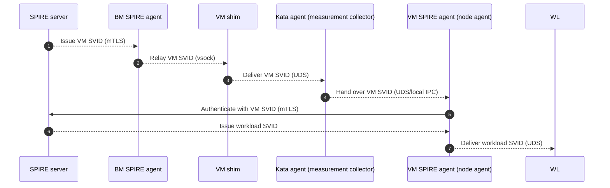
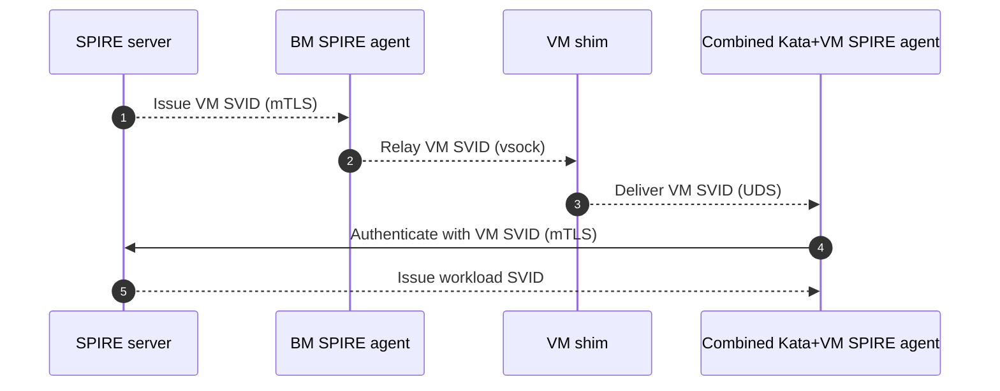

# Unified Workload Identity: End-to-End Flow (Three Rings & Communication)
_**Work in progress**_

## Table of Contents

- [Summary of Novel Aspects](#summary-of-novel-aspects)
- [Outermost Ring: Bare-Metal SPIRE Agent SVID](#outermost-ring-bare-metal-spire-agent-svid)
- [Outer Ring: VM Attestation and VM SVID](#outer-ring-vm-attestation-and-vm-svid)
- [Inner Ring: Workload Identity and Key Release](#inner-ring-workload-identity-and-key-release)
- [Three Rings Summary](#three-rings-summary)
- [Full Mermaid Diagram: Comms and Rings](#full-mermaid-diagram-comms-and-rings)
- [Detailed flows](#detailed-flows)
  - [Split‑role design (kata agent + VM SPIRE agent separate)](#splitrole-design-kata-agent--vm-spire-agent-separate)
  - [Combined‑role design (kata agent + VM SPIRE agent merged)](#combinedrole-design-kata-agent--vm-spire-agent-merged)

## Terminology

**BM**: Bare Metal (physical host, not a VM)
**VM**: Virtual Machine
**SPIRE**: SPIFFE Runtime Environment (for workload identity)
**SVID**: SPIFFE Verifiable Identity Document (X.509 or JWT identity)
**UDS**: Unix Domain Socket (local inter-process communication transport, provides fast and secure communication between processes on the same host or VM)
**vsock**: Virtio Socket (host-VM communication channel, used for efficient communication between virtual machines and the host without networking)
**Keylime**: An open-source remote attestation framework that uses TPMs to verify the integrity of hosts and orchestrate trust in distributed systems

---

## Summary of Novel Aspects

This document unifies the **outermost ring** (BM SPIRE agent SVID), the **outer ring** (VM attestation and VM SVID), and the **inner ring** (workload identity and KBS release), with explicit transport and device access at each step.  

The proposal introduces several **innovations** beyond conventional SPIRE/Keylime deployments:

- **Three‑ring trust model:**  
  - **Outermost ring:** Bare‑metal SPIRE agent itself is attested and issued an SVID, anchored in host TPM + IMA evidence.  
  - **Outer ring:** VM attestation fuses vTPM quotes with host TPM quotes in a single session, ensuring replay protection and launch binding.  
  - **Inner ring:** Workload SVIDs are issued only if the VM SVID is valid, and KBS secrets are released only to workloads with valid workload SVIDs.

- **Role inversion for clarity:**  
  - **VM Kata agent** is dedicated to **attestation collection** (vTPM quotes, `vm_claims_digest`, evidence relay).  
  - **VM SPIRE agent** is repurposed as the **container runtime and identity broker**, consuming the VM SVID and issuing workload SVIDs.  
  - This separation of duties simplifies auditability and allows attestation logic to evolve independently of workload lifecycle management.

- **Explicit comms and device paths:**  
  - **UDS** inside the VM (workload ↔ kata agent, kata agent ↔ VM SPIRE agent).  
  - **vsock** between VM shim and BM SPIRE agent.  
  - **mTLS** for all SPIRE server, Keylime verifier, and KBS interactions.  
  - This explicit mapping ensures reproducibility and regulator‑ready clarity.

- **Nonce‑anchored freshness and fusion:**  
  - Server‑issued `session_id`, `nonce_host`, and `nonce_vm` are cryptographically bound into both host and VM quotes.  
  - Evidence is fused at the BM SPIRE agent, signed, and verified as a single bundle, preventing replay or split‑verdict attacks.

- **Policy‑driven selectors and key scoping:**  
  - VM SVIDs are tied to fused selectors (host AK, VM AK, PCRs, VM image, sandbox config).  
  - Workload SVIDs inherit trust from VM SVIDs.  
  - KBS keys are released only to workloads with valid workload SVIDs, scoped for one‑time use and short TTL.


## Outermost Ring: Bare-Metal SPIRE Agent SVID

### Phase 0: Host Attestation and BM SVID Issuance
- **Comms:** mTLS (BM SPIRE agent ↔ SPIRE server).
- **Evidence:** Host TPM quote via Keylime agent, IMA runtime measurements, optional GPU/geolocation plugins.
- **TPM access:** `/dev/tpm0` (host physical TPM via TIS/CRB).
- **Result:** BM SPIRE agent receives a short‑TTL SVID and uses it to authenticate subsequent VM evidence relays.
---


## Outer Ring: VM Attestation and VM SVID

### Phase 1: Challenge Issuance (Server-Anchored Nonces)
 **Comms:** UDS (workload ↔ VM kata agent), UDS (VM kata agent ↔ VM shim), vsock (VM shim ↔ BM SPIRE agent), mTLS (BM SPIRE agent ↔ SPIRE server).
 **Return path:** mTLS (server→bm), vsock (bm→shim), UDS (shim→VM kata agent).
- **Return path:** mTLS (server→bm), vsock (bm→shim), UDS (shim→VM/kata agent).
### Phase 2: VM Quote (vTPM)
 **Delivery:** mTLS (server→bm), vsock (bm→shim), UDS (shim→VM kata agent).
- **Quote:** `TPM2_Quote` with `extraData = H(session_id || nonce_vm || vm_claims_digest)`.
- **TPM access:** `/dev/tpm0` inside VM (vTPM TIS/CRB) or TPM proxy socket.
- **Evidence:** VM quote, AK pub, PCRs, event logs, vm_claims_digest, VM metadata.

### Phase 3: Host Quote (Physical TPM via Keylime)
- **Request:** BM SPIRE agent asks Keylime agent for host quote.
### Phase 4: Evidence Bundling and Verification
- **Comms:** mTLS (BM SPIRE agent → SPIRE server), mTLS (SPIRE server ↔ Keylime verifier).
- **Verify:** Keylime verifier checks EK/AK chains, PCR profiles, IMA allowlists, event logs, nonce bindings, and shared session_id.
- **Consume nonces:** SPIRE server marks nonces used.
- **Result:** If both host and VM pass, SPIRE server issues VM SVID (short TTL, fused selectors: host AK hash, VM AK hash, PCRs, VM image, sandbox config).
- **Delivery:** mTLS (server→BM), vsock (BM→shim), UDS (shim→VM kata agent).

---
## Inner Ring: Workload Identity and Key Release

### Phase 5: Workload SVID Issuance

### Phase 6: KBS Key Release
---


## Full Mermaid Diagram: Comms and Rings

    %% Outermost Ring
  participant BM as "BM SPIRE agent"

    participant Shim as "VM shim"
    participant Kata as "VM Kata agent (attestation collector)"
    participant vTPM as "vTPM (/dev/tpm0)"

    %% Inner Ring
    participant KBS as "Key Broker Service"
  %% Phase 0: BM SVID
  BM->>Server: Request BM SVID (mTLS)
  BM->>KLAgent: Request host evidence
  KLAgent->>HostTPM: TPM2_Quote (physical TPM)
  KLAgent-->>BM: Host evidence
  BM->>Server: Submit evidence (mTLS)
  Server->>KLVer: Verify host evidence
  KLVer-->>Server: Verdict
  Server-->>BM: Issue BM SVID (if pass)

    %% Phase 1: VM challenge
    Kata->>Shim: Attest-and-SVID request (UDS)
  Shim->>BM: Forward (vsock)
  BM->>Server: Request challenge (mTLS)
  Server-->>BM: session_id, nonces, token
  BM-->>Shim: Relay (vsock)
    Shim-->>Kata: Relay (UDS)

    %% Phase 2: VM quote
    Kata->>vTPM: TPM2_Quote(extraData=H(session_id||nonce_vm||vm_claims_digest))
    vTPM-->>Kata: VM quote + PCRs + logs
    Kata->>Shim: Send VM evidence (UDS)
  Shim->>BM: Forward (vsock)

    %% Phase 3: Host quote
  BM->>KLAgent: Request host quote
    KLAgent->>HostTPM: TPM2_Quote(extraData=H(session_id||nonce_host||host_claims_digest))
    HostTPM-->>KLAgent: Host quote
    KLAgent-->>BM: Host evidence

    %% Phase 4: Verification
  BM->>Server: Submit bundle (mTLS)
    Server->>KLVer: Verify host+VM evidence
    KLVer-->>Server: Verdict
    Server-->>BM: Issue VM SVID (if pass)
  BM-->>Shim: Relay (vsock)
    Shim-->>Kata: Deliver VM SVID (UDS)
    Kata-->>VMA: Hand over VM SVID (UDS)

    %% Phase 5: Workload SVID
    WL->>VMA: Request identity (UDS)
    VMA->>Server: Authenticate with VM SVID (mTLS)
    Server-->>VMA: Issue workload SVID
    VMA-->>WL: Deliver workload SVID (UDS)

    %% Phase 6: KBS release
    WL->>KBS: Present workload SVID (mTLS/SPIFFE)
    KBS-->>WL: Release scoped key
```
## Detailed flows
### Split‑role design (kata agent + VM SPIRE agent separate)


### Combined‑role design (kata agent + VM SPIRE agent merged)

