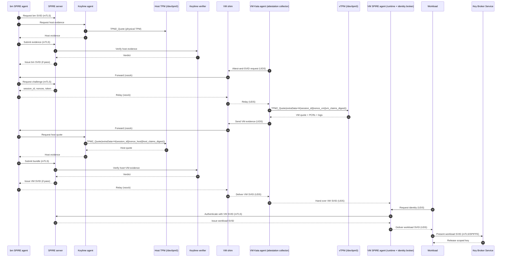

# Unified workload identity - End-to-end flow with three rings and communication mechanisms - work in progress

This unifies the outermost ring (bm SPIRE agent SVID), outer ring (VM attestation and VM SVID), and inner ring (workload identity and KBS release), with explicit transport and device access at each step.

---

## Outermost ring: Bare-metal SPIRE agent SVID

### Phase 0: Host attestation and bm SVID issuance
- **Initiate:** bm SPIRE agent requests its node SVID from SPIRE server.
- **Comms:** mTLS (bm SPIRE agent ↔ SPIRE server).
- **Evidence:** Host TPM quote via Keylime agent, IMA runtime measurements, optional GPU/geolocation plugins.
- **TPM access:** `/dev/tpm0` (host physical TPM via TIS/CRB).
- **Result:** bm SPIRE agent receives a short‑TTL SVID and uses it to authenticate subsequent VM evidence relays.

---

## Outer ring: VM attestation and VM SVID

### Phase 1: Challenge issuance (server-anchored nonces)
- **Request:** VM/kata agent initiates “attest‑and‑SVID”.
- **Comms:** UDS (workload ↔ VM/kata agent), UDS (VM/kata agent ↔ VM shim), vsock (VM shim ↔ bm SPIRE agent), mTLS (bm SPIRE agent ↔ SPIRE server).
- **Server action:** SPIRE server issues `session_id`, `nonce_host`, `nonce_vm`, `expires_at`, and a signed challenge token.
- **Return path:** mTLS (server→bm), vsock (bm→shim), UDS (shim→VM/kata agent).

### Phase 2: VM quote (vTPM)
- **Compute:** vm_claims_digest over VM measured boot claims (PCRs, VMID, image digest, kata sandbox config hash).
- **Quote:** `TPM2_Quote` with `extraData = H(session_id || nonce_vm || vm_claims_digest)`.
- **TPM access:** `/dev/tpm0` inside VM (vTPM TIS/CRB) or TPM proxy socket.
- **Comms:** UDS (VM/kata agent → VM shim), vsock (VM shim → bm SPIRE agent).
- **Evidence:** VM quote, AK pub, PCRs, event logs, vm_claims_digest, VM metadata.

### Phase 3: Host quote (physical TPM via Keylime)
- **Request:** bm SPIRE agent asks Keylime agent for host quote.
- **Quote:** `TPM2_Quote` with `extraData = H(session_id || nonce_host || host_claims_digest)`.
- **TPM access:** `/dev/tpm0` (host physical TPM).
- **Comms:** local RPC or mTLS (bm SPIRE agent ↔ Keylime agent).
- **Evidence:** Host quote, AK/EK chain, PCRs, IMA allowlist, event logs, host_claims_digest.

### Phase 4: Evidence bundling and verification
- **Bundle:** bm SPIRE agent aggregates VM evidence + host evidence + server challenge token and signs the bundle.
- **Comms:** mTLS (bm SPIRE agent → SPIRE server), mTLS (SPIRE server ↔ Keylime verifier).
- **Verify:** Keylime verifier checks EK/AK chains, PCR profiles, IMA allowlists, event logs, nonce bindings, and shared session_id.
- **Consume nonces:** SPIRE server marks nonces used.
- **Result:** If both host and VM pass, SPIRE server issues VM SVID (short TTL, fused selectors: host AK hash, VM AK hash, PCRs, VM image, sandbox config).
- **Delivery:** mTLS (server→bm), vsock (bm→shim), UDS (shim→VM/kata agent).

---

## Inner ring: Workload identity and key release

### Phase 5: Workload SVID issuance
- **Request:** Workload asks VM SPIRE agent for identity.
- **Comms:** UDS (workload ↔ VM SPIRE agent), mTLS (VM SPIRE agent ↔ SPIRE server using VM SVID).
- **Selectors:** VM SPIRE agent collects workload selectors (UID, cgroup, labels).
- **Result:** SPIRE server issues workload SVID (short TTL). Delivered via UDS to workload.

### Phase 6: KBS key release
- **Request:** Workload presents workload SVID to KBS.
- **Comms:** mTLS with SPIFFE bundle (workload ↔ KBS).
- **Policy:** KBS validates SPIFFE ID, selectors, TTL, and trust roots.
- **Result:** KBS releases scoped key (one‑time unwrap, short TTL) for workload cryptographic operations.

---

## Three rings summary

- **Outermost ring (bm SVID):** Host integrity and bm SPIRE agent trust via physical TPM and Keylime.
- **Outer ring (VM SVID):** VM’s measured boot and session freshness, fused with host evidence; issued only on joint pass.
- **Inner ring (workload SVID):** Workload identity anchored to VM SVID; enables KBS key release to attested workloads.

---

## Full mermaid diagram with comms and rings

